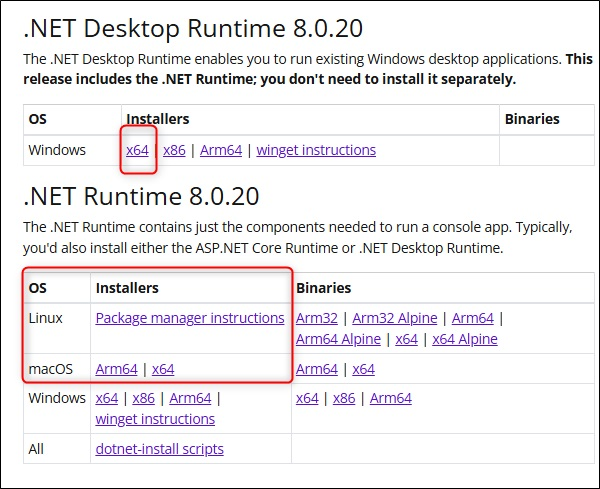
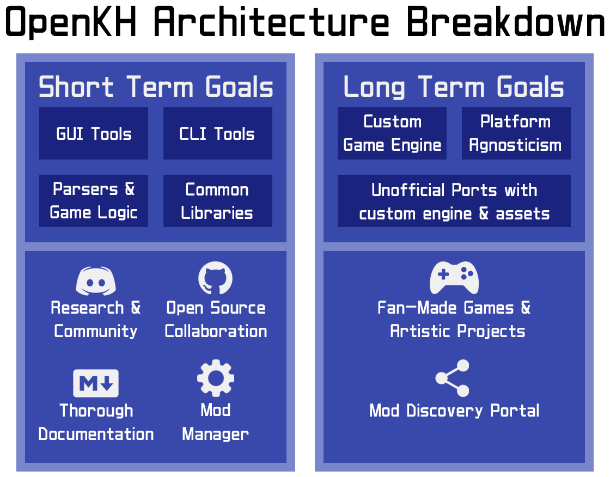

  

Aims to centralize all the technical knowledge of the 'Kingdom Hearts' game series in one place, providing documentation, tools, code libraries, and the foundation for modding the commercial games.

## Documentation

All the documentation is located in the `/docs` folder in its raw form. A more web-friendly version can be accessed at: [https://openkh.dev/](https://openkh.dev/)

## Downloads

New builds of OpenKH are automatically generated every time one of the contributors inspects and approves a new proposed feature or fix. Those builds are considered stable as they are built from the `master` branch. The version format used in the builds is `YEAR.MONTH.DAY.BUILDID`.

All the builds from `master` and from pull requestes are generated from [GitHub Actions](https://github.com/OpenKh/OpenKh/actions).

OpenKH tools require the installation of the [.NET 8.0 Runtime](https://dotnet.microsoft.com/download/dotnet/8.0). All the UI tools are designed to work on Windows, while command line tools will work on any operating system.

  

Note: All CLI and GUI programs **should** be cross-platform, though extensive testing primarily happens on Windows systems. As such, users may be required to run GUI programs under a WINE prefix for Linux, Mac, BSD, etc.

Note: Since `OpenKh Build 1446 (master)` (Sep 16, 2025 release) OpenKh has changed the framework from .NET 6.0 to .NET 8.0.

## OpenKH in depth

  

From an architectural point of view, the code is structured to abstract low-level implementation such as file parsers and infrastructural logic to high-level functionalties such as 3D rendering or tools. The projects are layered to be able to share as much as code possible, but isolated in order to avoid coupling.

From a community perspective, OpenKH will provide the best form of documentation, modding portal and fan-game support that is derived from it.

## Build from source code

The minimum requirement is [.NET 8 SDK](https://dotnet.microsoft.com/download/dotnet/8.0). Once the repository is downloaded, `build.ps1` or `build.sh` needs be executed. This is determined by the operating system in use. Alternatively, for those who prefer an IDE environment under Windows, you can always open the included solution file `OpenKh.sln` in Visual Studio and compile through the `Build` menu.

## Additional info

### Future plans

* Provide a fully fledged and user friendly modding toolchain.
* Centralize modding downloads with a review system.
* Provide a friendly environment for mod users and creators alike.
* Create a community site and forum where users can openly interact with and help one another with modifications using OpenKH tools and documentation.
* Create a custom game engine that is compatible with assets from the retail games.

### Contribution

There is a [guide](CONTRIBUTING.md) describing how to contact the team and contribute to the project.

### License

The entire content of the repository is protected by the Apache 2.0 license. Some of the key points of the license are:

* You **can** copy, modify, and distribute the software.
* You **can** use this software privately.
* You **can** use this software for commercial purposes.
* You **can** append to the "NOTICE" file, if said file exists in the main repository.
* You **cannot** hold any contributor to the repository liable for damages.
* You **cannot** change or otherwise modify any patent, trademark, and attribution notices from the source repository.
* You **must** indicate changes made to the code, if any.
* You **must** include the same NOTICE file in every distribution, if included within the original repository.
* You **must** include the license and copyright notice with each and every distribution and fork.
* Any modifications of this code base **ABSOLUTELY MUST** be distributed with the same license, Apache 2.0.
