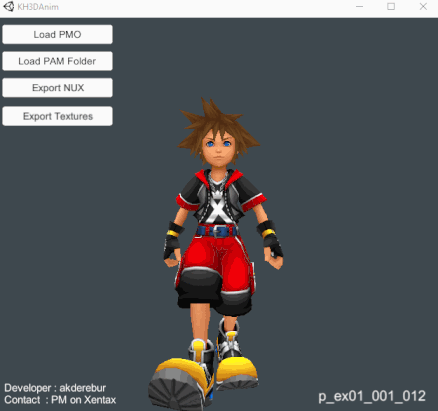

# [Kingdom Hearts Birth by Sleep](index.md) - PAM (Animation Container)

## File format

### PAM Header

| Offset | Variable Type | Description |
|--------|---------------|-------------|
| 00 | char[4] | The identifier of the file (always 0x004D4150) |
| 04 | uint32_t | Animation count|
| 08 | byte[6] | Always zero. Padding, never read by the game.|
| 0E | uint16_t  | Unknown. Seems to always be 0x0001. The game only checks if it's less than 1 and crashes if it is.|

### PAM Entry

| Offset | Variable Type | Description |
|--------|---------------|-------------|
| 00 | uint32_t | Offset to animation, alignment doesn't matter.|
| 04 | char[12] | Animation name.|

## Animations

Animations in Birth by Sleep do not need to be aligned in any way.

### Animation Header

| Offset | Variable Type | Description |
|--------|---------------|-------------|
| 00 | uint16_t  | Animation Type, currently unknown, but determines how the data inside the animation is read.|
| 02 | byte | Animation frame rate, always 0x1E, or 30 FPS.|
| 03 | byte | Interpolation frame count, determines how many frames it takes to transition into this animation.|
| 04 | uint16_t | Loop from frame, determines the point the animation loops from, usually the last frame.|
| 06 | byte | Bone count, must match bone count of target model.|
| 08 | uint16_t | Animation frame count.|
| 0A | uint16_t | Loop to frame, determines the point the animation loops to.|

## Animation Data

The animation data consists of separate channels for each animated property. There can be maximum 9 channels for every bone: Translation X/Y/Z, Rotation (radians) X/Y/Z, Scale X/Y/Z.

There are 9 flags (1 bit) for every bone to tell if that bone uses a channel or not. This will be explained below in more detail.

Each channel contains keyframes or a constant value . Linear interpolation is used to calculate values between keyframes. How the keyframe data is stored depends on the total frame count of the animation and the frame count specified for that channel.

## Channel Flags

Immediately after the header the flags start at 0xC. They are read 2 bytes at a time for each bone. Only the first 9 bits are used and the rest is always 0.

The meanings of the set bits are as follows:

| Bit Set | Description
|---------|---------------
| 0       | `translation.x` exists
| 1       | `translation.y` exists
| 2       | `translation.z` exists
| 3       | `rotation.x` exists
| 4       | `rotation.y` exists
| 5       | `rotation.z` exists
| 6       | `scale.x` exists
| 7       | `scale.y` exists
| 8       | `scale.z` exists

## Channel Data

After the flags comes the actual animation data. It is ordered by bones, meaning first all channels for Bone0, then all channels for Bone1 and so on. The channels are also ordered as the table in channel flags section. If a flag for a channel was not set, then it is skipped and there is no data for it.

The keyframe data (if exists) is quantized and stored as unsigned shorts. The maximum and minimum values are stored for each channel which are used for dequantization.

### Channel Header

| Offset | Variable Type | Description |
|--------|---------------|-------------|
| 00 | float  | Maximum value for this channel|
| 04 | float  | Minimum value for this channel|
| 08 | byte   | Keyframe count (animation frame count <= 255) |
| 08 | ushort | Keyframe count (animation frame count > 255) |

## Keyframe Data

After the channel header the keyframe data starts. The data storage also changes here depending on keyframe counts. So it will be divided into 3 categories for ease of understanding.

### Keyframe Count = 1

This channel uses a constant value throughout the animation. The maximum and minimum values in the channel header will be the same. Either one of these can be used as the constant value of this channel. There will be no keyframe data.

### Keyframe Count = Animation Frame Count

This channel has a key for every frame of this animation. So the frame ids of keyframes will not be stored. Frame id will start from 0 and will be incremented after each entry.

#### Keyframe Index Entry

| Variable Type | Description |
|---------------|-------------|
| ushort | Quantized value of this keyframe|

### Keyframe Count < Animation Frame Count

This channel has only keys for specific frames. Therefore the frame id is also stored before the value for each entry.

#### Keyframe Entry

| Variable Type | Description |
|---------------|-------------|
| byte   | Frame id of this keyframe (animation frame count <= 255)|
| ushort | Frame id of this keyframe (animation frame count > 255)|
| ushort | Quantized value of this keyframe|

## Implementation and Other Uses

An animation parser/viewer can be made using the documentation above. Although all the information was gathered from BBS, it seems to hold true for DDD. There is a [tool](https://forum.xentax.com/viewtopic.php?p=169270&sid=51dbc614987b03be478bbcb5b90665a4#p169270) by akderebur which implements animation support for DDD remaster on PS4.

