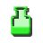
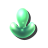
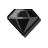
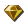
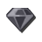
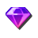
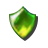
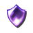
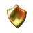

# [Kingdom Hearts II](index.md) - Icons

Icons can be seen using the ImageViewer tool on KH2/msg/*/fontimage.bar. Set "KH2 Font Multiple" to #4.

| ID | Icon | Description
|------|------|------|
| 0    |  | Consumable (Equippable)
| 1    |  | Consumable (Menu)
| 2    |  | Document (Maps, recipes, reports, proofs, key items)
| 3    |  | Ability
| 4    |  | Keyblade
| 5    |  | Staff
| 6    |  | Shield
| 7    |  | Armor
| 8    |  | Magic
| 9    |  | Synthesis item
| 10   |  | Exclamation icon
| 11   |  | Interrogation icon
| 12   |  | Consumable (Equippable, Autorefill)
| 13   |  | Ability (Equipped)
| 14   |  | Keyblade (Sparkles)
| 15   |  | Staff (Sparkles)
| 16   |  | Shield (Sparkles)
| 17   |  | Accessory
| 18   |  | Magic (Blocked)
| 19   |  | Party
| 20   |  | SELECT button
| 21   |  | START button
| 22   |  | D-Pad
| 23   |  | Synthesis Tranquil (Vanilla: File)
| 24   |  | Synthesis Remembrance (Vanilla: Ability (Equipped, blue))
| 25   |  | Form
| 26   |  | AI mode frequent
| 27   |  | AI mode moderate
| 28   |  | AI mode rare
| 29   |  | Summon / AI settings
| 30   |  | R1 button
| 31   |  | R2 button
| 32   |  | L1 button
| 33   |  | L2 button
| 34   |  | Triangle button
| 35   |  | Cross button
| 36   |  | Square button
| 37   |  | Circle button
| 38   |  | Synthesis Dark
| 39   |  | Synthesis Blazing
| 40   |  | Synthesis Frost
| 41   |  | Synthesis Lightning
| 42   |  | Synthesis Power
| 43   |  | Synthesis Lucid
| 44   |  | Synthesis Dense
| 45   |  | Synthesis Twilight
| 46   |  | Synthesis Mythril
| 47   |  | Synthesis Bright
| 48   |  | Synthesis Energy
| 49   |  | Synthesis Serenity
| 50   |  | Synthesis Orichalcum / Illusion
| 51   |  | Synthesis S
| 52   |  | Synthesis A
| 53   |  | Synthesis B
| 54   |  | Synthesis C
| 55   |  | Gummi paint
| 56   |  | Gummi ability
| 57   |  | Gummi ship
| 58   |  | Gummi block
| 59   |  | Gummi upgrade