# [Kingdom Hearts II](../../index) - AI ISA

Original document is licensed under the [CC-BY license](https://creativecommons.org/licenses/by/4.0/) by GovanifY.

License [exemption given by GovanifY](https://discordapp.com/channels/409140906625728532/575294959129722881/725434128597778463) permits the relicensing of this documentation to match ALv2 for the purpose of use and reference within the OpenKH repository.
\_\_\_\_\_\_\_\_\_\_\_\_\_\_\_\_\_\_\_\_\_\_\_\_\_\_\_\_\_\_\_\_\_\_\_\_\_\_\_\_\_\_\_\_\_\_\_\_\_\_\_\_\_\_\_\_\_\_\_\_\_\_\_\_\_  
v0.1

Kingdom Hearts 2 is a video game developped by Square Enix that also happens to be a very good game. As Square loves to reinvent the wheel they decided to make a custom AI assembler like scripting language for this engine, which also happens to be pretty inconsistent. This document will, in its value of a document, document this language as an Instruction Set Architecture(ISA) with additional information when necessary.

This booklet is separated into parts:

*   The Notational Convention, explaining how every instruction is defined
*   The Instruction Set, defining every operation in this language
*   The System Calls, documenting calls done by the language outside of its own scope
*   Known issues, if any
*   An appendix for additional documents that might help comprehension

It is also worthy to note that some operations that otherwise do the same thing are given a different mnemonic depending on the context to be easier to write an assembler. An example of this can be seen in the PUSH.V and PUSH.L operations, which, while they both push a value to the stack, one of them is 48bits long and pushes a raw value while the other is 32bits long and does a relocation on the encoded address before pushing it, making the different naming needed.

Chapter 1  
Notational Convention
---------------------------------

1\. Notational Convention  
\_\_\_\_\_\_\_\_\_\_\_\_\_\_\_\_\_\_\_\_\_\_\_\_\_\_\_\_\_\_\_\_\_\_\_\_\_\_\_\_\_\_\_\_\_\_\_\_\_\_\_\_\_\_\_\_\_\_\_\_\_\_\_\_\_  

The description of each instruction uses the following format:

Page headings show the instruction mnemonic and a brief description of the function, and the MIPS architecture level.

This picture illustrates the bit formats of an instruction word.

This section indicates the instruction formats for the assembler. Lower case indicates variables, corresponding to variable fields in the encoding picture.

This section describes the instruction function and operation.

This section shows the exceptions that can be caused by the instructions.

This section describes the instruction operations in SLEIGH. You can refer to SLEIGH’s own documentation for its notational conventions and refer to the Appendix for the custom SLEIGH notational conventions defined.

This section shows the supplementary information about programming when using the instruction.

Chapter 2  
Instruction Set
---------------------------

2\. Instruction Set  
\_\_\_\_\_\_\_\_\_\_\_\_\_\_\_\_\_\_\_\_\_\_\_\_\_\_\_\_\_\_\_\_\_\_\_\_\_\_\_\_\_\_\_\_\_\_\_\_\_\_\_\_\_\_\_\_\_\_\_\_\_\_\_\_\_  

\_\_\_\_\_\_\_\_\_\_\_\_\_\_\_\_\_\_\_\_\_\_\_\_\_\_\_\_\_\_\_\_\_\_\_\_\_\_\_\_\_\_\_\_\_\_\_\_\_\_\_\_\_\_\_\_\_\_\_\_\_\_\_\_\_  
Operation Code  
  
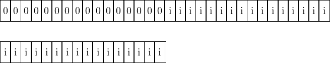  
  
  
  
  
Format  
  PUSH.V ri  
  
Description  
  Pushes a value to the stack.  
  
Operations

   
push(full\_ext:4);

\_\_\_\_\_\_\_\_\_\_\_\_\_\_\_\_\_\_\_\_\_\_\_\_\_\_\_\_\_\_\_\_\_\_\_\_\_\_\_\_\_\_\_\_\_\_\_\_\_\_\_\_\_\_\_\_\_\_\_\_\_\_\_\_\_  
Operation Code  
  
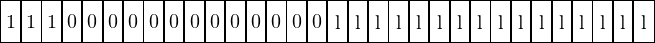  
  
Format  
  PUSH.L la  
  
Description  
  Pushes a relocated label(address pointer) to the stack.  
  
Operations

   
push(LABEL02:4);

Programming notes  
  The relocation formula is 0x10 + (l \>\> 1)  
  

\_\_\_\_\_\_\_\_\_\_\_\_\_\_\_\_\_\_\_\_\_\_\_\_\_\_\_\_\_\_\_\_\_\_\_\_\_\_\_\_\_\_\_\_\_\_\_\_\_\_\_\_\_\_\_\_\_\_\_\_\_\_\_\_\_  
Operation Code  
  
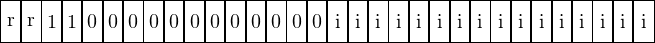  
  
Format  
  PUSH.A rn, ri  
  
Description  
  Pushes to the stack the value (rn+ri).  
  
Operations

\_\_\_\_\_\_\_\_\_\_\_\_\_\_\_\_\_\_\_\_\_\_\_\_\_\_\_\_\_\_\_\_\_\_\_\_\_\_\_\_\_\_\_\_\_\_\_\_\_\_\_\_\_\_\_\_\_\_\_\_\_\_\_\_\_  
Operation Code  
  
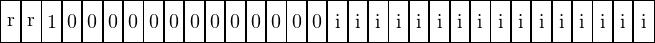  
  
Format  
  PUSH.AP rn, ri  
  
Description  
  Pushed to the stack a pointer toward (rn+ri).  
  
Operations

\_\_\_\_\_\_\_\_\_\_\_\_\_\_\_\_\_\_\_\_\_\_\_\_\_\_\_\_\_\_\_\_\_\_\_\_\_\_\_\_\_\_\_\_\_\_\_\_\_\_\_\_\_\_\_\_\_\_\_\_\_\_\_\_\_  
Operation Code  
  
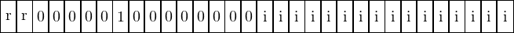  
  
Format  
  POP.A rn, ri  
  
Description  
  Pops the last value from the stack to the address (rn+ri).  
  
Operations

\_\_\_\_\_\_\_\_\_\_\_\_\_\_\_\_\_\_\_\_\_\_\_\_\_\_\_\_\_\_\_\_\_\_\_\_\_\_\_\_\_\_\_\_\_\_\_\_\_\_\_\_\_\_\_\_\_\_\_\_\_\_\_\_\_  
Operation Code  
  
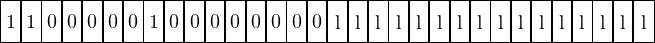  
  
Format  
  POP.L la  
  
Description  
  Pops the latest value from the stack and stores it at the relocated label(address pointer) la.  
  
Operations

   
push(LABEL02:4);

Programming notes  
  The relocation formula is 0x10 + (l \>\> 1). This opcode is never used in practice as the only way to use this opcode is to modify the AI’s own ram region, which would create self-modifying code.  
  

\_\_\_\_\_\_\_\_\_\_\_\_\_\_\_\_\_\_\_\_\_\_\_\_\_\_\_\_\_\_\_\_\_\_\_\_\_\_\_\_\_\_\_\_\_\_\_\_\_\_\_\_\_\_\_\_\_\_\_\_\_\_\_\_\_  
Operation Code  
  
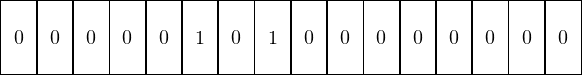  
  
Format  
  CFTI  
  
Description  
  Retrieves the last value pushed on to the stack and converts it from a signed integer to a floating point value, pushing back the result to the stack.  
  
Operations

   
local tmp:4 = sp;   
pop(tmp);   
tmp = round(tmp);   
push(tmp);

\_\_\_\_\_\_\_\_\_\_\_\_\_\_\_\_\_\_\_\_\_\_\_\_\_\_\_\_\_\_\_\_\_\_\_\_\_\_\_\_\_\_\_\_\_\_\_\_\_\_\_\_\_\_\_\_\_\_\_\_\_\_\_\_\_  
Operation Code  
  
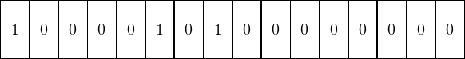  
  
Format  
  NEG  
  
Description  
  Retrieves the last value pushed on to the stack and converts it to a negative number, pushing back the result to the stack.  
  
Operations

   
local tmp:4 = sp;   
pop(tmp);   
tmp=−tmp;   
push(tmp);

\_\_\_\_\_\_\_\_\_\_\_\_\_\_\_\_\_\_\_\_\_\_\_\_\_\_\_\_\_\_\_\_\_\_\_\_\_\_\_\_\_\_\_\_\_\_\_\_\_\_\_\_\_\_\_\_\_\_\_\_\_\_\_\_\_  
Operation Code  
  
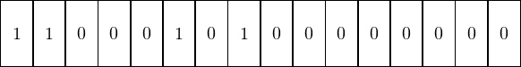  
  
Format  
  INV  
  
Description  
  Retrieves the last value pushed on to the stack and inverts it, pushing back the result to the stack.  
  
Operations

   
local tmp:4 = sp;   
pop(tmp);   
tmp = ˜tmp;   
push(tmp);

\_\_\_\_\_\_\_\_\_\_\_\_\_\_\_\_\_\_\_\_\_\_\_\_\_\_\_\_\_\_\_\_\_\_\_\_\_\_\_\_\_\_\_\_\_\_\_\_\_\_\_\_\_\_\_\_\_\_\_\_\_\_\_\_\_  
Operation Code  
  
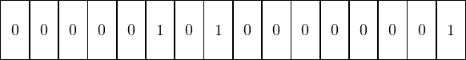  
  
Format  
  EQZ  
  
Description  
  Retrieves the last value pushed on to the stack and compares it to zero, pushing back the result to the stack.  
  
Operations

   
local tmp:4 = sp;   
pop(tmp);   
local ret = (tmp == 0);   
push(ret);

\_\_\_\_\_\_\_\_\_\_\_\_\_\_\_\_\_\_\_\_\_\_\_\_\_\_\_\_\_\_\_\_\_\_\_\_\_\_\_\_\_\_\_\_\_\_\_\_\_\_\_\_\_\_\_\_\_\_\_\_\_\_\_\_\_  
Operation Code  
  
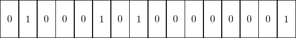  
  
Format  
  ABS  
  
Description  
  Retrieves the last value pushed on to the stack and converts it to an absolute value, pushing back the result to the stack.  
  
Operations

   
local tmp:4 = sp;   
pop(tmp);   
if(tmp s<\= 0) goto <min\>;   
goto <done\>;   
<min\>   
    tmp=−tmp;   
<done\>   
    push(tmp);

\_\_\_\_\_\_\_\_\_\_\_\_\_\_\_\_\_\_\_\_\_\_\_\_\_\_\_\_\_\_\_\_\_\_\_\_\_\_\_\_\_\_\_\_\_\_\_\_\_\_\_\_\_\_\_\_\_\_\_\_\_\_\_\_\_  
Operation Code  
  
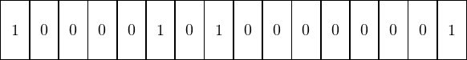  
  
Format  
  MSB  
  
Description  
  Retrieves the last value pushed on to the stack and gets back its most significant bit, pushing back the result to the stack.  
  
Operations

   
local tmp:4 = sp;   
pop(tmp);   
tmp = tmp \>> 0x1F;   
push(tmp);

\_\_\_\_\_\_\_\_\_\_\_\_\_\_\_\_\_\_\_\_\_\_\_\_\_\_\_\_\_\_\_\_\_\_\_\_\_\_\_\_\_\_\_\_\_\_\_\_\_\_\_\_\_\_\_\_\_\_\_\_\_\_\_\_\_  
Operation Code  
  
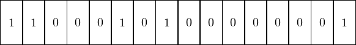  
  
Format  
  INFO  
  
Description  
  Retrieves the last value pushed on to the stack and compares it to one, pushing back the result to the stack.  
  
Operations

   
local tmp:4 = sp;   
pop(tmp);   
push((tmp s< 1));

\_\_\_\_\_\_\_\_\_\_\_\_\_\_\_\_\_\_\_\_\_\_\_\_\_\_\_\_\_\_\_\_\_\_\_\_\_\_\_\_\_\_\_\_\_\_\_\_\_\_\_\_\_\_\_\_\_\_\_\_\_\_\_\_\_  
Operation Code  
  
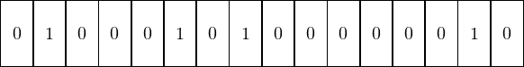  
  
Format  
  NEQZ  
  
Description  
  Retrieves the last value pushed on to the stack and compares it to zero, pushing back the result to the stack.  
  
Operations

   
local tmp:4 = sp;   
pop(tmp);   
push((tmp != 0));

\_\_\_\_\_\_\_\_\_\_\_\_\_\_\_\_\_\_\_\_\_\_\_\_\_\_\_\_\_\_\_\_\_\_\_\_\_\_\_\_\_\_\_\_\_\_\_\_\_\_\_\_\_\_\_\_\_\_\_\_\_\_\_\_\_  
Operation Code  
  
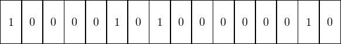  
  
Format  
  MSBI  
  
Description  
  Retrieves the last value pushed on to the stack and gets back its most significant bit and inverts it, pushing back the result to the stack.  
  
Operations

   
local tmp:4 = sp;   
pop(tmp);   
tmp = tmp \>> 0x1F;   
push(˜tmp);

\_\_\_\_\_\_\_\_\_\_\_\_\_\_\_\_\_\_\_\_\_\_\_\_\_\_\_\_\_\_\_\_\_\_\_\_\_\_\_\_\_\_\_\_\_\_\_\_\_\_\_\_\_\_\_\_\_\_\_\_\_\_\_\_\_  
Operation Code  
  
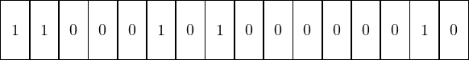  
  
Format  
  IPOS  
  
Description  
  Retrieves the last value pushed on to the stack and compares it to zero, pushing back the result to the stack.  
  
Operations

   
local tmp:4 = sp;   
pop(tmp);   
push((tmp s\> 0));

\_\_\_\_\_\_\_\_\_\_\_\_\_\_\_\_\_\_\_\_\_\_\_\_\_\_\_\_\_\_\_\_\_\_\_\_\_\_\_\_\_\_\_\_\_\_\_\_\_\_\_\_\_\_\_\_\_\_\_\_\_\_\_\_\_  
Operation Code  
  
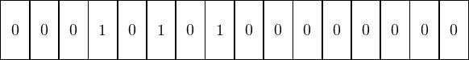  
  
Format  
  CITF  
  
Description  
  Retrieves the last value pushed on to the stack and converts it from a signed integer to a floating point value, pushing back the result to the stack.  
  
Operations

   
local tmp:4 = sp;   
pop(tmp);   
tmp=int2float(tmp);   
push(tmp);

\_\_\_\_\_\_\_\_\_\_\_\_\_\_\_\_\_\_\_\_\_\_\_\_\_\_\_\_\_\_\_\_\_\_\_\_\_\_\_\_\_\_\_\_\_\_\_\_\_\_\_\_\_\_\_\_\_\_\_\_\_\_\_\_\_  
Operation Code  
  
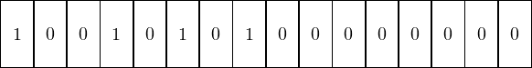  
  
Format  
  NEGF  
  
Description  
  Retrieves the last value pushed on to the stack and converts it to a negative value, pushing back the result to the stack.  
  
Operations

Programming notes  
  This function exclusively deals with floating numbers  
  

\_\_\_\_\_\_\_\_\_\_\_\_\_\_\_\_\_\_\_\_\_\_\_\_\_\_\_\_\_\_\_\_\_\_\_\_\_\_\_\_\_\_\_\_\_\_\_\_\_\_\_\_\_\_\_\_\_\_\_\_\_\_\_\_\_  
Operation Code  
  
  
  
Format  
  ABSF  
  
Description  
  Retrieves the last value pushed on to the stack and converts it to an absolute value, pushing back the result to the stack.  
  
Operations

   
local tmp:4 = sp;   
pop(tmp);   
tmp=abs(tmp);   
push(tmp);

Programming notes  
  This function exclusively deals with floating numbers  
  

\_\_\_\_\_\_\_\_\_\_\_\_\_\_\_\_\_\_\_\_\_\_\_\_\_\_\_\_\_\_\_\_\_\_\_\_\_\_\_\_\_\_\_\_\_\_\_\_\_\_\_\_\_\_\_\_\_\_\_\_\_\_\_\_\_  
Operation Code  
  
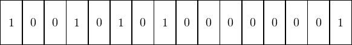  
  
Format  
  INFZF  
  
Description  
  Retrieves the last value pushed on to the stack and compares it to zero, pushing back the result to the stack.  
  
Operations

   
local tmp:4 = sp;   
pop(tmp);   
push((tmp f< 0));

Programming notes  
  This function exclusively deals with floating numbers  
  

\_\_\_\_\_\_\_\_\_\_\_\_\_\_\_\_\_\_\_\_\_\_\_\_\_\_\_\_\_\_\_\_\_\_\_\_\_\_\_\_\_\_\_\_\_\_\_\_\_\_\_\_\_\_\_\_\_\_\_\_\_\_\_\_\_  
Operation Code  
  
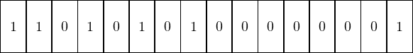  
  
Format  
  INFOEZF  
  
Description  
  Retrieves the last value pushed on to the stack and compares it to zero, pushing back the result to the stack.  
  
Operations

   
local tmp:4 = sp;   
pop(tmp);   
push((tmp f<\= 0));

Programming notes  
  This function exclusively deals with floating numbers  
  

\_\_\_\_\_\_\_\_\_\_\_\_\_\_\_\_\_\_\_\_\_\_\_\_\_\_\_\_\_\_\_\_\_\_\_\_\_\_\_\_\_\_\_\_\_\_\_\_\_\_\_\_\_\_\_\_\_\_\_\_\_\_\_\_\_  
Operation Code  
  
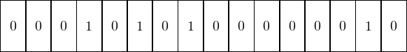  
  
Format  
  EQZF  
  
Description  
  Retrieves the last value pushed on to the stack and compares it to zero, pushing back the result to the stack.  
  
Operations

   
local tmp:4 = sp;   
pop(tmp);   
push((tmp f== 0));

Programming notes  
  This function exclusively deals with floating numbers  
  

\_\_\_\_\_\_\_\_\_\_\_\_\_\_\_\_\_\_\_\_\_\_\_\_\_\_\_\_\_\_\_\_\_\_\_\_\_\_\_\_\_\_\_\_\_\_\_\_\_\_\_\_\_\_\_\_\_\_\_\_\_\_\_\_\_  
Operation Code  
  
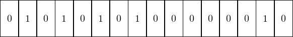  
  
Format  
  NEQZF  
  
Description  
  Retrieves the last value pushed on to the stack and compares it to zero, pushing back the result to the stack.  
  
Operations

   
local tmp:4 = sp;   
pop(tmp);   
push((tmp f!= 0));

Programming notes  
  This function exclusively deals with floating numbers  
  

\_\_\_\_\_\_\_\_\_\_\_\_\_\_\_\_\_\_\_\_\_\_\_\_\_\_\_\_\_\_\_\_\_\_\_\_\_\_\_\_\_\_\_\_\_\_\_\_\_\_\_\_\_\_\_\_\_\_\_\_\_\_\_\_\_  
Operation Code  
  
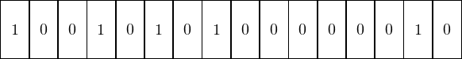  
  
Format  
  SUPOEZF  
  
Description  
  Retrieves the last value pushed on to the stack and compares it to zero, pushing back the result to the stack.  
  
Operations

   
local tmp:4 = sp;   
pop(tmp);   
push((tmp f\>\= 0));

Programming notes  
  This function exclusively deals with floating numbers  
  

\_\_\_\_\_\_\_\_\_\_\_\_\_\_\_\_\_\_\_\_\_\_\_\_\_\_\_\_\_\_\_\_\_\_\_\_\_\_\_\_\_\_\_\_\_\_\_\_\_\_\_\_\_\_\_\_\_\_\_\_\_\_\_\_\_  
Operation Code  
  
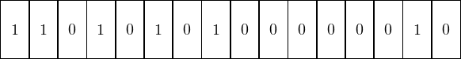  
  
Format  
  SUPZF  
  
Description  
  Retrieves the last value pushed on to the stack and compares it to zero, pushing back the result to the stack.  
  
Operations

   
local tmp:4 = sp;   
pop(tmp);   
push((tmp f\> 0));

Programming notes  
  This function exclusively deals with floating numbers  
  

\_\_\_\_\_\_\_\_\_\_\_\_\_\_\_\_\_\_\_\_\_\_\_\_\_\_\_\_\_\_\_\_\_\_\_\_\_\_\_\_\_\_\_\_\_\_\_\_\_\_\_\_\_\_\_\_\_\_\_\_\_\_\_\_\_  
Operation Code  
  
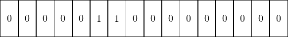  
  
Format  
  ADD  
  
Description  
  Retrieves the last 2 values pushed on to the stack and applies an addition between them, pushing back the result to the stack.  
  
Operations

   
local tmp:4 = sp;   
local tmp2:4 = sp;   
pop(tmp);   
pop(tmp2);   
push(tmp2+tmp);

\_\_\_\_\_\_\_\_\_\_\_\_\_\_\_\_\_\_\_\_\_\_\_\_\_\_\_\_\_\_\_\_\_\_\_\_\_\_\_\_\_\_\_\_\_\_\_\_\_\_\_\_\_\_\_\_\_\_\_\_\_\_\_\_\_  
Operation Code  
  
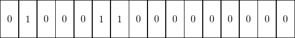  
  
Format  
  SUB  
  
Description  
  Retrieves the last 2 values pushed on to the stack and applies a substraction between them, pushing back the result to the stack.  
  
Operations

   
local tmp:4 = sp;   
local tmp2:4 = sp;   
pop(tmp);   
pop(tmp2);   
push(tmp2−tmp);

\_\_\_\_\_\_\_\_\_\_\_\_\_\_\_\_\_\_\_\_\_\_\_\_\_\_\_\_\_\_\_\_\_\_\_\_\_\_\_\_\_\_\_\_\_\_\_\_\_\_\_\_\_\_\_\_\_\_\_\_\_\_\_\_\_  
Operation Code  
  
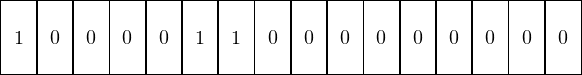  
  
Format  
  MUL  
  
Description  
  Retrieves the last 2 values pushed on to the stack and applies a multiplication between them, pushing back the result to the stack.  
  
Operations

   
local tmp:4 = sp;   
local tmp2:4 = sp;   
pop(tmp);   
pop(tmp2);   
push(tmp2 ∗ tmp);

\_\_\_\_\_\_\_\_\_\_\_\_\_\_\_\_\_\_\_\_\_\_\_\_\_\_\_\_\_\_\_\_\_\_\_\_\_\_\_\_\_\_\_\_\_\_\_\_\_\_\_\_\_\_\_\_\_\_\_\_\_\_\_\_\_  
Operation Code  
  
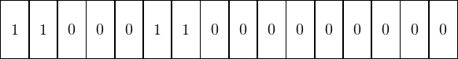  
  
Format  
  DIV  
  
Description  
  Retrieves the last 2 values pushed on to the stack and applies a division between them, pushing back the result to the stack.  
  
Operations

   
local tmp:4 = sp;   
local tmp2:4 = sp;   
pop(tmp);   
pop(tmp2);   
push(tmp2 s/ tmp);

\_\_\_\_\_\_\_\_\_\_\_\_\_\_\_\_\_\_\_\_\_\_\_\_\_\_\_\_\_\_\_\_\_\_\_\_\_\_\_\_\_\_\_\_\_\_\_\_\_\_\_\_\_\_\_\_\_\_\_\_\_\_\_\_\_  
Operation Code  
  
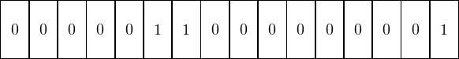  
  
Format  
  MOD  
  
Description  
  Retrieves the last 2 values pushed on to the stack and applies a modulo between them, pushing back the result to the stack.  
  
Operations

   
local tmp:4 = sp;   
local tmp2:4 = sp;   
pop(tmp);   
pop(tmp2);   
push(tmp2 s% tmp);

\_\_\_\_\_\_\_\_\_\_\_\_\_\_\_\_\_\_\_\_\_\_\_\_\_\_\_\_\_\_\_\_\_\_\_\_\_\_\_\_\_\_\_\_\_\_\_\_\_\_\_\_\_\_\_\_\_\_\_\_\_\_\_\_\_  
Operation Code  
  
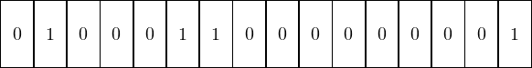  
  
Format  
  AND  
  
Description  
  Retrieves the last 2 values pushed on to the stack and applies a logical and between them, pushing back the result to the stack.  
  
Operations

   
local tmp:4 = sp;   
local tmp2:4 = sp;   
pop(tmp);   
pop(tmp2);   
push(tmp2&tmp);

\_\_\_\_\_\_\_\_\_\_\_\_\_\_\_\_\_\_\_\_\_\_\_\_\_\_\_\_\_\_\_\_\_\_\_\_\_\_\_\_\_\_\_\_\_\_\_\_\_\_\_\_\_\_\_\_\_\_\_\_\_\_\_\_\_  
Operation Code  
  
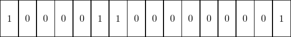  
  
Format  
  OR  
  
Description  
  Retrieves the last 2 values pushed on to the stack and applies a logical or between them, pushing back the result to the stack.  
  
Operations

   
local tmp:4 = sp;   
local tmp2:4 = sp;   
pop(tmp);   
pop(tmp2);   
push(tmp2|tmp);

\_\_\_\_\_\_\_\_\_\_\_\_\_\_\_\_\_\_\_\_\_\_\_\_\_\_\_\_\_\_\_\_\_\_\_\_\_\_\_\_\_\_\_\_\_\_\_\_\_\_\_\_\_\_\_\_\_\_\_\_\_\_\_\_\_  
Operation Code  
  
  
  
Format  
  XOR  
  
Description  
  Retrieves the last 2 values pushed on to the stack and applies an exclusive or between them, pushing back the result to the stack.  
  
Operations

   
local tmp:4 = sp;   
local tmp2:4 = sp;   
pop(tmp);   
pop(tmp2);   
push(tmp2ˆtmp);

\_\_\_\_\_\_\_\_\_\_\_\_\_\_\_\_\_\_\_\_\_\_\_\_\_\_\_\_\_\_\_\_\_\_\_\_\_\_\_\_\_\_\_\_\_\_\_\_\_\_\_\_\_\_\_\_\_\_\_\_\_\_\_\_\_  
Operation Code  
  
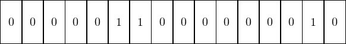  
  
Format  
  SLL  
  
Description  
  Retrieves the last 2 values pushed on to the stack and applies a left logical shift between them, pushing back the result to the stack.  
  
Operations

   
local tmp:4 = sp;   
local tmp2:4 = sp;   
pop(tmp);   
pop(tmp2);   
push(tmp2<<(tmp&0x1F));

\_\_\_\_\_\_\_\_\_\_\_\_\_\_\_\_\_\_\_\_\_\_\_\_\_\_\_\_\_\_\_\_\_\_\_\_\_\_\_\_\_\_\_\_\_\_\_\_\_\_\_\_\_\_\_\_\_\_\_\_\_\_\_\_\_  
Operation Code  
  
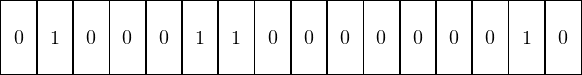  
  
Format  
  SRA  
  
Description  
  Retrieves the last 2 values pushed on to the stack and applies a right arithmetic shift between them, pushing back the result to the stack.  
  
Operations

   
local tmp:4 = sp;   
local tmp2:4 = sp;   
pop(tmp);   
pop(tmp2);   
push(tmp2\>>(tmp&0x1F));

\_\_\_\_\_\_\_\_\_\_\_\_\_\_\_\_\_\_\_\_\_\_\_\_\_\_\_\_\_\_\_\_\_\_\_\_\_\_\_\_\_\_\_\_\_\_\_\_\_\_\_\_\_\_\_\_\_\_\_\_\_\_\_\_\_  
Operation Code  
  
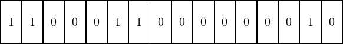  
  
Format  
  NEQZV  
  
Description  
  Retrieves the last 2 values pushed on to the stack and verifies if both are equal to zero, pushing back the result to the stack.  
  
Operations

   
local tmp:4 = sp;   
local tmp2:4 = sp;   
pop(tmp);   
pop(tmp2);   
local ret:4 = 1;   
if(tmp==0) goto <next\>;   
goto <end\>;   
<next\>   
    if(tmp2!=0) goto <end\>;   
ret=0;   
<end\>   
    push(ret);

\_\_\_\_\_\_\_\_\_\_\_\_\_\_\_\_\_\_\_\_\_\_\_\_\_\_\_\_\_\_\_\_\_\_\_\_\_\_\_\_\_\_\_\_\_\_\_\_\_\_\_\_\_\_\_\_\_\_\_\_\_\_\_\_\_  
Operation Code  
  
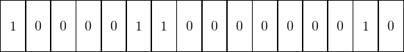  
  
Format  
  EQZV  
  
Description  
  Retrieves the last 2 values pushed on to the stack and verifies if both are equal to zero, pushing back the result to the stack.  
  
Operations

   
local tmp:4 = sp;   
local tmp2:4 = sp;   
pop(tmp);   
pop(tmp2);   
local ret:4 = 1;   
if(tmp!=0) goto <next\>;   
goto <end\>;   
<next\>   
    if(tmp2==0) goto <end\>;   
ret=0;   
<end\>   
    push(ret);

\_\_\_\_\_\_\_\_\_\_\_\_\_\_\_\_\_\_\_\_\_\_\_\_\_\_\_\_\_\_\_\_\_\_\_\_\_\_\_\_\_\_\_\_\_\_\_\_\_\_\_\_\_\_\_\_\_\_\_\_\_\_\_\_\_  
Operation Code  
  
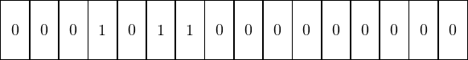  
  
Format  
  ADDF  
  
Description  
  Retrieves the last 2 values pushed on to the stack and apply an addition onto them, pushing back the result to the stack.  
  
Operations

   
local tmp:4 = sp;   
local tmp2:4 = sp;   
pop(tmp);   
pop(tmp2);   
push(tmp2 f+ tmp);

Programming notes  
  This function exclusively deals with floating numbers  
  

\_\_\_\_\_\_\_\_\_\_\_\_\_\_\_\_\_\_\_\_\_\_\_\_\_\_\_\_\_\_\_\_\_\_\_\_\_\_\_\_\_\_\_\_\_\_\_\_\_\_\_\_\_\_\_\_\_\_\_\_\_\_\_\_\_  
Operation Code  
  
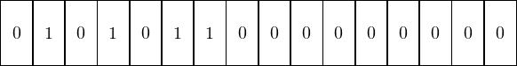  
  
Format  
  SUBF  
  
Description  
  Retrieves the last 2 values pushed on to the stack and apply a substraction onto them, pushing back the result to the stack.  
  
Operations

   
local tmp:4 = sp;   
local tmp2:4 = sp;   
pop(tmp);   
pop(tmp2);   
push(tmp2 f− tmp);

Programming notes  
  This function exclusively deals with floating numbers  
  

\_\_\_\_\_\_\_\_\_\_\_\_\_\_\_\_\_\_\_\_\_\_\_\_\_\_\_\_\_\_\_\_\_\_\_\_\_\_\_\_\_\_\_\_\_\_\_\_\_\_\_\_\_\_\_\_\_\_\_\_\_\_\_\_\_  
Operation Code  
  
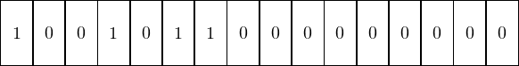  
  
Format  
  MULF  
  
Description  
  Retrieves the last 2 values pushed on to the stack and apply a multiplication onto them, pushing back the result to the stack.  
  
Operations

   
local tmp:4 = sp;   
local tmp2:4 = sp;   
pop(tmp);   
pop(tmp2);   
push(tmp2 f∗ tmp);

Programming notes  
  This function exclusively deals with floating numbers  
  

\_\_\_\_\_\_\_\_\_\_\_\_\_\_\_\_\_\_\_\_\_\_\_\_\_\_\_\_\_\_\_\_\_\_\_\_\_\_\_\_\_\_\_\_\_\_\_\_\_\_\_\_\_\_\_\_\_\_\_\_\_\_\_\_\_  
Operation Code  
  
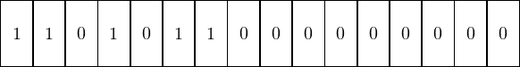  
  
Format  
  DIVF  
  
Description  
  Retrieves the last 2 values pushed on to the stack and apply a division onto them, pushing back the result to the stack.  
  
Operations

   
local tmp:4 = sp;   
local tmp2:4 = sp;   
pop(tmp);   
pop(tmp2);   
push(tmp2 f/ tmp);

Programming notes  
  This function exclusively deals with floating numbers  
  

\_\_\_\_\_\_\_\_\_\_\_\_\_\_\_\_\_\_\_\_\_\_\_\_\_\_\_\_\_\_\_\_\_\_\_\_\_\_\_\_\_\_\_\_\_\_\_\_\_\_\_\_\_\_\_\_\_\_\_\_\_\_\_\_\_  
Operation Code  
  
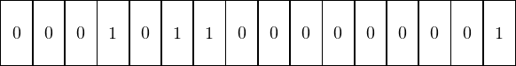  
  
Format  
  MODF  
  
Description  
  Retrieves the last 2 values pushed on to the stack and apply a modulo onto them, pushing back the result to the stack.  
  
Operations

   
local tmp:4 = sp;   
local tmp2:4 = sp;   
pop(tmp);   
pop(tmp2);   
# primitive doesn’t exist, so we do with what we can   
local ret:4 = fmod(tmp2, tmp);   
push(ret);

Programming notes  
  This function exclusively deals with floating numbers  
  

\_\_\_\_\_\_\_\_\_\_\_\_\_\_\_\_\_\_\_\_\_\_\_\_\_\_\_\_\_\_\_\_\_\_\_\_\_\_\_\_\_\_\_\_\_\_\_\_\_\_\_\_\_\_\_\_\_\_\_\_\_\_\_\_\_  
Operation Code  
  
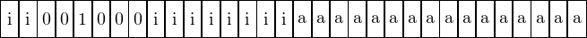  
  
Format  
  JMP ri, addr  
  
Description  
  Change the control flow to the given address addr and saves the instruction following it as the return pointer.  
  
Operations

   
call LABEL8;

Programming notes  
  Argument ri is currently unknown. The following address relocation formula is applied when decoding a into addr: addr \= inst\_start + (a ∗ 2) + 4 where inst\_start is the beginning of the instruction.  
  

\_\_\_\_\_\_\_\_\_\_\_\_\_\_\_\_\_\_\_\_\_\_\_\_\_\_\_\_\_\_\_\_\_\_\_\_\_\_\_\_\_\_\_\_\_\_\_\_\_\_\_\_\_\_\_\_\_\_\_\_\_\_\_\_\_  
Operation Code  
  
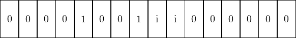  
  
Format  
  EXIT ri  
  
Description  
  Completely stops the execution flow of the AI Parser with return code ri  
  
Operations

   
exit(iarg:1);

Programming notes  
  In the bitwise encoding ri is encoded as r \= ri − 1  
  

\_\_\_\_\_\_\_\_\_\_\_\_\_\_\_\_\_\_\_\_\_\_\_\_\_\_\_\_\_\_\_\_\_\_\_\_\_\_\_\_\_\_\_\_\_\_\_\_\_\_\_\_\_\_\_\_\_\_\_\_\_\_\_\_\_  
Operation Code  
  
  
  
Format  
  RET  
  
Description  
  Stops the execution flow and return back to the last saved function call  
  
Operations

   
return\[ra\];

\_\_\_\_\_\_\_\_\_\_\_\_\_\_\_\_\_\_\_\_\_\_\_\_\_\_\_\_\_\_\_\_\_\_\_\_\_\_\_\_\_\_\_\_\_\_\_\_\_\_\_\_\_\_\_\_\_\_\_\_\_\_\_\_\_  
Operation Code  
  
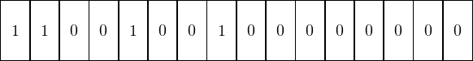  
  
Format  
  PUSH.CA  
  
Description  
  Pushes the last cached stack value to the stack  
  
Operations

Programming notes  
  This seems to have the same effect as PUSH.C but without doing a POP. I have no clue why both of those instructions exist alongisde another.  
  

\_\_\_\_\_\_\_\_\_\_\_\_\_\_\_\_\_\_\_\_\_\_\_\_\_\_\_\_\_\_\_\_\_\_\_\_\_\_\_\_\_\_\_\_\_\_\_\_\_\_\_\_\_\_\_\_\_\_\_\_\_\_\_\_\_  
Operation Code  
  
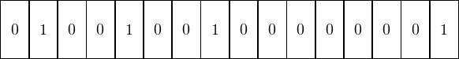  
  
Format  
  PUSH.C  
  
Description  
  Pops the latest value from the stack and pushes it back twice  
  
Operations

\_\_\_\_\_\_\_\_\_\_\_\_\_\_\_\_\_\_\_\_\_\_\_\_\_\_\_\_\_\_\_\_\_\_\_\_\_\_\_\_\_\_\_\_\_\_\_\_\_\_\_\_\_\_\_\_\_\_\_\_\_\_\_\_\_  
Operation Code  
  
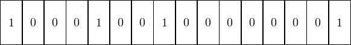  
  
Format  
  SIN  
  
Description  
  Retrieves the latest value pushed to the stack and apply a sinus onto it, pushing it to the stack  
  
Operations

   
local tmp:4 = sp;   
pop(tmp);   
local ret:4 = sin(tmp);   
push(ret);

Programming notes  
  Radians are used as input. Radians used are modulo \[π − 2π\]  
  

\_\_\_\_\_\_\_\_\_\_\_\_\_\_\_\_\_\_\_\_\_\_\_\_\_\_\_\_\_\_\_\_\_\_\_\_\_\_\_\_\_\_\_\_\_\_\_\_\_\_\_\_\_\_\_\_\_\_\_\_\_\_\_\_\_  
Operation Code  
  
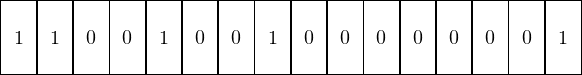  
  
Format  
  COS  
  
Description  
  Retrieves the latest value pushed to the stack and apply a cosinus onto it, pushing it to the stack  
  
Operations

   
local tmp:4 = sp;   
pop(tmp);   
local ret:4 = cos(tmp);   
push(ret);

Programming notes  
  Radians are used as input. Radians used are modulo \[π − 2π\]  
  

\_\_\_\_\_\_\_\_\_\_\_\_\_\_\_\_\_\_\_\_\_\_\_\_\_\_\_\_\_\_\_\_\_\_\_\_\_\_\_\_\_\_\_\_\_\_\_\_\_\_\_\_\_\_\_\_\_\_\_\_\_\_\_\_\_  
Operation Code  
  
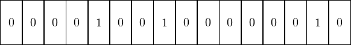  
  
Format  
  DEGR  
  
Description  
  Retrieves the last element pushed to the stack and converts it to radians, pushing it to the stack  
  
Operations

   
local tmp:4 = sp;   
pop(tmp);   
local ret:4 = degrees\_to\_radians(tmp);   
push(ret);

Programming notes  
  Radians used are modulo \[π − 2π\]  
  

\_\_\_\_\_\_\_\_\_\_\_\_\_\_\_\_\_\_\_\_\_\_\_\_\_\_\_\_\_\_\_\_\_\_\_\_\_\_\_\_\_\_\_\_\_\_\_\_\_\_\_\_\_\_\_\_\_\_\_\_\_\_\_\_\_  
Operation Code  
  
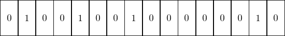  
  
Format  
  RADD  
  
Description  
  Retrieves the last element pushed to the stack and converts it to degrees, pushing it to the stack  
  
Operations

   
local tmp:4 = sp;   
pop(tmp);   
local ret:4 = radians\_to\_degrees(tmp);   
push(ret);

Programming notes  
  Radians used are modulo \[π − 2π\]  
  

\_\_\_\_\_\_\_\_\_\_\_\_\_\_\_\_\_\_\_\_\_\_\_\_\_\_\_\_\_\_\_\_\_\_\_\_\_\_\_\_\_\_\_\_\_\_\_\_\_\_\_\_\_\_\_\_\_\_\_\_\_\_\_\_\_  
Operation Code  
  
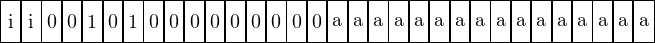  
  
Format  
  syscall ri, ra  
  
Description  
  Executes a System Call, using the stack as arguments  
  
Operations

   
system\_call(opesub:4,ope2:4);

Programming notes  
  Refer to the syscall own documentation chapter for more information about this instruction.  
  

Chapter 3  
System Calls
------------------------

3\. System Calls  
\_\_\_\_\_\_\_\_\_\_\_\_\_\_\_\_\_\_\_\_\_\_\_\_\_\_\_\_\_\_\_\_\_\_\_\_\_\_\_\_\_\_\_\_\_\_\_\_\_\_\_\_\_\_\_\_\_\_\_\_\_\_\_\_\_  

KH2AI has an instruction used to call some functions into the base game, which we call syscall, short for System Call. None of them are currently documented, they are available at address 0x0034dd00 of SLPM\_666.75, which is Kingdom Hearts 2 Final Mix ELF file. If you want to contribute you can submit your syscall findings at [https://framaforms.org/kh2ai-report-errata-1577102965](https://framaforms.org/kh2ai-report-errata-1577102965) for them to be incorporated into the next release of the ISA.

Chapter 4  
Known issues
------------------------

4\. Known issues  
\_\_\_\_\_\_\_\_\_\_\_\_\_\_\_\_\_\_\_\_\_\_\_\_\_\_\_\_\_\_\_\_\_\_\_\_\_\_\_\_\_\_\_\_\_\_\_\_\_\_\_\_\_\_\_\_\_\_\_\_\_\_\_\_\_  

As this is very much a work-in-progress project, much of the ISA has yet to stabilize before getting a stable documentation and some issues still exist. You will find below some of those.

While the disassemblers knows the size of all instructions and is able to get a complete unbroken output, some functions are still partly or fully unknown and as such cannot be assembled yet, nor are they understood by the decompiler. Such instructions will most likely have ”unk” in their name.

Sometimes, syscalls take for arguments function pointers. An analyzer has been created to be able to analyze this specific case but I have been unable to find a way to get a similar instruction but resolving the relocation without breaking the assembler. As such pointers are written down as comments next to the instruction. You would have to use those to verify X-Refs until a better solution is found.

Chapter 5  
Appendix
--------------------

5\. Appendix  
\_\_\_\_\_\_\_\_\_\_\_\_\_\_\_\_\_\_\_\_\_\_\_\_\_\_\_\_\_\_\_\_\_\_\_\_\_\_\_\_\_\_\_\_\_\_\_\_\_\_\_\_\_\_\_\_\_\_\_\_\_\_\_\_\_  

   
define space ram type=ram\_space size=4 wordsize=1 default;   
define space register type=register\_space size=4;   
   
# this is obviously wrong and will need to be edited when i understand how   
# internal regs are used besides stack   
define register offset=0 size=4 \[   
    r0 r1 r2 r3 r4 r5 r6   
    r7 r8 pc sp ra broken   
\];   
   
define token instr(16)   
    opcode = (0, 3)   
    ssub\_opc = (6, 15)   
    sub\_opc = (4, 5)   
    iarg = (14, 15);   
   
define token instr\_ext(32)   
    opcode\_ext = (0, 3)   
    sub\_opc\_ext = (4, 5)   
    opesub = (6, 7)   
    \_opesub = (6, 7)   
    rn = (6, 7)   
    ope3 = (6, 15)   
    full\_ext = (0, 31)   
    full\_rel = (0, 31) signed   
# the label thingy   
    ope2 = (16, 31)   
    \_ope2 = (16, 31)   
    ope2s = (16, 31) signed;   
   
# relocated labels   
LABEL8: reloc is ope2s\[ reloc = inst\_start+(ope2s∗2)+4; \]    { export ∗:4 reloc; }   
LABEL02: reloc is ope2s\[ reloc = 0x10+(ope2s∗2); \]    { export ∗:4 reloc; }   
#LABELV: reloc is full\_rel    \[ reloc = 0x10+(full\_rel∗2); \]{ export ∗:4 reloc; }   
NOT\_LABEL03: reloc is ope2s    \[ reloc = 0x10+(ope2s∗2); \]    { tmp:4 = reloc:4; export tmp; }   
#CLABEL: reloc is full\_ext    \[ reloc = 0x10+(full\_ext∗2); \]{ export ∗:4 reloc; }   
   
# if i’m not mistaken 0x1da4d8 1 and 2 uses two regs   
# one of them or more is a status reg so i’ll have to double check how it’s used   
attach variables \[ rn \] \[ r0 r1 r2 r3 \];   
   
# exit values   
attach values \[ iarg \] \[ 1 2 \_ \_ \];   
   
   
define pcodeop system\_call;   
define pcodeop fmod;   
define pcodeop exit;   
define pcodeop cos;   
define pcodeop sin;   
define pcodeop radians\_to\_degrees;   
define pcodeop degrees\_to\_radians;   
   
   
macro push(v) {   
    ∗\[ram\]:4 sp = v;   
    sp = sp + 4;   
}   
   
macro pop(v) {   
    sp = sp − 4;   
    v = ∗\[ram\]:4 sp;   
}   
   
macro to\_address(v) {   
    if(v!=0) goto <address\>;   
        v=0;   
        goto <end\>;   
    <address\>   
        v=0x10+(v∗2);   
    <end\>   
}
