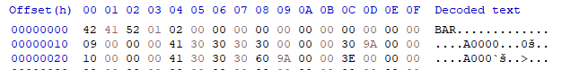
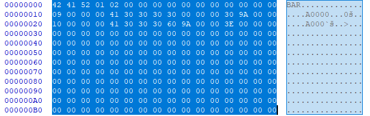
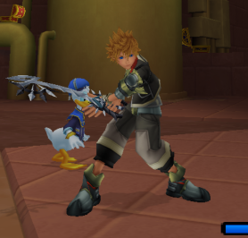

# [Kingdom Hearts II](../../index.md) - Interpolated motion

Okay, so this doc is is for people to look at and think “so that’s what an ANB does”.

I’ll jump into it, so first off, download the stuff in kkdf2’s gitlab for the msetDoc. Get it [here](https://gitlab.com/kenjiuno/msetDoc).

This is because it’s better to look back and forth between ours to get a more thorough understanding.

Then [download this](https://drive.google.com/file/d/1vVFq4DSlmXR7wTT1eoUKIFMAoihKzVeq/view?usp=sharing): it’s a group of files to help follow along.

ANBs are stored in MSETs, as I’m sure you know, so extract one (I’ve provided you with A000, P_EX100’s Battle Idle, since it’s the one use in kkdf2’s docs, it’s easier to follow along with) and all things should apply the same

First (again), open the anb (A000) in the hex editor of your choosing, I’m using HxD, then set the bytes to 16 bytes a line. The first 3 lines should be

This is just telling what anb it is, nothing groundbreaking.

The first 12 lines are useless in terms of doing things in the game, in this case, I deleted them, `A000 top chunk off so that it matchs kkdf2's formating for the first part` is the result of this. *Note, re add the deleted lines at the end of the process, I’m simply telling you to delete lines in order to make viewing the bytes more manageable, and to follow the initial docs.

Now, change the bytes per line to 8, and then go to offset 000000B0. This is where the fun begins.

Scroll Down.

The `Red` is the bones number

The `Blue` is the type of modification (translate, scale, rotate)

The `Green` is the extent to which is is modified

## Format description

Display the values that correspond to the action of the bone. Full credits to kkdf2 for the chart.

| Topic   | Description
|---------|----------------
| Joint#  | Apply fixed value for ax in joint specified by `joint#`
| Channel |
| Value   |

Those are the known accepted values for the Joint channel

| Channel | Description
|---------|---------------
| 0       | Modify `scale.x`
| 1       | Modify `scale.y`
| 2       | Modify `scale.z`
| 3       | Modify `rotate.x`
| 4       | Modify `rotate.y`
| 5       | Modify `rotate.z`
| 6       | Modify `translate.x`
| 7       | Modify `translate.y`
| 8       | Modify `translate.z`
| ...     | unresearched

## Samples

P_EX100 has 227 bones, most if not all of which are present, and the bones are labeled in hex, so bone 1 is “01” and  bone 227 is “E3”.

As kkdf2 (from now on referred to as Mr. Kenjiuno) discovered, the bytes in each line  “destroy the mdlx”, in other words, it poses the model into the desired shape bone by bone until you get the main pose wanted.

The above image is an example of me messing with what is the X Axis Rotate Value on bone 2.

All other bones not paired to bone 2 will be unaffected.

Now is where things get a lot more tricky to understand, but bare with me.

Go to line offset 00000F88 (remember, we have it set to 8 bytes per line) in `A000 top chunk off so that it matchs kkdf2's formating for the first part`, the bytes should read as follows `00 00 03 0A 00 00 00 00` once you’re here, delete all bytes above this for simplicity sake, and save as a new file (re add the cut files once the process is done). Once all bytes above are gone, set bytes per line to 6.

Keep Reading

The `Red` is the bones number

The `Blue` is the type of modification (translate, scale, rotate)

The `Green` is from what I can gather, a pointer that specifies what kind of interpolation occurs and for how long

The Purple is unknown from what I’ve read.

*Refer to Mr. Kenjiuno’s docs about this section to understand more, the explanation I’ve given will help to further understand what he’s said: `t2` in his doc

Most if not all data below this section is dedicated to interpolation and the process of it, however, there is one section in which the IK (Inverse Kinematics) is called on. Because I can’t figure this section of his docs, and because Mr. Kenjuino stated that they were speculations as he goes further into the ANB, I strongly recommend following the rest of his docs, this doc’s main purpose was to give basic info to help understand the more complex stuff.

**This Doc needs to be improved, if you have any insights, please revise any errors, the goal is to have the most comprehensive, yet understandable explanation.
