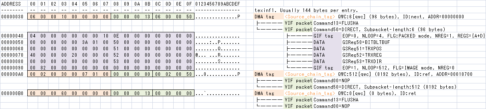
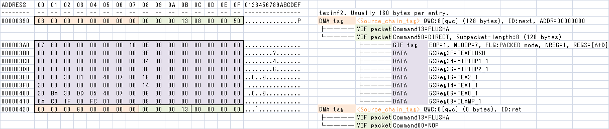
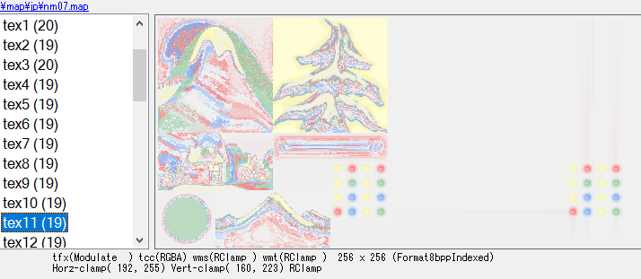

# [Kingdom Hearts II](../index.md) - Raw Texture

This is used by 3D models of Kingdom Hearts II to give them a texture.

The format holds low-level data to instruct the Playstation 2 where to store the texture in the VRAM and how the GPU should use it for rendering.

When GS is mentioned, it refers to the Playstation 2 GPU.

## Header

| Offset | Type   | Description
|--------|--------|-------------
| 0      | uint32 | Magic code. Always 0.
| 4      | int32  | Color count. How many individual colors are stored in the CLUT.
| 8      | int32  | [Texture transfer info](#texture-transfer-info) count. 16 bytes aligned.
| 12     | int32  | [GS Info](#gs-info) count.
| 16     | int32  | [Offset data](#offset-data) count.
| 20     | int32  | [CLUT transfer info](#clut-transfer-info) offset. And then [Texture transfer info](#texture-transfer-info) follows.
| 24     | int32  | [GS Info](#gs-info) offset.
| 28     | int32  | Picture offset, where all the pixels are located. 128 bytes aligned.
| 32     | int32  | Palette offset, where the whole palette is located.

## Offset data

The offset data tells what Texture Info is associated to a specific GS Info.

The algorithm is `textureInfo = textureInfoTable[OffsetData[gsInfoIndex]]`.

## CLUT transfer info

CLUT (color lookup table) is a Playstation 2 term. It is same as _color palette_.

CLUT transfer info is used to transfer entire CLUT data to GS VRAM.

The data structure is: [Data transfer info](#data-transfer-info).

## Texture transfer info

It is supposed to be used to interpret picture information on the process to upload them to the GS VRAM.

The data structure is: [Data transfer info](#data-transfer-info).

## Data transfer info

Before the expected data reaches to GS VRAM, it needs to pass over several peripherals: EE → DMA → VIF → GIF → GS

- EE (Playstation 2 CPU)
- DMA (Direct Memory Access)
- VIF (VPU1 interface)
- GIF (GS interface)
- GS (Playstation 2 GPU)

Thus final data is encapsulated some times with their tags.



| Offset | Type   | Descriptor
|--------|--------|------------
| 0      | int32  | Always 0x10000006
| 4      | int32  | Always 0
| 8      | int32  | Always 0x13000000
| 12     | int32  | Always 0x50000006
| 16     | int32  | Always 4
| 20     | int32  | Always 0x10000000
| 24     | int32  | Always 14
| 28     | int32  | Always 0
| 32     | int32  | Always 0
| 36     | int32  | 
| 40     | int32  | 
| 44     | int32  | Always 0
| 48     | int32  | Always 0
| 52     | int32  | Always 0
| 56     | int32  | Always 0x51
| 60     | int32  | Always 0
| 64     | int32  | 
| 68     | int32  | 
| 72     | int32  | Always 0x52
| 76     | int32  | Always 0
| 80     | int32  | Always 0
| 84     | int32  | Always 0
| 88     | int32  | Always 0x53
| 92     | int32  | Always 0
| 96     | int32  | 
| 100    | int32  | Always 0
| 104    | int32  | Always 0
| 108    | int32  | Always 0
| 112    | int32  | 
| 116    | int32  | Data offset, where either clut or texture is stored
| 120    | int32  | Always 0
| 124    | int32  | 
| 128    | int32  | 
| 132    | int32  | Always 0
| 136    | int32  | Always 0x13000000
| 140    | int32  | Always 0

## GS info

GS info describes how the pictures stored into GS VRAM are supposed to be used by GS.



| Offset | Type   | Descriptor
|--------|--------|------------
| 0      | int64  | Always 0x0000000010000008
| 8      | int64  | Always 0x5000000813000000
| 16     | int64  | Always 0x1000000000008007
| 24     | int64  | Always 14
| 32     | int64  | Always 0
| 40     | int64  | Always 0x3f
| 48     | int64  | 
| 56     | int64  | Always 0x34
| 64     | int64  | 
| 72     | int64  | Always 0x36
| 80     | int64  | 
| 88     | int64  | Always 0x16
| 96     | int64  | 
| 104    | int64  | Always 0x14
| 112    | int64  | [GS TEX0 register](../../common/tm2.md#gstex)
| 120    | int64  | [Texture Wrap Mode](#texture-wrap-mode)
| 128    | int64  | 
| 136    | int64  | Always 8
| 144    | int64  | Always 0x0000000060000000
| 152    | int64  | Always 0x0000000013000000

_Note for 4-bpp images:_

- Utilize `TEX2_1` register for:
  - set PSMT8 to PSM for uploading 1KB (256 color entries) clut table into GS clut buffer.
  - set 4 to CLD for clut buffer upload.
- And then use `TEX0_1` register for:
  - set CSA (0 to 31) for index offseting.
  - set PSMT4 to PSM for indexed 4-bpp texture.
  - set 0 to CLD for refrain clut upload.

## Texture Wrap Mode

In PlayStation 2 graphics, texture wrapping does not only occur when UV are `<0.0` or `>1.0`, but it is possible to define a custom wrap box. This is done by the Texture Wrap register.

| Bit | Count | Name | Description
|-----|-------|------|------------
| 0   | 2     | WMS  | Defines the [wrap mode](#wrap-mode) for the U coordinate
| 2   | 2     | WMT  | Defines the [wrap mode](#wrap-mode) for the V coordinate
| 4   | 10    | MINU | Lower clamp value for U coordinate
| 14  | 10    | MAXU | Upper clamp value for U coordinate
| 24  | 10    | MINU | Lower clamp value for V coordinate
| 34  | 10    | MAXU | Upper clamp value for V coordinate
| 44  | 20    |      | not used

MINx and MAXx are only applied if the [wrap mode](#wrap-mode) is of type `REGION`.

## Wrap Mode (also called WMS and WMT)

| Value | Description
|-------|------------
| 0     | REPEAT
| 1     | CLAMP
| 2     | REGION_REPEAT
| 3     | REGION_CLAMP

## Texture Animation Metadata

Includes parameters for animating textures. This section appears at the end of the file.

The main header does not directly provide an offset to this metadata. Instead, this offset is calculated as the sum of the CLUT data offset and the total byte size of CLUT data.

Each block begins with a 4-byte tag and an optional byte size field, followed by the data itself.

| Offset | Type    | Descriptor
|--------|---------|------------
| 0      | char[4] | Tag name. See below sub-sections for possible tags.
| 4      | uint32  | Total byte size of data. Present for all tags except _KN5.
| 8      |         | Data. Varies by tag.

### UVSC (UV Scroll)

Provides a single pair of U and V speed factors for texture scrolling. Entries in the VIF table for the model may apply scrolling by specifying an index corresponding with a UVSC entry.

| Offset | Type    | Descriptor
|--------|---------|------------
| 0      | char[4] | "UVSC"
| 4      | uint32  | Total byte size of data. Always `0xC`.
| 8      | uint32  | UVSC entry target index.
| 12     | float   | U scroll speed.
| 16     | float   | V scroll speed.

_Notes:_

- The engine can manage up to 16 UVSC entries simultaneously.
- 6,400,000 will be enough to scroll 1 round per 1 second.
- Negative scroll speed is acceptable too.

### TEXA (Texture Animation)

Provides parameters and image data for rendering sprite animations for a single texture. Consists of one or more frame tables for animations as well as raw image data for individual sprites.

Most of the GS register fields used to upload the base image texture, including the base pointer, buffer width and pixel storage format, are used to upload sprite image data for the active animation frame to GS memory (see [Texture transfer info](#texture-transfer-info)). The pixel offset and size of the transmission area (dsax, dsay, rrw, rrh) are set such that the upload overwrites the base image at the given region with image data for the sprite. All sprites under a single TEXA tag are the same size and pixel format, which means that these parameters are constant across all animations.

Image data for sprites is stored contiguously. Starting offsets for each image are calculated using a sprite index as well as the sprite dimensions and bits per pixel specified in the tag header.

| Offset | Type    | Descriptor
|--------|---------|------------
| 0      | char[4] | "TEXA"
| 4      | uint32  | Total byte size of data.
| 8      | uint16  | 
| 10     | uint16  | Texture index (GS Info index) to apply the animation.
| 12     | uint16  | Frame stride in halfwords for entries in the [frame table](#frame-table-entry).
| 14     | uint16  | Bits per pixel of sprite image data.
| 16     | uint16  | Base slot index. Applies to entries in the [slot table](#animation-slot-table).
| 18     | uint16  | Maximum slot index. Applies to entries in the [slot table](#animation-slot-table).
| 20     | uint16  | Number of animations.
| 22     | uint16  | Number of sprites in sprite image data.
| 24     | uint16  | U offset in base image in pixels (dsax).
| 26     | uint16  | V offset in base image in pixels (dsay).
| 28     | uint16  | Sprite width in pixels (rrw).
| 30     | uint16  | Sprite height in pixels (rrh).
| 32     | uint32  | Offset of [slot table](#animation-slot-table).
| 36     | uint32  | Offset of [animation table](#animation-table-entry).
| 40     | uint32  | Offset of sprite image data.
| 44     | uint32  | Default animation index (idle).

_Notes:_

- The offsets in TEXA are based on offset 8 (not offset 0), where heading 8 bytes are part of common header of metadata.
- GS Info vs TEXA is 1:N. One texture pointed by GS info may be updated by two or more TEXA entries simultaneously.

This is sample placement of TEXA metadata.

```txt
14:93C0h: 5F 44 4D 59 00 00 00 00 54 45 58 41 50 12 00 00  _DMY....TEXAP... 
14:93D0h: <--   TEXA header                              
14:93E0h:                                                
14:93F0h:                     --> <--   Slot table       
...
14:95F0h:                     --> <--   A --> <--   F      // A is anim table (4 bytes)
14:9600h:                                                  // F is frame table (30 bytes)
14:9610h:         --> 00 00 00 00 00 00 00 00 00 00 00 00
14:9620h: <--   Sprite image data                        
...
14:A610h:                                             -->
14:A620h: 5F 44 4D 59 00 00 00 00 54 45 58 41 50 12 00 00  _DMY....TEXAP... 
```

Sample: TEXA header from _nm07.map_:

```
14:93D0h: 1C 00 0B 00 00 00 08 00 00 00 FF 00 01 00 01 00  ..........ÿ..... 
14:93E0h: C0 00 A0 00 40 00 40 00 28 00 00 00 28 02 00 00  À. .@.@.(...(... 
14:93F0h: 50 02 00 00 00 00 00 00                          P.......
```

_Notes:_

- Slot table seems to have fixed 512 bytes length.
- Number of animations seems to be always 1 on asset maps. And anim table is 4 bytes length.
- Frame table can be considered as a script block rather than simple data array, because it has relative jump feature.

#### Animation Slot Table

This table contains animation slots where each slot may optionally be assigned an animation index. An external source can enable one of these slots to trigger a certain animation for the texture. The exact interaction with these external files is currently unknown.

| Offset | Type   | Descriptor
|--------|--------|------------
| 0      | uint32 | Animation index assigned to the slot (actual index is `value - 1`). If `0`, the slot is empty.

Sample: animation slot table from _nm07.map_:

```txt
14:93F0h:                         00 00 00 00 00 00 00 00          ........ 
14:9400h: 00 00 00 00 00 00 00 00 00 00 00 00 00 00 00 00  ................ 
14:9410h: 00 00 00 00 00 00 00 00 00 00 00 00 00 00 00 00  ................ 
14:9420h: 00 00 00 00 00 00 00 00 00 00 00 00 00 00 00 00  ................ 
14:9430h: 00 00 00 00 00 00 00 00 00 00 00 00 00 00 00 00  ................ 
14:9440h: 00 00 00 00 00 00 00 00 00 00 00 00 00 00 00 00  ................ 
14:9450h: 00 00 00 00 00 00 00 00 00 00 00 00 00 00 00 00  ................ 
14:9460h: 00 00 00 00 00 00 00 00 00 00 00 00 00 00 00 00  ................ 
14:9470h: 00 00 00 00 00 00 00 00 00 00 00 00 00 00 00 00  ................ 
14:9480h: 00 00 00 00 00 00 00 00 00 00 00 00 00 00 00 00  ................ 
14:9490h: 00 00 00 00 00 00 00 00 00 00 00 00 00 00 00 00  ................ 
14:94A0h: 00 00 00 00 00 00 00 00 00 00 00 00 00 00 00 00  ................ 
14:94B0h: 00 00 00 00 00 00 00 00 00 00 00 00 00 00 00 00  ................ 
14:94C0h: 00 00 00 00 00 00 00 00 00 00 00 00 00 00 00 00  ................ 
14:94D0h: 00 00 00 00 00 00 00 00 00 00 00 00 00 00 00 00  ................ 
14:94E0h: 00 00 00 00 00 00 00 00 00 00 00 00 00 00 00 00  ................ 
14:94F0h: 00 00 00 00 00 00 00 00 00 00 00 00 00 00 00 00  ................ 
14:9500h: 00 00 00 00 00 00 00 00 00 00 00 00 00 00 00 00  ................ 
14:9510h: 00 00 00 00 00 00 00 00 00 00 00 00 00 00 00 00  ................ 
14:9520h: 00 00 00 00 00 00 00 00 00 00 00 00 00 00 00 00  ................ 
14:9530h: 00 00 00 00 00 00 00 00 00 00 00 00 00 00 00 00  ................ 
14:9540h: 00 00 00 00 00 00 00 00 00 00 00 00 00 00 00 00  ................ 
14:9550h: 00 00 00 00 00 00 00 00 00 00 00 00 00 00 00 00  ................ 
14:9560h: 00 00 00 00 00 00 00 00 00 00 00 00 00 00 00 00  ................ 
14:9570h: 00 00 00 00 00 00 00 00 00 00 00 00 00 00 00 00  ................ 
14:9580h: 00 00 00 00 00 00 00 00 00 00 00 00 00 00 00 00  ................ 
14:9590h: 00 00 00 00 00 00 00 00 00 00 00 00 00 00 00 00  ................ 
14:95A0h: 00 00 00 00 00 00 00 00 00 00 00 00 00 00 00 00  ................ 
14:95B0h: 00 00 00 00 00 00 00 00 00 00 00 00 00 00 00 00  ................ 
14:95C0h: 00 00 00 00 00 00 00 00 00 00 00 00 00 00 00 00  ................ 
14:95D0h: 00 00 00 00 00 00 00 00 00 00 00 00 00 00 00 00  ................ 
14:95E0h: 00 00 00 00 00 00 00 00 00 00 00 00 00 00 00 00  ................ 
14:95F0h: 00 00 00 00 00 00 00 00                          ........         
```

#### Animation Table Entry

| Offset | Type   | Descriptor
|--------|--------|------------
| 0      | uint32 | Offset of first frame in the [frame table](#frame-table-entry).

Sample: animation table entry from _nm07.map_:

```txt
14:95F0h:                         2C 02 00 00                      ,...     
```

_Note:_ 0x22C points first Frame Table entry.

#### Frame Table Entry

| Offset | Type         | Descriptor
|--------|--------------|------------
| 0      | uint16 : 0-3 | Frame control. <br> `0`: Enable sprite <br> `1`: Disable sprite (use the base image) <br> `2`: Jump to given frame offset (loop) <br> `3`: Stop the animation
| 0      | int16 : 4-15 | Loop offset in number of frames. Need sign extended using MSB (most significant bit). Usually < 0 if present, and moving to start of this table.
| 2      | uint16       | Minimum length of frame.
| 4      | uint16       | Maximum length of frame.
| 6      | uint16       | Sprite image index.

If minimum length < maximum length, a random number between [minimum, maximum] is selected as the length the frame. Random intervals are used in cases such as blinking animations for characters.

Sample: frame table entry from _nm07.map_:

```txt
14:95F0h:                                     01 00 3C 00              ..<. 
14:9600h: 3C 00 00 00 00 00 3C 00 3C 00 00 00 E2 FF 00 00  <.....<.<...âÿ.. 
14:9610h: 00 00 00 00                                      ....             
```

Sample reading:

| Frame control | Loop offset | Min | Max | Sprite Index
|---------------|:-----------:|:---:|:---:|--------------
| DisableSprite | 0           | 60  | 60  | 0
| EnableSprite  | 0           | 60  | 60  | 0
| Jump          | -2          | 0   | 0   | 0

#### Sample TEXA representation

From _nm07.map_ decoded by using 010 Editor's Binary Template:

| Name | Value | Start | Size |
|---|---|---|---|
| struct texAnimTexa texa |  | 1493D0h | 28h |
| ushort unk1 | 28 | 1493D0h | 2h |
| ushort texIndex | 11 | 1493D2h | 2h |
| ushort frameStride | 0 | 1493D4h | 2h |
| ushort bitsPerPixel | 8 | 1493D6h | 2h |
| ushort minSlotIdx | 0 | 1493D8h | 2h |
| ushort maxSlotIdx | 255 | 1493DAh | 2h |
| ushort numAnims | 1 | 1493DCh | 2h |
| ushort numSprites | 1 | 1493DEh | 2h |
| ushort uOff | 192 | 1493E0h | 2h |
| ushort vOff | 160 | 1493E2h | 2h |
| ushort rrw | 64 | 1493E4h | 2h |
| ushort rrh | 64 | 1493E6h | 2h |
| uint slotTableOffset | 40 | 1493E8h | 4h |
| uint animTableOffset | 552 | 1493ECh | 4h |
| uint spriteImageOffset | 592 | 1493F0h | 4h |
| uint defAnimIdx | 0 | 1493F4h | 4h |

`tex11` is 12th GS Info in _nm07.map_. And `tex11` is the target texture pointed from first TEXA metadata. This TEXA is same metadata as described at previous sections.



The left texture is base 256x256 image. The color palette looks wrong entirely, because this single image consists of at least 7 individual sub parts. It means that seven GS Infos refer this single image.

The right texture is a region-clamped 64x64 texture image using UV offset (192, 160), with proper palette.

The image generated with frame:

| Frame index | Output sprite image | Applied effect
|-------------|---------------------|------------
| 0           |  | Renders part (192, 160, 255, 223) of original texture
| 1           |  | Replace part (192, 160, 255, 223) with embedded sprite image.
| 2           | No image | Immediately jump to frame index 0 (due to loopOffset = -2)

### _DMY

Dummy tag used for padding.

| Offset | Type    | Descriptor
|--------|---------|------------
| 0      | char[4] | "_DMY"
| 4      | uint32  | Total byte size of data. Always `0`.

This is sample placement of `_DMY` found in _nm07.map_. The following `TEXA` metadata can be aligned on 16 bytes boundary.

```txt
14:93C0h: 5F 44 4D 59 00 00 00 00 54 45 58 41 50 12 00 00  _DMY....TEXAP... 
14:93D0h: <--             TEXA metadata
14:93B0h:                                             -->
14:A620h: 5F 44 4D 59 00 00 00 00 54 45 58 41 50 12 00 00  _DMY....TEXAP... 
14:A630h: ...
```

### _KN5

Indicates end of metadata.

| Offset | Type    | Descriptor
|--------|---------|------------
| 0      | char[4] | "_KN5"
