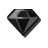
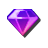

# [OpenKh Tool Documentation](../../../OpenKh.Kh2/Messages) - KH2 Text Editor

Welcome to the official OpenKh tool documentation!
This document assumes you are already familiar with either compiling or acquiring the released version of the KH2 Text Editor bundled with OpenKh and have a dumped copy of the ISO. If you do not know how, consult the nearest Organizer for help.

In this particular document, we will be taking a look at the first fully functional text editor program for Kingdom Hearts II.

## Navigating the Tool

First and foremost, one you have opened the program, you need to open both the fontimage.bar and fontinfo.bar files (located in ./KH2/msg/jp), which can be done so like this:


Afterwards, open the desired .bar file containing the text in question that you would like to edit. For this documentation, we will go with sys.bar, which contains all frequently referenced, important, and miscellaneous text.


## Basic Text Editing

Now that we've got our sys.bar open, let's say we want to edit some of the Command Menu text. It should be easy enough. Let's change its text output from the classic "Attack" to something more fierce. How about "Slash"?


There is a search bar at yor disposal in the bottom left which will greatly help you narrow down your search for specific strings of text! Once we've changed all of our basic single line text, such as "Attack", "Magic", and whatnot, let's save the file to a new location so we don't accidentaly overwrite the original.


After saving, we can finally patch in our simple edit to see if the changes are reflected in-game!


Uh-Oh! Some of our changed text is going a little farther than it should. We'll fix that and do some other neat adjustments in the next section!

## Advanced Text Editing

Before we get started, here's just how fancy text editing can get with this powerful tool!


As far as we know, this is just the tip of the iceberg. There are many more powerful functions built into this very tool, and the best part is it's utilizing functions in the game engine itself! There's a somewhat lengthy list of commands that can be called for various purposes, from width-scaling to forcing specific colors and transparency, and more! We'll now be going over how exactly to utilize these string maps we have at our disposal.

For now, let's list all the primary functions you will be likely to use, their type indicator, and detail exactly what they do:

| Type | Human-Readable Format 	| Description
|------|------------------------|------------------------
| 02   | {:newline}             | Feeds a new line to the current selected text.
| 07   | {:color #FFFFFFFF}     | Forces all text after this argument to appear as the specified color in Hex.
| 09   | {:icon icon-name}      | Displays the named icon within the text string.
| 0A   | {:scale Value}         | Forces all text after this argument to scale proportionately to the original size (16 is normal).
| 0B   | {:width Value}         | Forces all text after this argument to scale only in width, leaving height untouched (100 is normal, 72 for widescreen fixed).
| 10   | {:clear}               | Nullifies all text in the selected string after this argument is placed.
| 11   | {:position X,Y}        | Forces text after this argument to appear X,Y pixels away from the origin point of the text string on screen.

While there are more types, as of writing these are the primary ones you might wish to use, since they generally cover all your bases. Let's get down to showing examples of both using the text edited for our Command Menu in the previous image!

While it's a ridiculous setup and you would never use it practically, in order to fix the width spacing and add all those fancy colors to the transformation text, my text string ended up looking like this:
```{:width 50}{:color #75FFFFFF}T{:color #FF75FFFF}r{:color #FFFF75FF}a{:color #C3FFFFFF}n{:color #FFC3FFFF}s{:color #FFFFC3FF}f{:color #00C3FFFF}o{:color #FF00C3FF}r{:color #FF00C3FF}m{:color #C3FF00FF}a{:color #C325FFFF}t{:color #FFC325FF}i{:color #25FFC3FF}o{:color #C325FFFF}n{:color #FFFFFFFF}s```

It's certainly not practical, but it's cool nonetheless that we can do such a thing! It really doesn't get any simpler than this though. To start, I needed to determine that all the text should scale in width proportionately, so I made sure to place my {:width 50} argument at the very beginning so I didn't have to do it for every individual letter, as the arguments apply to everything that come after it!

**In addition to the aforementioned arguments, certain special characters such as Roman numberals can be called at any point by using arguments such as {I}, {III}, {XIII}, and so forth.**

Let's test some more arguments for various texts in our sys.bar.

| Line Number | Original Text                          | New Text
|-------------|----------------------------------------|-----------------------
| 480         | Attack                                 | {:color 952121FF}Slash
| 481         | Magic                                  | {:color 214D95FF}Mana
| 482         | Items                                  | {:width 64}{:color 219542FF}Consumables
| 483         | Drive                                  | {:width 50}{:color 218995FF}Transformations
| 14133       | Kingdom Hearts                         | {:icon form}{:color D3D971FF}Classic Menu{:icon form}
| 14135       | Keep the look of the original command menu. | {:scale 24}{:color D3D971FF}Use this if you prefer the classic{:newline}Command Menu.


And how it all appears in-game:


## Closing Notes

Now that you've got a pretty good idea of how the text works, feel free to experiment and see what all you can come up with! As mentioned earlier, there are more arguments that can be used, but for the sake of preventing this documentation from being too complicated, for now it's just covering the core functions that the majority of people will use.

As a farewell, here's a list of all the {:icon} arguments you can use to spice up your text as you see fit!

| Icon-Name (Alphabetical)  | Icon
|---------------------------|---------
| ability-equip             | 
| ability-unequip           | 
| accessory                 | 
| ai-mode-frequent          | 
| ai-mode-moderate          | 
| ai-mode-rare              | 
| ai-settings               | 
| armor                     | 
| auto-equip                | 
| button-circle             | 
| button-cross              | 
| button-dpad               | 
| button-l1                 | 
| button-l2                 | 
| button-r1                 | 
| button-r2                 | 
| button-select             | 
| button-square             | 
| button-start              | 
| button-triangle           | 
| exclamation-mark          | 
| form                      | 
| gem-blazing               | 
| gem-bright                | 
| gem-dark                  | 
| gem-dense                 | 
| gem-energy                | 
| gem-frost                 | 
| gem-lightning             | 
| gem-lucid                 | 
| gem-mythril               | 
| gem-orichalcum            | 
| gem-power                 | 
| gem-serenity              | 
| gem-twilight              | 
| gumi-block                | 
| gumi-blueprint            | 
| gumi-brush                | 
| gumi-gear                 | 
| gumi-ship                 | 
| item-consumable           | 
| item-key                  | 
| item-tent                 | 
| magic                     | 
| magic-nocharge            | 
| material                  | 
| party                     | 
| question-mark             | 
| rank-a                    | 
| rank-b                    | 
| rank-c                    | 
| rank-s                    | 
| remembrance               | 
| tranquil                  | 
| weapon-keyblade           | 
| weapon-keyblade-equip     | 
| weapon-shield             | 
| weapon-shield-equip       | 
| weapon-staff              | 
| weapon-staff-equip        | 
