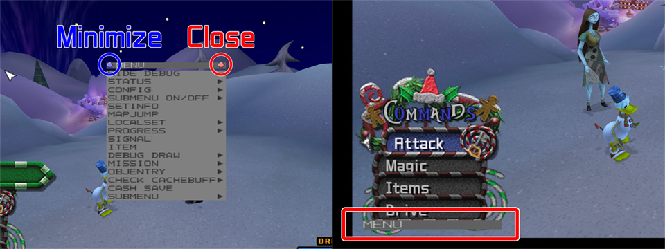

# [Kingdom Hearts 2.5 HD Remix](index.md) - KH2FM+ Debug Menu

The E3 2014 Kiosk Demo for Kingdom Hearts 2.5 HD Remix has the developer debug menu enabled for KH2FM+. The menu works but causes crashes when attempting to use most functions intended for use with the complete game data.
By replacing the demo `index.dat` and `kingdom2.mself` with the files from a retail copy of the game it is possible to restore *most* missing functionality.

## Debug Menu Controls and Setup

To access the debug menu on a PS3 devkit or emulator, right-click on the screen with a connected mouse. To select an option left-click it in the menu. It is recommended to only use the debug menu _after_ the title screen to avoid crashes.
The following steps are recommended to improve useability:

1. Click `SUBMENU > SYSTEM > SYSTEM > VSYNC LIMIT` and choose `60`. This will set the internal frame rate to 60fps and improve mouse movement significantly when navigating the debug menu (although it still is not perfect).

2. Click `CONFIG > EDIT` and check to see if `SHOW VERSION` is enabled (it is enabled if the check box on the left is dark grey instead of light grey). If enabled, a handful of game functionality is limited to the `Premium Showcase` aspect of the demo. Disabling this option allows you to access the Camp menu when pausing, for example. Re-enabling this feature will restore the demo functions to as intended.

3. At the top of the debug menus, clicking the red (right) button will close said menu. Clicking the blue (left) button will minimize the current menu and place it at the bottom left of the screen to be quickly accessed again. Simply click that menu to maximize it.

## Detailed Breakdown of Debug Menu (Top-level)

### HIDE DEBUG

* Self-explanatory.

### STATUS >>

* Displays various realtime diagnostics, including but not limited to:
  * Player HP
  * Motion details
  * Memory/RAM usage

### CONFIG >>

* Various useful settings under ``EDIT``:
  * Movement speed
  * Player, Ally, and Enemy attack damage multipliers
  * EXP gain rate
  * Region setting (Appears to do nothing)
  * Pause mode (Appears to do nothing)
  * Various cheat options (Drive any time, infinite items, etc.)
  * Lobotomize enemy AI
  * Button turbo enable (Labelled as `ONIOSHI`)
  * And more
    * Note: The `FREE ABILITY` option appears to be mistranslated. So far it has only been seen to give Sora the *hidden* High Jump, Aerial Dodge, Glide, and Quick Run LV5 abilities (which are usually only programmed for use during the Dragoon Xemnas fight) at zero AP cost. It also forces these abilities onto all of Sora's forms, making jumping and Quick Run very dangerous to use.

### SUBMENU ON/OFF >>

* Allows docking of submenus in the top-level menu.

### SETINFO

### MAPJUMP >>

#### More documentation to come as needed

* This can be used to warp to any map in the game.
* By default, the demo is limited to maps only included in said demo. Replacing the demo's `index.dat` and `kingdom2.mself` files as explained above will rectify this limitation.
* For internal map names refer to [KH2 Worlds](../../kh2/worlds.md)
* By changing ``EVENT`` user can warp to various boss fights, scripted fights, and cutscenes.
* `PLAYER`, `FRIEND1`, `FRIEND2`, and `FRIEND3` can be used freely in most cases. I.e., making all three party members Goofy.

### LOCALSET >>

* Selecting a map prefix presents event jumps to specific events.
* Items suffixed with `_MS***` bring the player to the appropriate `MISSION` events.
  * I.e., `NM00_MS101` changes the map to NM00 (Halloween Town: Town Square) and begins the event labelled `MS101`, which is the first forced fight in the world.
* Items suffixed with `_EVENT_***` appear to initiate cutscenes that lead into certain story segments.
  * I.e., `NM_EVENT_122` shows the cutscene where Oogie has captured Santa, and Sora can now make his way to the toy factory to begin the boss fight.
  * Some of these might cause the game to crash!
* Items prefixed with `CHAP_` are cutscenes that are tied to no particular events. They appear to be what the `THEATER` menu in the retail game calls.

### PROGRESS  >>

### SIGNAL >>

### ITEM >>

An inventory editor with seemingly only one functionality: to add and remove things to and from Sora's stock. Click `BATTLE` or `SUPPORT` at the top of the menu to select various menus with different items to distribute. Left-click on an item to add one. Right-click on an item to remove one. Some items are purely cosmetic (such as HP Gain, Zantetsuken, Sync Blade, etc.) and therefore cannot be distributed outside of their respective Forms. Furthermore, certain objects in the game such as Magic and Forms are actually just items given to the player and then hidden in the items menu, which is why they are listed here.

#### Items

* `BATTLE`: Combat-usable items such as Potions and Elixers.
* `CAMP`: Items that are usable only from the Camp (Pause) menu, such as Tent, Drive Recovery, etc.
* `W_CHARCTER`: Weapons relating to the named character. E.g. `W_SORA` for a list of Sora's Keyblades.
* `ARMOR`: Armor items that can be equipped, such as Fire Bangle and Shock Charm.
* `ACCESSORY`: Ditto, but accessories such as Ability Ring and Full Bloom.
* `MIX`: Synthesis materials.
* `KEY`: Key items, such as Torn Pages, Recipes.
* `MAGIC`: Magic. (Requires a map reload. Setting these above 3 appears to do nothing.)
* `ABILITY`: Abbilities that Sora and co. can equip, including ones locked to accessories and armor. (However, these appear to not work.)
* `SUMMON`: Charms that unlock Sora's four Summons.
* `FORM`: Drive Forms for Sora to use. Includes Antiform and will even add it to the Drive list.
* `NAVIMAP`: Maps for every room in the game.
* `REPORT`: Ansem Reports.

#### Abilities (None of these appear to work.)

* `SUPPORT`: Same as `ABILITY`.
* `LIMIT`: Sora and ally limits.
* `ACTION`: Party member special attacks, such as Goofy Tornado and Tron's Scouting Disk, as well as Form-specific (cosmetic only) action abilities.
* `FORM`: Form growth abilities. Ranges from `LV1` to `MAX`.

### DEBUG DRAW >>

* Disabled graphics debugging functions. These were used for developing the PS2 version but seem to have not been used for the PS3 port.

### MISSION >>

### OBJENTRY >>

Opens a menu allowing the user to change playable characters and party members and spawn objects/enemies/bosses etc. More documentation to come soon.

* `PLAYER`: Points to the current player model and allows the user to switch which model is currently loaded. Probably used just to test if models will load properly.
* `FRIEND`: Points to Sora's allies and allows the user to switch the character loaded in. Probably used just to test if models will load properly, but tends to crash.
* `CAPTURE`: Peems to point to Sora primarily. Changing this will force him into a Drive Form state and update all appropriate files loaded in RAM, including the necessary a.fm and MSET files. Can crash if not careful.
* `1 OBJ`: Spawn one (1) of a selected object around Sora. Can be used to spawn enemies, other allies, field objects such as chests, etc.
* `3 OBJ`: Ditto, three (3).
* `5 OBJ`: Ditto, five (5).
* `10 OBJ`: Ditto, ten (10). - There is a hardcoded limit to how many objects can spawn in a map at once on a per-map basis, so this setting and the following ones will not always, if rarely spawn the determined amount of objects.
* `20 OBJ`: Ditto, twenty (20).
* `30 OBJ`: Ditto, thirty (30).
* `50 OBJ`: Ditto, fifty (50).
* `ACTOR`: Spawns the selected actor/object in the default T-stance.
  * At the top of the `ACTOR` spawn list, there are two buttons to narrow down the search for a specific model. By default it is set to `ZAKO` and `ALL`.
    * `ZAKO` means "small fry", and thus usually refers to regular enemies such as Shadow and Hook Bat.
    * `L_ZAKO` refers to large enemies, such as the Morningstar or Large Body.
    * `BOSS` will spawn regular/medium boss enemies.
    * `L_BOSS` will spawn large boss enemies, such as Twilight Thorn.
    * `PLAYER` will spawn player characters, such as Sora's various forms, Roxas, and Mickey.
    * `FRIEND` will spawn allies to Sora, such as Donald, Goofy, and world-specific characters.
    * `SUMMON` will spawn all four Summon characters, including Stitch during the Hollow Bastion cutscene.
    * `BTLNPC` will spawn in non-party allies, such as Axel, Tifa, and Squall.
    * `F_OBJ` will spawn in field objects, such as miscellaneous decor around various maps and chests.
    * `G_OBJ` will spawn in general objects. Typically more decor.
    * `E_OBJ` will spawn enemy objects, things that enemies use to attack the player, such as Dragoon Xemnas' towers or Jafar's building chunks.
    * `NPC` will spawn non-player characters. This basically encompasses every character that doesn't belong in any other category, including enemy/boss models used only for cutscenes.
    * `WEAPON` will spawn weapon models.
    * `E_WEAPON` will spawn equipped(?) weapon models. Seems inconsistent sometimes.
    * `SP` will spawn a regular save point or world point. The latter allows the player to return to the world map.
    * `TREASURE` will spawn specific chest models.
    * `SUBMENU` will spawn a moogle and shop. Doesn't appear to work fully, however.
    * `MEMO` will spawn `_GM` suffixed models, which are specific to Jiminy's Journal.
    * `RTN` will spawn models that usually have a Reaction Command attached to it. Since only the model is loaded without its MSET or AI, only the dummy `-` Reaction Command is called, which does nothing.
    * `MINIGAME` will spawn various minigame models, such as Sora's many Pooh models and Agrabah's carpet Sora.
    * `WORLDMAP` will spawn the specified world models on the world map.
    * `PRIZEBOX` will spawn the prize boxes enemies drop, though functionless.
    * `SHOP` will spawn the holographic shop Moogle instead of the real one listen in `SUBMENU`.
    * `MASSEFFECT` supposedly spawns in large effects(?)
    * `JIGSAW` spawns in dummy puzzle pieces.
* `RELOAD`: Clears all models from the buffer and respawns the last model introduced.
* `LEAVE ALL`: Clears all models from the buffer.

### CHECK CACHEBUFFER >>

This feature appears to have the game run through all currently cached events, depending on the option selected.

* `ALL AREA` probably runs through all maps in the world.
* `ALL SET` probably runs through all event sets in the current map.
* `PROGRESS` does... something, I'm sure.
* `REPEAT` self-explanatory; repeats the process after completing.

### CASH SAVE

## Submenus

### DEBUG

* `HIDE DEBUG`: Self-explantory.
* `STATUS`: Show's realtime statistics.
* `CONFIG`: Includes two menus with various settings (some of which are listed near the top of this page) and two options that appear to do nothing. (`EDIT, EDIT 2` & `SAVE, SAVE START AREA`, respectively.)

### SYSTEM

* `CACHE BUFF`: Shows the realtime memory buffer of objects loaded. The table is messed up usually, but the number reading appears to be accurate.
* `SAVERAM`: A save/load menu for fast RAM states. Investigation needed; doesn't appear to work fully.
* `SYSTEM`: Includes a few useful items.
  * `VSYNC TYPE`: Variable or Fixed.
  * `VSYNC LIMIT`: Frame limiter. Setting this to `60` enables smoother debug menu navigation, but obviously comes with pre-PS4 game fixes.
  * `GAME SPEED`: Presets that the game uses at various points, such as the slowdown effect after beating a forced fight.
  * `SHOW MODE`: Show Mode or Work Mode. Presumably used either for showcasing or development. Changing this appears to do nothing.
  * `PLAY TIME`: Set the game's play time to predetermined amounts.
* `FM PATCH`: Does nothing, presents KH2's `error` sound when selecting it. Probably used by development to test new fixes on the fly.

### FIELD

* `SETINFO`: Shows a table where all values are `AAA`. Cannot be changed(?)
* `MAPJUMP`: The same `MAPJUMP` feature explained above.
* `LOCALSET`: The same `LOCALSET` feature explained above.
* `PROGRESS`: ???
* `SIGNAL`: ???
* `ITEM`: The same `ITEM` feature explained above.
* `DEBUG DRAW`: The same `DEBUG DRAW` feature explained above.
* `MISSION`: The same `MISSION` feature explained above.
* `OBJENTRY`: The same `OBJENTRY` feature explained above.
* `CHECK CACHEBUFF`: The same `CHECK CACHEBUFF` feature explained above.
* `CASH SAVE`: ???

### BATTLE

* `MOTION INFO`: Hide or Show. Doesn't appear to work. Probably requires development utility that we do not have.
* `BATTLE REPORT`: Crash!
* `CHG WEAPON`: Crash!
* `BONUSLEVEL`: Crash!
* `BATTLE LEVEL`: Crash?
* `STOP`: Weirdly named, but has `START` and `END` options, with `LIMIT` and `SUMMON` following. None appear to do anything.

### EVENT

### MAP

* Free camera mode can be activated here. Free camera will cause a crash in battles if game is not paused. Right analog controls camera angle, left stick moves camera horizontally. Hold L1 to switch to vertical movement.

### WORLD

### GUMI BATTLE

### GUMI EDIT

* Nothing

### MENU

### EFFECT

* Allows user to center camera on active visual effects. Contains menus for effect editors. These crash when attempting to load an effect file.

### SOUND

### ETC

### YASUI

* Mostly unknown options at this point. ``TEST`` will kill Sora.

### SUGI

* Nothing.

### TOZAWA

* For testing menus. Options include opening the ``SAVE``, ``LOAD``, and ``PARTY`` menus, changing game difficulty, giving oneself max synthesis materials, and max munny.

### ITO

* Allows user to play various minigames.

### SAVE POINT

### TREASURE BOX
