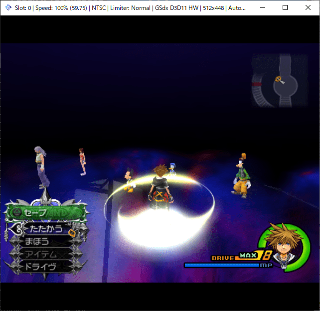

# [OpenKh Tool Documentation](../index.md) - DoctChanger

## Overview

DoctChanger is useful tool to:

- Create dummy doct
- Print doct summary
- Replace doct inside map many files at once.

Applying empty doct will cause to disappear map mesh model:



`create-doct-for-map` command is useful, if you have custom map model, and then you are looking for matching doct.

## Command usage

```bat
OpenKh.Command.DoctChanger.exe

1.0.0

Usage: OpenKh.Command.DoctChanger [command] [options]

Options:
  --version            Show version information
  -?|-h|--help         Show help information

Commands:
  create-doct-for-map  map file: create and set unoptimized doct for rendering entire map
  create-dummy-doct    doct file: create dummy
  read-doct            doct file: read
  read-map-doct        map file: read doct
  use-this-doct        map file: replace doct with your doct

Run 'OpenKh.Command.DoctChanger [command] -?|-h|--help' for more information about a command.
```

### `create-dummy-doct` command

Specify: doctFileOutput

```bat
OpenKh.Command.DoctChanger.exe create-dummy-doct dummy.doct

```

### `read-doct` command

Specify: doctFileInput

```bat
OpenKh.Command.DoctChanger.exe read-doct dummy.doct

# DOCT (dummy.doct)

- Version: 2
- Unk2: 0

## Entry1

'''
   0:(  -1,  -1,  -1,  -1,  -1,  -1,  -1,  -1) (       0,       0,       0) (       0,       0,       0)    0    0 00000000
'''

## Entry2

'''
   0:00000000 (       0,       0,       0) (       0,       0,       0)
'''
```

### `use-this-doct` command

Batch doct injector for map files.

Specify: inDir, outDir, and doctFile.

```bat
OpenKh.Command.DoctChanger.exe use-this-doct H:\KH2fm.yaz0r\map\jp  H:\Proj\pcsx2\bin\inject.f266b00b\map\jp dummy.doct

H:\KH2fm.yaz0r\map\jp\al00.map
H:\KH2fm.yaz0r\map\jp\al01.map
H:\KH2fm.yaz0r\map\jp\al02.map
...
H:\KH2fm.yaz0r\map\jp\wi07.map
H:\KH2fm.yaz0r\map\jp\wi08.map
H:\KH2fm.yaz0r\map\jp\wm00.map
```

### `create-doct-for-map` command

Create a simple doct (with no culling) from your map file, and then inject doct into your map.

Specify: inMap, and outMap.

```bat
OpenKh.Command.DoctChanger.exe create-doct-for-map H:\KH2fm.yaz0r\map\jp\eh18.map H:\Proj\pcsx2\bin\inject.f266b00b\map\jp\eh18.map

Output map file: H:\Proj\pcsx2\bin\inject.f266b00b\map\jp\eh18.map
numVifPackets: 1,583
numAlb2Groups: 725
Note: this tool will build a unoptimized doct that renders all ALB2 725 groups.
DOCT entry replaced.
Output map file is written successfully.
```

### `read-map-doct` command

Specify: inMap

```bat
OpenKh.Command.DoctChanger.exe read-map-doct H:\Proj\pcsx2\bin\inject.f266b00b\map\jp\eh18.map

# DOCT (eh18.map)

- Version: 2
- Unk2: 0

## Entry1

'''
   0:(  -1,  -1,  -1,  -1,  -1,  -1,  -1,  -1) (       0,       0,       0) (       0,       0,       0)    0  725 00000000
'''

## Entry2

'''
   0:00000000 (  -18000,  -18000,  -18000) (   18000,   18000,   18000)
   1:00000000 (  -18000,  -18000,  -18000) (   18000,   18000,   18000)
   2:00000000 (  -18000,  -18000,  -18000) (   18000,   18000,   18000)
...
 722:00000000 (  -18000,  -18000,  -18000) (   18000,   18000,   18000)
 723:00000000 (  -18000,  -18000,  -18000) (   18000,   18000,   18000)
 724:00000000 (  -18000,  -18000,  -18000) (   18000,   18000,   18000)
'''
```

### `show-stats` command

Specify: `.map` file, otherwise treated as `.doct` file.

```bat
OpenKh.Command.DoctChanger.exe show-stats tt05.map

# tt_0:0 (MeshOcclusion)
   1,320 drawing mesh groups.
   1,330 drawing meshes.
```
