# [OpenKh Tool Documentation](../index.md) - IDX/IMG Extraction Tool

Welcome to the official OpenKh tool documentation!
This document assumes you are already familiar with either compiling or acquiring the released version of the KH2 Text Editor bundled with OpenKH and have a copy of Kingdom Hearts II. (Final Mix works as well!) 
If you have the ISO but no toolset, you can download the release builds of OpenKH [here](https://github.com/Xeeynamo/OpenKh/releases).

This document will focus on teaching you how to dump your copy of KH2.

## Using the GUI tool

If your objective is to just extract the game's content without performing any kind of automation, or if you just need to extract a single file or folder, `OpenKh.Tools.IdxImg` is the tool for you.

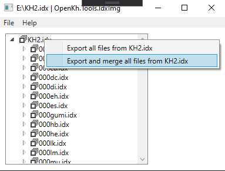

## Using Command Prompt and Extracting KH2.IMG + IDX

This guide is specialized toward Windows users, as the assumption (for now) is, if you're on Linux, you're already familiar with using the terminal. As such, we'll begin teaching new CLI users the basics. If you're already familiar with using the terminal / command prompt / cmd, skip ahead to the next section.

Upon opening your start menu, if you type `cmd` into the search bar, you will be presented with either "cmd" or "command prompt". Opening that program shows you the following window:

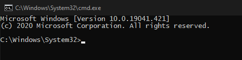

As listed in the screenshot and in your terminal window, the current working directory should by default be `C:\Windows\System32`. We need to change that to where our OpenKH tools are. To do so, we're going to use the `cd` command, which stands for "change directory".
My location of the OpenKH tools is as follows: `D:\Game Tools\openkh`
Because my OpenKH files are on a different hard drive (marked by the "D:" at the beginning instead of the standard "C:"), before I input my `cd` command I have to simply type `D:` into the terminal.

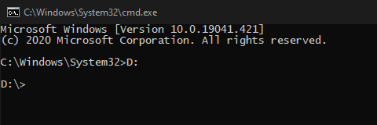

Now that my working directory is set to `D:\`, I'm ready to use the `cd` command!
`cd "D:\Game Tools\openkh"`
Note: if your path to the correct folder has a space in it like in my example, you *MUST* put the path in quotes. If you don't, the cd command will not function properly.

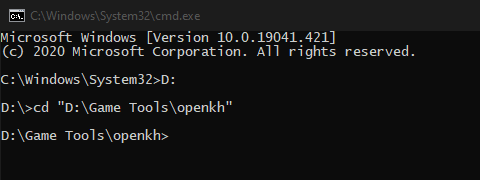

Now that our terminal is targeting the OpenKH folder with our tools, we can directly call the IdxImg program and extract our KH2 game files. To start, I recommend installing [7-zip](https://7-zip.org/). Alternatives like WinRar, jZip, and WinZip work too, and of course the built-in Linux tool "tar", but on Windows 7-zip is heavily preferred and widely considered the best choice.
Once you have 7-zip installed, you must right-click your ISO and go to `7-zip > Open archive`, which will present you with a new window, showing the contents of your ISO file. Barring the Windows theme, it should look roughly like so:

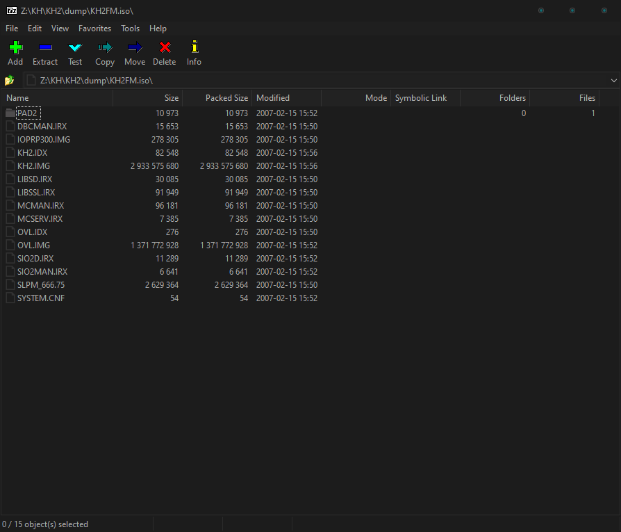

What you're looking for within are the KH2.IMG and KH2.IDX files. Click and drag to highlight both of them, or press and hold Ctrl and click them to highlight both, then drag them into your OpenKH folder. It may take a moment depending on your PC, but shouldn't take too long. After the extraction process is finished, it's time to finally use the IdxImg tool.

## Using OpenKh.Command.IdxImg - List

First and foremost, KH2.IMG contains the actual data contents of the ISO while the IDX file extracted with 7-zip is a data table, or index, detailing information relating to said files within the IMG. Additionally, every CLI tool for OpenKH will utilize the `-h` or `--help` arguments, so if you need help understanding the syntax to use the tool or simply do not know any other arguments, you can always use those as a fallback to get a reliable list. For example, to call our IdxImg tool with the `-h` argument, simply type into your terminal: `OpenKh.Command.IdxImg -h` (running programs through CLI is not usually case-sensitive).

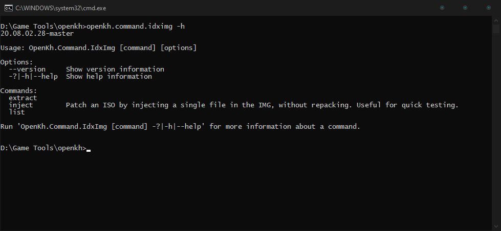

This command shows us that in addition to our `-h` argument, we can execute specific commands. In this instance, our IdxImg tool has three options: `extract`, `inject`, and `list`. All three do different things, two of which are pretty self-explanatory, while the most interesting command would be `inject`. For the sake of going in the order of least to most complicated however, let's start with `list`, then move onto `extract`, and then finally `inject`.

Running the program again but with our `list` argument (`openkh.command.idximg list`), we notice the terminal yells at us about an input IDX file not being specified. If you're not sure what that means or how to rectify it, have no fear, for the glorious `-h` argument is command agnostic, meaning it can be applied to virtually any and all commands attached to the program! Because of this, it is safe to run the following command and get some information on how to proceed: `openkh.command.idximg list -h`

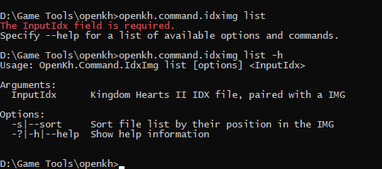

It shows that the next require input is simply the name of our KH2 IDX file, which, as you may remember, is simply `KH2.IDX`. So, you guessed it, run `openkh.command.idximg list kh2.idx` to list every file within the IMG. The list will be very long and only a madman will actually take the time to read the more than just a few lines, but as long as the list is generated without errors, you can assume you have successfully extracted both the IMG and IDX file properly and is not corrupted.

## Using OpenKh.Command.IdxImg - Extract

Next up is actually extracting the contents of the IMG and IDX pair. As you may expect at this point, the first thing you should do is run the program with the `extract` command and the `-h` argument. `openkh.command.idximg extract -h`

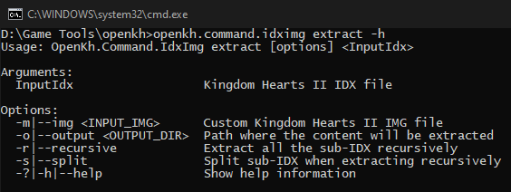

From here on out, only the essentials will be explained, while you will be free to experiment outside of what's talked about in this document on your own time. To start, let's cover the most important arguments with the `extract` command: `-o` and `-r`. `-o` is used to specify where your files will be extracted, and `-r` will extract files that require sub-IDXs that reside inside our standard issue KH2.IMG. To use them, it's as simple as this: `openkh.command.idximg extract kh2.idx -o ./extract -r`

The process will definitely take a fair bit longer than simply listing the files, but assuming you've followed the guide up to this point, it should be smooth sailing. You'll notice in your OpenKH folder that you have a new folder named `extract`, which contains the contents of KH2.IMG. This is the very first step to becoming a modder for KH2. Welcome to the club!

Extra note: in the previous command, you'll notice we typed `./extract` instead of just simply `extract` or the entire `D:/Game Tools/openkh/extract` path when specifying the folder name. You do not have to do this, but it is good practice to use relative paths when specifying a location, instead of hard-typed paths. What this means is, instead of simply typing out the entire location or just the target folder name, adding `./` to the beginning of your location basically means "in this location relative to the folder we are working in." If I wanted to leave the openkh folder and create a new `KH2` folder and place my `extract` contents in there instead, I would have typed the command like this: `openkh.command.idximg kh2.idx -o ../KH2/extract -r` This would have made my extract location `D:/Game Tools/KH2/extract`. Relative pathing is always good practice, and you can stack it!

## Using OpenKh.Command.IdxImg - Inject

`openkh.command.idximg inject -h`

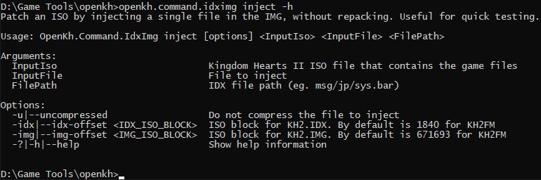

At this point, it's a matter of following what you've learned so far and applying it here. You're able to specify the input ISO file (*not the IMG!!*), then the file (previously extracted) that you would like to inject after modifying it, and then the internal ISO path of the file in question. For example, let's say our ISO is in the same folder as our IdxImg program and we would like to replace a modified title.2ld file without having to patch, rebuild, remake, or reimport the entire game again, just a quick little injection that takes virtually no time at all. The commands listed via the `-h` argument are in order of operation. So, since our ISO is in the root folder with the program and our extracted and modified title.2ld file is elsewhere...

`openkh.command.idximg inject ./kh2fm.iso ./path/to/modified/title.2ld menu/fm/title.2ld`

This may look confusing at first, but realize that spaces indicate one argument/command has finished executing and it's onto the next one! This means after we specify we're injecting, we give the location of our ISO, which is `./kh2fm.iso`. After that, the space indicates we're now focusing on the next argument in the list from above, which is the input file. In this case, `title.2ld`. After that, we specify the path of the file inside KH2.IMG, which is exactly how the folder structure is set up from our extraction process. That means, inside your `extract` folder, you go to `menu/fm/`, and therein resides our destined title.2ld file. Easy!

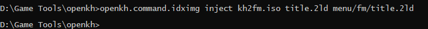

And that's really it. The process is done, there's no need for feedback, it simply executed quickly and without error! Assuming you've edited said file and it injected just fine, you can now boot up your new ISO and view the changes in game! Behold, the power of our toolset!

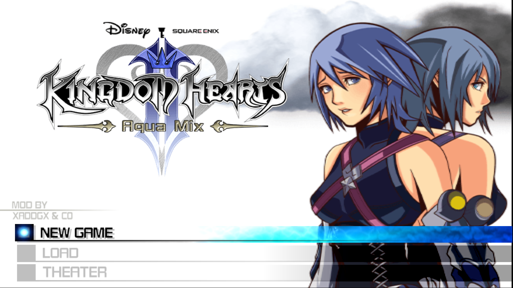

# To follow up this guide, check out the guide on our [Layout Editor here](../GUI.LayoutEditor/index.md)!