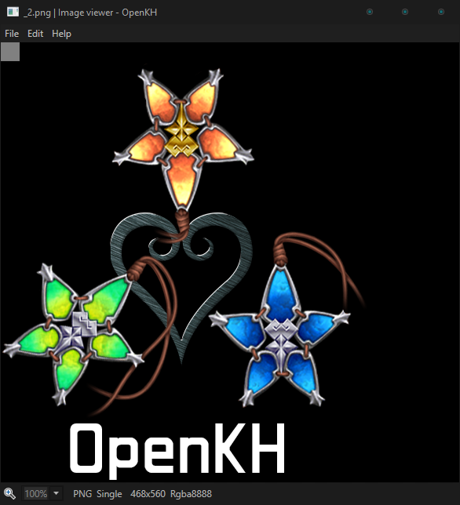

# [OpenKh Tool Documentation](../index.md) - OpenKH Image Viewer

Welcome to the official OpenKh tool documentation!
This document assumes you are already familiar with either compiling or acquiring the released version of the KH2 Text Editor bundled with OpenKH and have a dumped copy of the ISO. 
If you have neither, you can download the release builds of OpenKH [here](https://github.com/Xeeynamo/OpenKh/releases) and then dump your ISO using [this tutorial](../CLI.IdxImg/index.md). (Currently, only KH2 extraction is supported via the IdxImg tool.)

This document will focus on teaching you how to use the simple OpenKH Image Viewer.

## Navigating the Tool

Honestly, there really isn't much to say. The OpenKH Image Viewer is capable of supporting a myriad of image formats, both common to regular PCs and smartphones such as PNGs and BMPs, in addition to formats commonly used among Kingdom Hearts games, such as IMD, IMZ, and even Birth by Sleep's font .arc files! Simply open the program, go to `File > Open`, and then select your target file you wish to view. 

Currently the program only supports exporting the image, but import functions are well on the way. At the bottom of the program you will notice several details. You can set the scale factor so the image fits the size of the window or select static percentages based on the actual image proportions, and in the case of IMZ (stacked IMD files effectively zipped into one handy file, complete with a cute little bow) you can even select sub-images within to view. Additionally, there are other minor details such as the specific image dimensions and the color palette.

That about wraps up this document for now.

