# [OpenKh Tool Documentation](../index.md) - KH2 Object Editor

Welcome to the official OpenKh tool documentation!
This document assumes you are already familiar with either compiling or acquiring the released version of the KH2 Object Editor bundled with OpenKH and have a dumped copy of the ISO. 
If you have neither, you can download the release builds of OpenKH [here](https://github.com/Xeeynamo/OpenKh/releases) and then dump your ISO using [this tutorial](../CLI.IdxImg/index.md).

## What are Objects
Objects are the many entities that the game uses. Playable characters, enemies, bosses, Gummi enemies and scenario props (Like boxes) are examples of Objects. The game's objects are located in the obj folder.
Note: Object files are exactly the same in all versions.

Each Object is formed by up to 3 files:

### Mdlx
Mdlx files contain the Object's Model, Textures, Collisions and AI.

### Mset
Mset files contain a list of motions that the object can do as well as the motions required for Reaction Commands.

### Apdx
Apdx files contain (Among other things) the Effects and UI elements. Each object has multiple apdx files, one for each language (a.us, a.it...) The us files in PS2 FM are a.fm.

## Navigating the Object Editor
Files are opened in the Object Editor by dragging and dropping them in the tool. The tool uses Mdlx files as a base, so drag and drop an Mdlx file to open the object. A folder containing objects can also be dropped and the whole list of files will be shown on the left panel. Double clicking an object will open it in the tool.

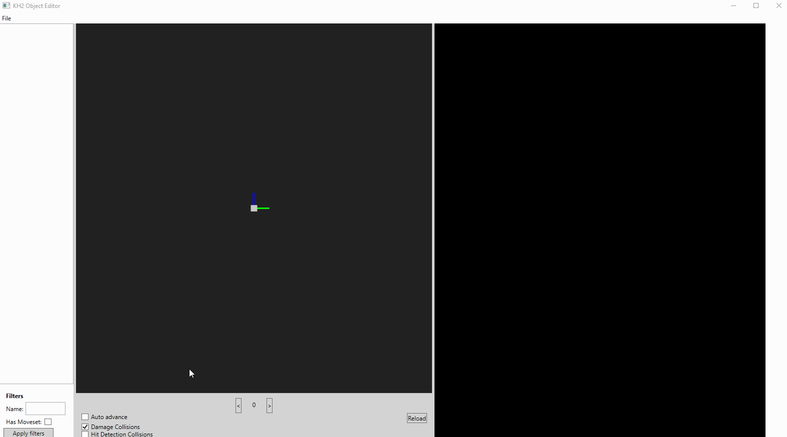

On the center the model can be seen and on the right the multiple modules the tool has to edit the Object can be opened by clicking on them.

### Searching and filtering
If a folder was opened, files can be filtered by name and objects without Msets can be filtered out.
By typing ">" followed by a keyword the tool will find files related to the keyword based on the description of the files in OKH's documentation. For example, ">sora" will find all files related to sora.

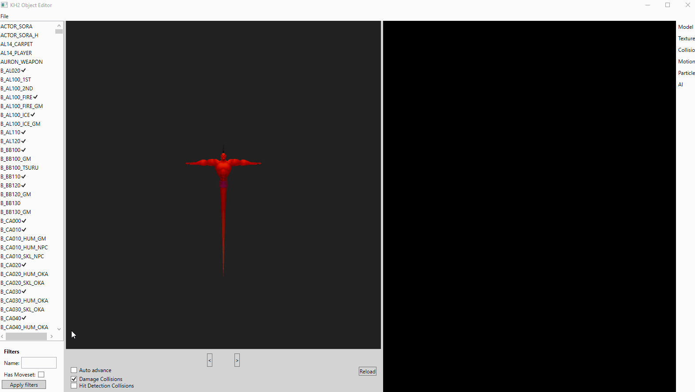

### Saving
After modifying the files they can overwrite the original files or be saved as new files. This is done per file, to know which file or files contain the modifications that were made check the "What are Objects" section.

### File detection
When the tool opens an Mdlx file it detects the other files by name. For example if sora.mdlx is opened, the files sora.mset and sora.a.us (In the same folder) will be fetched and loaded as well. (If no a.us is found it'll try to fetch a.fm)

## Loading single files
Single files can be loaded on top of loaded Objects. For example Sora.mdlx can be loaded with sora.a.us and then sora.a.it can be dropped on top to replace sora.a.us. This is useful in multiple settings, for example exporting an RC as a mset file and then dropping it on top of Sora's object.

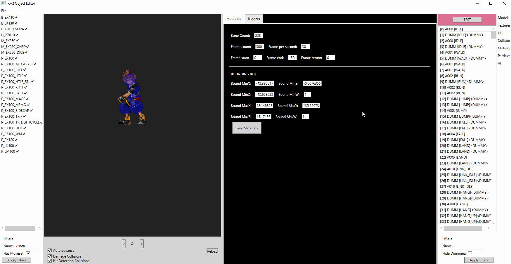

## Model module
In the model module the meshes' metadata can be viewed and edited as well as the list of bones of the model's skeleton.
If the model has transparent textures make sure to check the "DrawAlphaPhase" and "Alpha" flags.

## Textures module
In the textures module the list of textures can be seen as well as animations applied to them. Animations are pieces of an image that are set on top of the related texture. Be aware that animation images don't have a color palette, they use the one from their related texture.

### Textures
Textures can be exported, imported, replaced and reordered by right clicking or using the up and down buttons.

### Animations
The animation's image can be replaced similar to the textures but be aware of the lack of color palette. Parameters for the animations can be viewed and edited. The scripts define the sequence of sprites that will be applied to the texture. Scripts can be exported and imported but modifying the script is unimplemented at the time of writing. (Scripts can be edited via the Kh2 Mdlx Editor)

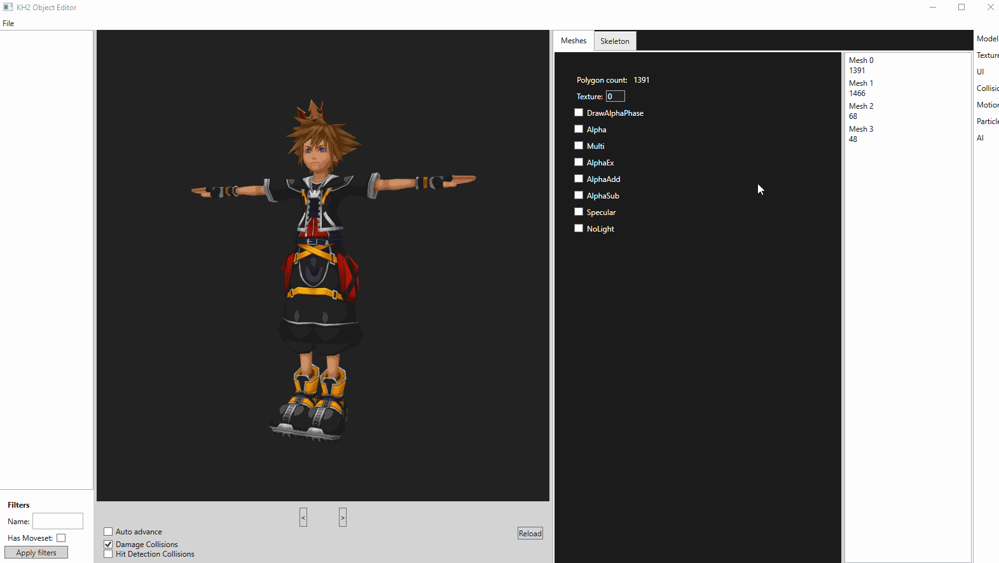

## UI module
Contains the elements displayed in the UI. Can be exported, imported and replaced by right clicking.

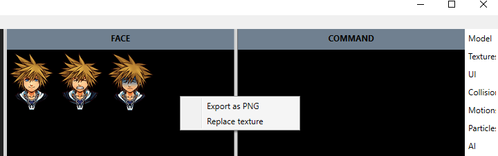
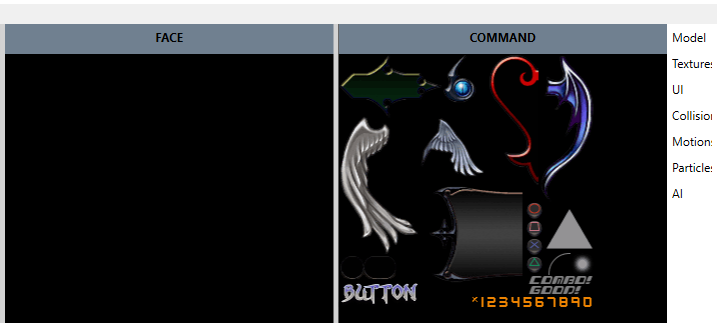

## Collisions module
Shows the list of collision geometry in the Object. Note that Collisions are called by group and all of the collisions on the group will activate. Can be added, removed and copied by right clicking.

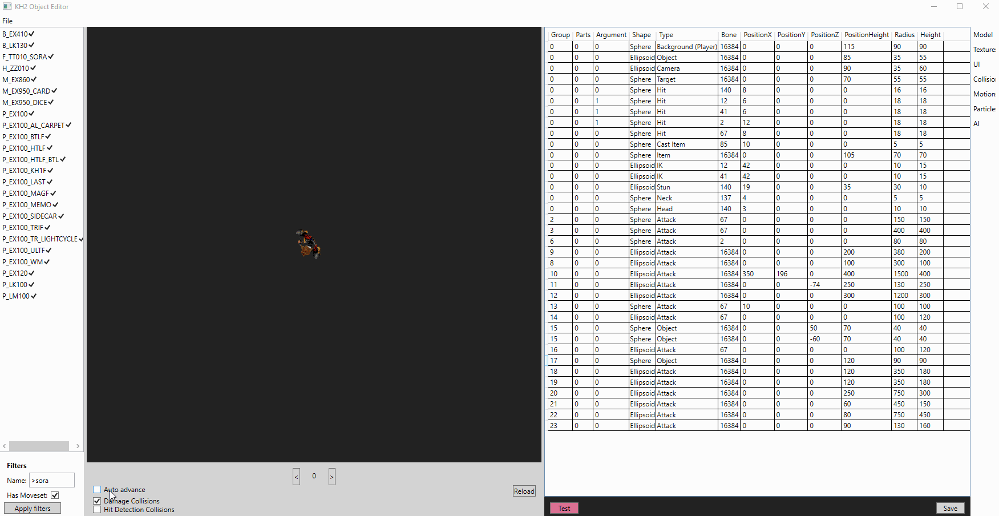

## Motions module
The list of motions is displayed on the right side.

### 3D Viewport
The model is visualized in the 3D Viewport. If a motion is loaded it'll be displayed. The animation can be played or moved frame by frame. Damage collisions (red) and Hit collisions (blue) can be enabled. RC collisions will also be shown (green)

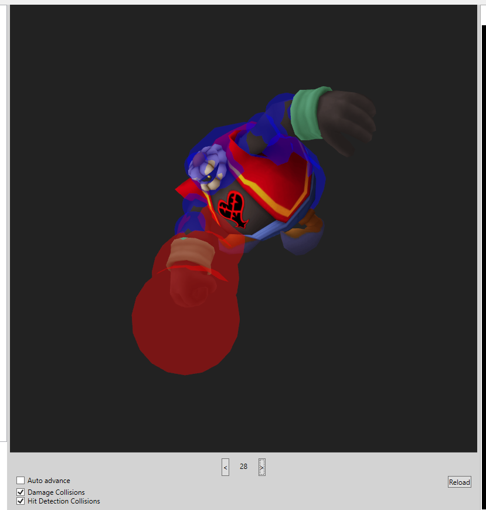

### Motions module
Entries can be double clicked to open them and a bunch of features are available through right click:

- Rename motion
- Add / Remove motion
- Copy / Paste motion (Can be done between objects)
- Import animation from FBX (Uses anbMaker, make sure your root bone's name contains "root" and at least one number, all of which must be zeroes)
- Export RC as mset

Be aware that an mset also contains Dummy entries (No data) and entries for a Reaction Command. Reaction Command msets can be exported and then viewed on other models.

### Triggers
Each motion may have a set of triggers that execute certain actions either in a timeframe or a specific frame. These can be modified and added / removed (Del key)
When modifying triggers bear in mind that each type of trigger has a set parameter length.

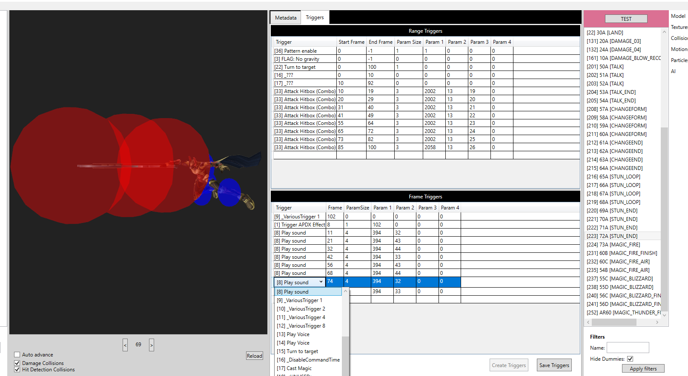

## Effects module
Effects are called via casters, each caster calls a specific effect, and each effect calls a specific entry within a DPD package (Which contains multiple effects)
The structure for effects is quite complex and it isn't well know at the time of writing, which is why there's not much to do in the tool. DPD packages can be copied and then called via casters and effects.

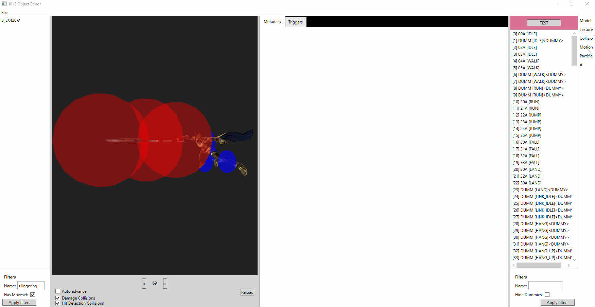

## AI module
The AI for the object can be seen through this module. Even though it can be modified in the tool, it may be better to copy the text to a text editor, modify it there, and then paste it back.

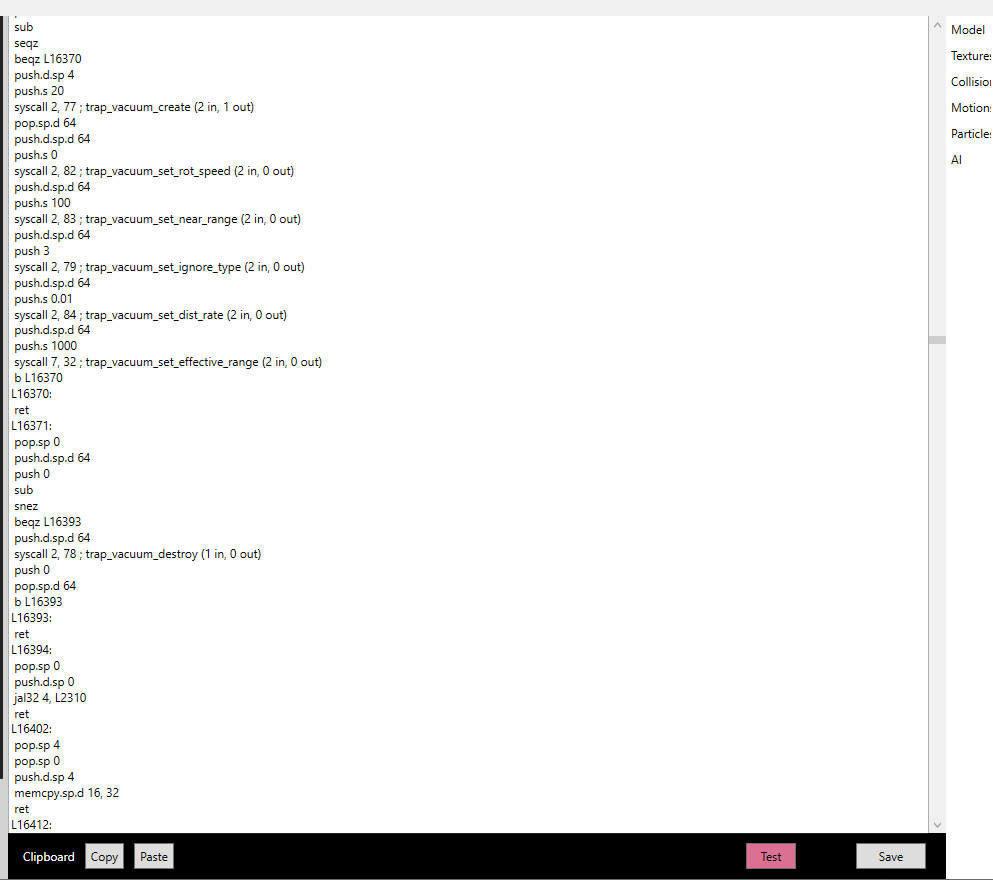

## Testing buttons
Throughtout the tool there are modules that have a Test button. These are used to check modifications in game. The way this works makes it a limited feature, and the user must bear the following consideraions in mind:

- The tool detects the file's name and searches for it in the game's memory. If a file with the same name isn't loaded ingame it won't work.
- Any object that is loaded ingame should be testable and any entity that isn't won't be.
- The game already has memory allocated for the files. Testing will only work if the size of the file is exactly the same (Or less?) size as it originally was. This means no adding or removing entries and no changing triggers to other triggers with different parameter sizes. This is best used to check parameters and variables.
- This change will be overwritten by the game when it loads the file again (Eg: leaving and entering worlds)
- Some files (Eg: Fire motion) are being constantly overwritten by the game so they can't be tested.

Note: Wait until the button is no longer blue. If the button is blue and the tool is frozen it's writing to the game's memory.

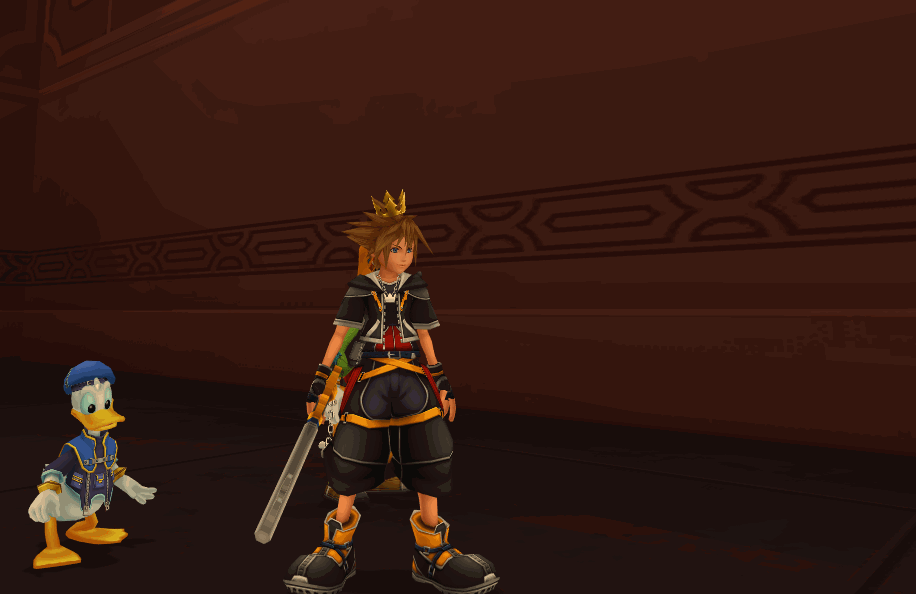