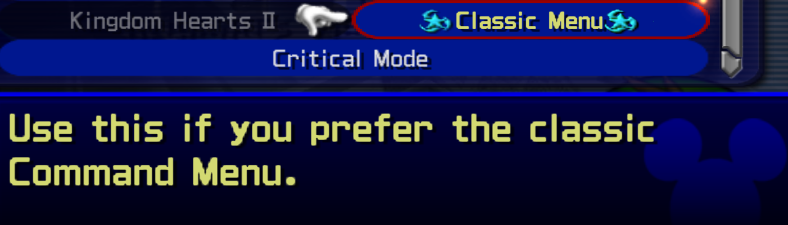
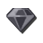
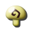
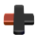
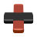
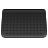
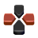
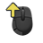
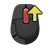
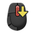

# [OpenKh Tool Documentation](../index.md) - KH2 Text Editor

Welcome to the official OpenKh tool documentation!
This document assumes you are already familiar with either compiling or acquiring the released version of the KH2 Text Editor bundled with OpenKH and have a dumped copy of the ISO. 
If you have neither, you can download the release builds of OpenKH [here](https://github.com/Xeeynamo/OpenKh/releases) and then dump your ISO using [this tutorial](../CLI.IdxImg/index.md).

This document will focus on teaching you how to use the first fully functional text editor for KH2.

- [OpenKh Tool Documentation - KH2 Text Editor](#openkh-tool-documentation---kh2-text-editor)
  - [Opening Notes](#opening-notes)
  - [Navigating the Tool](#navigating-the-tool)
  - [Basic Text Editing](#basic-text-editing)
  - [Advanced Text Editing](#advanced-text-editing)
  - [Closing Notes](#closing-notes)
  - [Glossary of Icons](#glossary-of-icons)
    - [Miscellaneous Icons (All Versions)](#miscellaneous-icons-all-versions)
    - [PS2 Version Button Icons](#ps2-version-button-icons)
    - [Xbox Button Icons](#xbox-button-icons)
    - [PlayStation Button Icons](#playstation-button-icons)
    - [Generic Button Icons](#generic-button-icons)
    - [Keyboard and Mouse Icons](#keyboard-and-mouse-icons)
    - [Dynamic Button Icons](#dynamic-button-icons)

## Opening Notes

If you are editing msg/* for the PS2 version of KH2, you must reference only the miscellaneous icons and the PS2 version buttons.

If you are editing msg/* for the PC HD re-release of the game, you may freely reference any and all tables, but please only utilize the [Dynamic Button Icons](#dynamic-button-icons) rather than static button prompts.

## Navigating the Tool

First and foremost, one you have opened the program, you need to open both the fontimage.bar and fontinfo.bar files (located in ./KH2/msg/jp). To get these, you must extract your game with the help of our ImgIdx CLI tool. If you need help, with this step, [here is another document to get you started](../CLI/IdxImg/index.md). When ready, open your files, like so:


Afterwards, open the desired .bar file containing the text in question that you would like to edit. These can be located at `./KH2/msg/jp`, just like the fontimage and fontinfo files. For this example, we'll go with sys.bar, which contains all frequently referenced, important, and miscellaneous text, such as menus.


## Basic Text Editing

Now that we've got our sys.bar open, let's say we want to edit some of the Command Menu text. It should be easy enough. Let's change its text output from the classic "Attack" to something more fierce, like "Slash".


There is a search bar at yor disposal in the bottom left which will greatly help you narrow down your search for specific strings of text! As long as you know what it is your looking for, type in a keyword or phrase and the editor will narrow down the selection for you. This way, you don't have to browse for text by string numbers or approximate by hand where they're located sequentially in the file. Once we've changed all of our basic single line text, such as "Attack", "Magic", and whatnot, let's save the file to a new location so we don't accidentaly overwrite the original.


After saving, we can finally patch in our simple edit to see if the changes are reflected in-game!


Uh-oh! Some of our changed text is going a little too far and is popping out of the text box. We'll fix that and do some other neat adjustments in the next section!

## Advanced Text Editing

Before we get started, here's just how fancy text editing can get with this powerful tool!


As far as we know, this is just the tip of the iceberg. There are many more powerful functions built into this very tool, and the best part is it's utilizing functions in the game engine itself! There's a somewhat lengthy list of commands that can be called for various purposes, from width-scaling to forcing specific colors and transparency, and more! We'll now be going over how exactly to utilize these string maps we have at our disposal.

For now, let's list all the primary functions you will be likely to use, their type indicator, and detail exactly what they do:

| Type | Human-Readable Format 	| Description
|------|------------------------|------------------------
| 03   | {:reset}               | Resets all text afterwards to be argument-less.
| 07   | {:color #RRGGBBAA}     | Forces all text after this argument to appear as the specified color in Hex. An AA value higher than 80 (default) will make your text appear bold, while values lower than 80 will make it appear less bold. The default color value for most text in the game is #F0F0F080.
| 09   | {:icon icon-name}      | Displays the named icon within the text string. A list of all icons resides at the end of this document.
| 0A   | {:scale Value}         | Forces all text after this argument to scale proportionately to the original size. (16 is normal.)
| 0B   | {:width Value}         | Forces all text after this argument to scale only in width, leaving height untouched. (100 is normal, 72 for 16:9 widescreen fixed.)
| 10   | {:clear}               | Makes all text after this argument null, meaning it does not show, regardless of what you type. (There is probably no real pracical use for this function, but it is there nonetheless.)
| 11   | {:position X,Y}        | Relocates text's (X,Y) pixel coordinates from the origin point on screen. (Text is rendered on a 2D screen buffer approximately the size of 512x416. Because of this, you will likely never want to use values higher than X:512, X:-512, Y:416, or Y:-416.)

While there are more types, as of writing these are probably the only arguments you will ever likely need to use. They should have all of your bases covered. With that, let's see what exactly your typed out text might look like in the editor after you make some adjustments. For this example, we'll be looking at the (overly complicated) "Transformations" text that replaced "Drive". While the example itself is a ridiculous setup and you would never use the tool like this practically, we'll fix its width spacing anyway, just to show how to alleviate this problem.
```
{:width 50}{:color #75FFFFFF}T{:color #FF75FFFF}r{:color #FFFF75FF}a{:color #C3FFFFFF}n{:color #FFC3FFFF}s{:color #FFFFC3FF}f{:color #00C3FFFF}o{:color #FF00C3FF}r{:color #FF00C3FF}m{:color #C3FF00FF}a{:color #C325FFFF}t{:color #FFC325FF}i{:color #25FFC3FF}o{:color #C325FFFF}n{:color #FFFFFFFF}s
```

It's certainly not practical to make your text look like this, but it's cool nonetheless that we can do such a thing! It really doesn't get any simpler than this. To start, I needed to determine that all the text should scale in width proportionately, so I made sure to place my {:width 50} argument at the very beginning so I didn't have to do it for every individual letter, as the arguments apply to everything that come after it. Placing something like `{:width 80}` halfway through the text would've made the second half much wider than the `{:width 50}` half. So you can mix and match your arguments as you please, though again, you will likely never need to do such a thing.

**In addition to the aforementioned arguments, certain special characters such as Roman numberals can be called at any point by using arguments such as {I}, {III}, {XIII}, and so forth.**

Let's test some more arguments for various texts in our sys.bar.

| Line Number | Original Text                          | New Text
|-------------|----------------------------------------|-----------------------
| 480         | Attack                                 | {:color 952121FF}Slash
| 481         | Magic                                  | {:color 214D95FF}Mana
| 482         | Items                                  | {:width 64}{:color 219542FF}Consumables
| 483         | Drive                                  | {:width 50}{:color 218995FF}Transformations
| 14133       | Kingdom Hearts                         | {:icon form}{:color D3D971FF}Classic Menu{:icon form}
| 14135       | Keep the look of the original command menu. | {:scale 24}{:color D3D971FF}Use this if you prefer the classic Command Menu.


And how it all appears in-game:




## Closing Notes

Now that you've got a pretty good idea of how the text works, feel free to experiment and see what all you can come up with! As mentioned earlier, there are more arguments that can be used, but for the sake of preventing this documentation from being too complicated, for now it's just covering the core functions that the majority of people will use.

## Glossary of Icons

As a farewell, here's a list of all the {:icon} arguments you can use to spice up your text as you see fit!

### Miscellaneous Icons (All Versions)

| Icon-Name                 | Icon    |
|---------------------------|---------|
| ability-equip             |  |
| ability-unequip           |  |
| accessory                 |  |
| ai-mode-frequent          |  |
| ai-mode-moderate          |  |
| ai-mode-rare              |  |
| ai-settings               |  |
| armor                     |  |
| auto-equip                |  |
| exclamation-mark          |  |
| form                      |  |
| gem-blazing               |  |
| gem-bright                |  |
| gem-dark                  |  |
| gem-dense                 |  |
| gem-energy                |  |
| gem-frost                 |  |
| gem-lightning             |  |
| gem-lucid                 |  |
| gem-mythril               |  |
| gem-orichalcum            |  |
| gem-power                 |  |
| gem-serenity              |  |
| gem-twilight              |  |
| gumi-block                |  |
| gumi-blueprint            |  |
| gumi-brush                |  |
| gumi-gear                 |  |
| gumi-ship                 |  |
| item-consumable           |  |
| item-key                  |  |
| item-tent                 |  |
| magic                     |  |
| magic-nocharge            |  |
| material                  |  |
| party                     |  |
| question-mark             |  |
| rank-a                    |  |
| rank-b                    |  |
| rank-c                    |  |
| rank-s                    |  |
| remembrance               |  |
| tranquil                  |  |
| weapon-keyblade           |  |
| weapon-keyblade-equip     |  |
| weapon-shield             |  |
| weapon-shield-equip       |  |
| weapon-staff              |  |
| weapon-staff-equip        |  |

### PS2 Version Button Icons

| Button-Name			      | Icon    |
|-----------------------|---------|
| button-circle         |  |
| button-cross          |  |
| button-dpad           |  |
| button-l1             |  |
| button-l2             |  |
| button-r1             |  |
| button-r2             |  |
| button-select         |  |
| button-square         |  |
| button-start          |  |
| button-triangle       |  |

The HD Collection (the PC port specifically) repurposes both used and unused PS2 button icons and adds in brand new ones for its multiple supported control options.

Below is a list of each icon name sorted by button/controller type.

### Xbox Button Icons

| Button-Name			      | Icon    |
|-----------------------|---------|
| button-cross          | .png) |
| button-circle         | .png) |
| button-square         | .png) |
| button-triangle       | .png) |
| button-select         | .png) |
| button-start          | .png) |
| button-l1             | .png) |
| button-l2             | .png) |
| weapon-keyblade-equip	| .png) |
| button-r1             | .png) |
| button-r2             | .png) |
| weapon-staff-equip    | .png) |
| xb-analog             |  |
| form                  | .png) |
| xb-left-analog-up     |  |
| xb-left-analog-down   |  |
| xb-left-analog-left   |  |
| xb-left-analog-right  |  |
| weapon-shield-equip   | .png) |
| xb-right-analog-up    |  |
| xb-right-analog-down  |  |
| xb-right-analog-left  |  |
| xb-right-analog-right |  |
| button-dpad           | .png) |
| xb-dpad-up            |  |
| xb-dpad-down          |  |
| xb-dpad-left          |  |
| xb-dpad-right         |  |
| xb-dpad-updown        |  |
| xb-dpad-leftright     |  |

### PlayStation Button Icons

| Button-Name			      | Icon    |
|-----------------------|---------|
| ps-cross              |  |
| ps-circle             |  |
| ps-square             |  |
| ps-triangle           |  |
| ps-touchpad           |  |
| ps-options            |  |
| ps-l1                 |  |
| ps-l2                 |  |
| ps-r3                 |  |
| ps-r1                 |  |
| ps-r2                 |  |
| ps-l3                 |  |
| ps-analog             |  |
| ps-analog-left        |  |
| ps-left-analog-up     |  |
| ps-left-analog-down   |  |
| ps-left-analog-left   |  |
| ps-left-analog-right  |  |
| ps-analog-right       |  |
| ps-right-analog-up    |  |
| ps-right-analog-down  |  |
| ps-right-analog-left  |  |
| ps-right-analog-right	|  |
| ps-dpad               |  |
| ps-dpad-up            |  |
| ps-dpad-down          |  |
| ps-dpad-left          |  |
| ps-dpad-right         |  |
| ps-dpad-updown        |  |
| ps-dpad-leftright     |  |

### Generic Button Icons

| Button-Name			      | Icon    |
|-----------------------|---------|
| gen-1                 |  |
| gen-2                 |  |
| gen-3                 |  |
| gen-4                 |  |
| gen-r1                |  |
| gen-r2                |  |
| gen-l1                |  |
| gen-l2                |  |
| gen-select            |  |
| gen-start             |  |

### Keyboard and Mouse Icons

| Key-Name	  		      | Icon    |
|-----------------------|---------|
| kb-a                  |  |
| kb-b                  |  |
| kb-c                  |  |
| kb-d                  |  |
| kb-e                  |  |
| kb-f                  |  |
| kb-g                  |  |
| kb-h                  |  |
| kb-i                  |  |
| kb-j                  |  |
| kb-k                  |  |
| kb-l                  |  |
| kb-m                  |  |
| kb-n                  |  |
| kb-o                  |  |
| kb-p                  |  |
| kb-q                  |  |
| kb-r                  |  |
| kb-s                  |  |
| kb-t                  |  |
| kb-u                  |  |
| kb-v                  |  |
| kb-w                  |  |
| kb-x                  |  |
| kb-y                  |  |
| kb-z                  |  |
| kb-left-shift         |  |
| kb-right-shift        |  |
| kb-left-ctrl          |  |
| kb-right-crtl         |  |
| kb-left-alt           |  |
| kb-right-alt          |  |
| kb-enter              |  |
| kb-backspace          |  |
| kb-space              |  |
| kb-esc                |  |
| kb-insert             |  |
| kb-delete             |  |
| kb-1                  |  |
| kb-2                  |  |
| kb-3                  |  |
| kb-4                  |  |
| kb-5                  |  |
| kb-6                  |  |
| kb-7                  |  |
| kb-8                  |  |
| kb-9                  |  |
| kb-0                  |  |
| kb-numpad-1           |  |
| kb-numpad-2           |  |
| kb-numpad-3           |  |
| kb-numpad-4           |  |
| kb-numpad-5           |  |
| kb-numpad-6           |  |
| kb-numpad-7           |  |
| kb-numpad-8           |  |
| kb-numpad-9           |  |
| kb-numpad-0           |  |
| kb-numpad-divide      |  |
| kb-numpad-multiply    |  |
| kb-numpad-minus       |  |
| kb-numpad-plus        |  |
| kb-numpad-period      |  |
| kb-up                 |  |
| kb-down               |  |
| kb-left               |  |
| kb-right              |  |
| kb-f1                 |  |
| kb-f2                 |  |
| kb-f3                 |  |
| kb-f4                 |  |
| kb-f5                 |  |
| kb-f6                 |  |
| kb-f7                 |  |
| kb-f8                 |  |
| kb-f9                 |  |
| kb-f10                |  |
| kb-f11                |  |
| kb-f12                |  |
| mouse-left-click      |  |
| mouse-right-click     |  |
| mouse-middle-click    |  |
| mouse-extra-click1    |  |
| mouse-extra-click2    |  |
| mouse-up              |  |
| mouse-down            |  |
| mouse-left            |  |
| mouse-right           |  |
| mouse-scroll-up       |  |
| mouse-scroll-down     |  |
| mouse-neutral         |  |
| hash                  |  |

### Dynamic Button Icons

This final table of icons doesn't have a static image to plug into your edited text, but instead changes what they look like based on the current active controller the player has selected.

For example `dynamic-cross` will look like the Playstation  input while using a Playstation controller and dynamically change to the Xbox  input if the cotroller was changed to an Xbox controller during gameplay.

`dynamic-circle-jp` and `dynamic-cross-jp` are used in place of `dynamic-cross` and `dynamic-circle`, respectively, if the user changed their settings to swap the confirm/cancel input.

As a result of this information and how the PC port handles these dynamic texts, the user should ***ALWAYS*** use these icons in place of static ones used above.

| Dynamic-Button-Name		    | PS Icon | XB Icon | Generic Icon |
|-------------------------------|---------|---------|--------------|
| dynamic-cross                 |  | .png) |  |
| dynamic-circle-jp             |  | .png) |  |
| dynamic-circle                |  | .png) |  |
| dynamic-cross-jp              |  | .png) |  |
| dynamic-square                |  | .png) |  |
| dynamic-triangle              |  | .png) |  |
| dynamic-select                |  | .png) |  |
| dynamic-start                 |  | .png) |  |
| dynamic-l1                    |  | .png) |  |
| dynamic-l2                    |  | .png) |  |
| dynamic-l3                    |  | .png) | 
| dynamic-r1                    |  | .png) |  |
| dynamic-r2                    |  | .png) |  |
| dynamic-r3                    |  | .png) | 
| dynamic-analog                |  |  | 
| dynamic-left-analog           |  | .png) | 
| dynamic-left-analog-up        |  |  | 
| dynamic-left-analog-down      |  |  | 
| dynamic-left-analog-left      |  |  | 
| dynamic-left-analog-right     |  |  | 
| dynamic-right-analog          |  | .png) | 
| dynamic-right-analog-up       |  |  | 
| dynamic-right-analog-down     |  |  | 
| dynamic-right-analog-left     |  |  | 
| dynamic-right-analog-right    |  |  | 
| dynamic-dpad                  |  | .png) | 
| dynamic-dpad-up               |  |  | 
| dynamic-dpad-down             |  |  | 
| dynamic-dpad-left             |  |  | 
| dynamic-dpad-right            |  |  | 
| dynamic-dpad-up-down          |  |  | 
| dynamic-dpad-left-right       |  |  | 

## Character table of international version

Some characters are difficult to type.

In this case, use UnsupportedCmdModel `{:unk HEX}` to represent special symbols.

This is the list of characters:

| Pseudo code | Character | Unicode
|:-----------:|:-----:|:--------:|
| `{:unk 20}` | `⬛` | `U+2B1B` |
| `{:unk 21}` | `０` | `U+FF10` |
| `{:unk 22}` | `１` | `U+FF11` |
| `{:unk 23}` | `２` | `U+FF12` |
| `{:unk 24}` | `３` | `U+FF13` |
| `{:unk 25}` | `４` | `U+FF14` |
| `{:unk 26}` | `５` | `U+FF15` |
| `{:unk 27}` | `６` | `U+FF16` |
| `{:unk 28}` | `７` | `U+FF17` |
| `{:unk 29}` | `８` | `U+FF18` |
| `{:unk 2a}` | `９` | `U+FF19` |
| `{:unk 2b}` | `+` | `U+002B` |
| `{:unk 2c}` | `−` | `U+2212` |
| `{:unk 2d}` | `ₓ` | `U+2093` |
| `{:unk 2e}` | `A` | `U+0041` |
| `{:unk 2f}` | `B` | `U+0042` |
| `{:unk 30}` | `C` | `U+0043` |
| `{:unk 31}` | `D` | `U+0044` |
| `{:unk 32}` | `E` | `U+0045` |
| `{:unk 33}` | `F` | `U+0046` |
| `{:unk 34}` | `G` | `U+0047` |
| `{:unk 35}` | `H` | `U+0048` |
| `{:unk 36}` | `I` | `U+0049` |
| `{:unk 37}` | `J` | `U+004A` |
| `{:unk 38}` | `K` | `U+004B` |
| `{:unk 39}` | `L` | `U+004C` |
| `{:unk 3a}` | `M` | `U+004D` |
| `{:unk 3b}` | `N` | `U+004E` |
| `{:unk 3c}` | `O` | `U+004F` |
| `{:unk 3d}` | `P` | `U+0050` |
| `{:unk 3e}` | `Q` | `U+0051` |
| `{:unk 3f}` | `R` | `U+0052` |
| `{:unk 40}` | `S` | `U+0053` |
| `{:unk 41}` | `T` | `U+0054` |
| `{:unk 42}` | `U` | `U+0055` |
| `{:unk 43}` | `V` | `U+0056` |
| `{:unk 44}` | `W` | `U+0057` |
| `{:unk 45}` | `X` | `U+0058` |
| `{:unk 46}` | `Y` | `U+0059` |
| `{:unk 47}` | `Z` | `U+005A` |
| `{:unk 48}` | `!` | `U+0021` |
| `{:unk 49}` | `?` | `U+003F` |
| `{:unk 4a}` | `%` | `U+0025` |
| `{:unk 4b}` | `/` | `U+002F` |
| `{:unk 4c}` | `※` | `U+203B` |
| `{:unk 4d}` | `、` | `U+3001` |
| `{:unk 4e}` | `。` | `U+3002` |
| `{:unk 4f}` | `.` | `U+002E` |
| `{:unk 50}` | `,` | `U+002C` |
| `{:unk 51}` | `;` | `U+003B` |
| `{:unk 52}` | `:` | `U+003A` |
| `{:unk 53}` | `…` | `U+2026` |
| `{:unk 54}` | `-` | `U+002D` |
| `{:unk 55}` | `–` | `U+2013` |
| `{:unk 56}` | `〜` | `U+301C` |
| `{:unk 57}` | `'` | `U+0027` |
| `{:unk 5a}` | `(` | `U+0028` |
| `{:unk 5b}` | `)` | `U+0029` |
| `{:unk 5c}` | `「` | `U+300C` |
| `{:unk 5d}` | `」` | `U+300D` |
| `{:unk 5e}` | `『` | `U+300E` |
| `{:unk 5f}` | `』` | `U+300F` |
| `{:unk 60}` | `“` | `U+201C` |
| `{:unk 61}` | `”` | `U+201D` |
| `{:unk 62}` | `[` | `U+005B` |
| `{:unk 63}` | `]` | `U+005D` |
| `{:unk 64}` | `<` | `U+003C` |
| `{:unk 65}` | `>` | `U+003E` |
| `{:unk 66}` | `-` | `U+002D` |
| `{:unk 67}` | `–` | `U+2013` |
| `{:unk 68}` | `⤷` | `U+2937` |
| `{:unk 69}` | `♩` | `U+2669` |
| `{:unk 6a}` | `⇾` | `U+21FE` |
| `{:unk 6b}` | `⇽` | `U+21FD` |
| `{:unk 6c}` | `◯` | `U+25EF` |
| `{:unk 6d}` | `✕` | `U+2715` |
| `{:unk 74}` | `I` | `U+0049` |
| `{:unk 75}` | `II` |  |
| `{:unk 76}` | `III` |  |
| `{:unk 77}` | `IV` |  |
| `{:unk 78}` | `V` | `U+0056` |
| `{:unk 79}` | `VI` |  |
| `{:unk 7a}` | `VII` |  |
| `{:unk 7b}` | `VIII` |  |
| `{:unk 7c}` | `IX` |  |
| `{:unk 7d}` | `X` | `U+0058` |
| `{:unk 7e}` | `XIII` |  |
| `{:unk 7f}` | `α` | `U+03B1` |
| `{:unk 80}` | `β` | `U+03B2` |
| `{:unk 81}` | `γ` | `U+03B3` |
| `{:unk 82}` | `⭑` | `U+2B51` |
| `{:unk 83}` | `⭒` | `U+2B52` |
| `{:unk 84}` | `XI` |  |
| `{:unk 85}` | `XII` |  |
| `{:unk 86}` | `&` | `U+0026` |
| `{:unk 87}` | `#` | `U+0023` |
| `{:unk 88}` | `®` | `U+00AE` |
| `{:unk 89}` | `▴` | `U+25B4` |
| `{:unk 8a}` | `▾` | `U+25BE` |
| `{:unk 8b}` | `▸` | `U+25B8` |
| `{:unk 8c}` | `◂` | `U+25C2` |
| `{:unk 8d}` | `°` | `U+00B0` |
| `{:unk 8e}` | `♪` | `U+266A` |
| `{:unk 90}` | `0` | `U+0030` |
| `{:unk 91}` | `1` | `U+0031` |
| `{:unk 92}` | `2` | `U+0032` |
| `{:unk 93}` | `3` | `U+0033` |
| `{:unk 94}` | `4` | `U+0034` |
| `{:unk 95}` | `5` | `U+0035` |
| `{:unk 96}` | `6` | `U+0036` |
| `{:unk 97}` | `7` | `U+0037` |
| `{:unk 98}` | `8` | `U+0038` |
| `{:unk 99}` | `9` | `U+0039` |
| `{:unk 9a}` | `a` | `U+0061` |
| `{:unk 9b}` | `b` | `U+0062` |
| `{:unk 9c}` | `c` | `U+0063` |
| `{:unk 9d}` | `d` | `U+0064` |
| `{:unk 9e}` | `e` | `U+0065` |
| `{:unk 9f}` | `f` | `U+0066` |
| `{:unk a0}` | `g` | `U+0067` |
| `{:unk a1}` | `h` | `U+0068` |
| `{:unk a2}` | `i` | `U+0069` |
| `{:unk a3}` | `j` | `U+006A` |
| `{:unk a4}` | `k` | `U+006B` |
| `{:unk a5}` | `l` | `U+006C` |
| `{:unk a6}` | `m` | `U+006D` |
| `{:unk a7}` | `n` | `U+006E` |
| `{:unk a8}` | `o` | `U+006F` |
| `{:unk a9}` | `p` | `U+0070` |
| `{:unk aa}` | `q` | `U+0071` |
| `{:unk ab}` | `r` | `U+0072` |
| `{:unk ac}` | `s` | `U+0073` |
| `{:unk ad}` | `t` | `U+0074` |
| `{:unk ae}` | `u` | `U+0075` |
| `{:unk af}` | `v` | `U+0076` |
| `{:unk b0}` | `w` | `U+0077` |
| `{:unk b1}` | `x` | `U+0078` |
| `{:unk b2}` | `y` | `U+0079` |
| `{:unk b3}` | `z` | `U+007A` |
| `{:unk b4}` | `Æ` | `U+00C6` |
| `{:unk b5}` | `æ` | `U+00E6` |
| `{:unk b6}` | `ß` | `U+00DF` |
| `{:unk b7}` | `à` | `U+00E0` |
| `{:unk b8}` | `á` | `U+00E1` |
| `{:unk b9}` | `â` | `U+00E2` |
| `{:unk ba}` | `ä` | `U+00E4` |
| `{:unk bb}` | `è` | `U+00E8` |
| `{:unk bc}` | `é` | `U+00E9` |
| `{:unk bd}` | `ê` | `U+00EA` |
| `{:unk be}` | `ë` | `U+00EB` |
| `{:unk bf}` | `ì` | `U+00EC` |
| `{:unk c0}` | `í` | `U+00ED` |
| `{:unk c1}` | `î` | `U+00EE` |
| `{:unk c2}` | `ï` | `U+00EF` |
| `{:unk c3}` | `ñ` | `U+00F1` |
| `{:unk c4}` | `ò` | `U+00F2` |
| `{:unk c5}` | `ó` | `U+00F3` |
| `{:unk c6}` | `ô` | `U+00F4` |
| `{:unk c7}` | `ö` | `U+00F6` |
| `{:unk c8}` | `ù` | `U+00F9` |
| `{:unk c9}` | `ú` | `U+00FA` |
| `{:unk ca}` | `û` | `U+00FB` |
| `{:unk cb}` | `ü` | `U+00FC` |
| `{:unk cc}` | `º` | `U+00BA` |
| `{:unk cd}` | `—` | `U+2014` |
| `{:unk ce}` | `»` | `U+00BB` |
| `{:unk cf}` | `«` | `U+00AB` |
| `{:unk d0}` | `À` | `U+00C0` |
| `{:unk d1}` | `Á` | `U+00C1` |
| `{:unk d2}` | `Â` | `U+00C2` |
| `{:unk d3}` | `Ä` | `U+00C4` |
| `{:unk d4}` | `È` | `U+00C8` |
| `{:unk d5}` | `É` | `U+00C9` |
| `{:unk d6}` | `Ê` | `U+00CA` |
| `{:unk d7}` | `Ë` | `U+00CB` |
| `{:unk d8}` | `Ì` | `U+00CC` |
| `{:unk d9}` | `Í` | `U+00CD` |
| `{:unk da}` | `Î` | `U+00CE` |
| `{:unk db}` | `Ï` | `U+00CF` |
| `{:unk dc}` | `Ñ` | `U+00D1` |
| `{:unk dd}` | `Ò` | `U+00D2` |
| `{:unk de}` | `Ó` | `U+00D3` |
| `{:unk df}` | `Ô` | `U+00D4` |
| `{:unk e0}` | `Ö` | `U+00D6` |
| `{:unk e1}` | `Ù` | `U+00D9` |
| `{:unk e2}` | `Ú` | `U+00DA` |
| `{:unk e3}` | `Û` | `U+00DB` |
| `{:unk e4}` | `Ü` | `U+00DC` |
| `{:unk e5}` | `¡` | `U+00A1` |
| `{:unk e6}` | `¿` | `U+00BF` |
| `{:unk e7}` | `Ç` | `U+00C7` |
| `{:unk e8}` | `ç` | `U+00E7` |
| `{:unk e9}` | `‛` | `U+201B` |
| `{:unk ea}` | `’` | `U+2019` |
| `{:unk eb}` | `` ` `` | `U+0060` |
| `{:unk ec}` | `´` | `U+00B4` |
| `{:unk ed}` | `"` | `U+0022` |
| `{:unk ee}` | `'` | `U+0027` |
| `{:unk ef}` | `★` | `U+2605` |
| `{:unk f0}` | `☆` | `U+2606` |
| `{:unk f1}` | `■` | `U+25A0` |
| `{:unk f2}` | `□` | `U+25A1` |
| `{:unk f3}` | `▲` | `U+25B2` |
| `{:unk f4}` | `△` | `U+25B3` |
| `{:unk f5}` | `●` | `U+25CF` |
| `{:unk f6}` | `○` | `U+25CB` |
| `{:unk f7}` | `♪` | `U+266A` |
| `{:unk f8}` | `♫` | `U+266B` |
| `{:unk f9}` | `→` | `U+2192` |
| `{:unk fa}` | `←` | `U+2190` |
| `{:unk fb}` | `↑` | `U+2191` |
| `{:unk fc}` | `↓` | `U+2193` |
| `{:unk fd}` | `・` | `U+30FB` |
| `{:unk fe}` | `❤` | `U+2764` |
