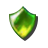
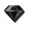
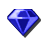
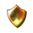
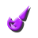
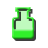

# [OpenKh Tool Documentation](../index.md) - KH2 Text Editor

Welcome to the official OpenKh tool documentation!
This document assumes you are already familiar with either compiling or acquiring the released version of the KH2 Text Editor bundled with OpenKH and have a dumped copy of the ISO. 
If you have neither, you can download the release builds of OpenKH [here](https://github.com/Xeeynamo/OpenKh/releases) and then dump your ISO using [this tutorial](../CLI.IdxImg/index.md).

This document will focus on teaching you how to use the first fully functional text editor for KH2.

## Navigating the Tool

First and foremost, one you have opened the program, you need to open both the fontimage.bar and fontinfo.bar files (located in ./KH2/msg/jp). To get these, you must extract your game with the help of our ImgIdx CLI tool. If you need help, with this step, [here is another document to get you started](../CLI/IdxImg/index.md). When ready, open your files, like so:


Afterwards, open the desired .bar file containing the text in question that you would like to edit. These can be located at `./KH2/msg/jp`, just like the fontimage and fontinfo files. For this example, we'll go with sys.bar, which contains all frequently referenced, important, and miscellaneous text, such as menus.


## Basic Text Editing

Now that we've got our sys.bar open, let's say we want to edit some of the Command Menu text. It should be easy enough. Let's change its text output from the classic "Attack" to something more fierce, like "Slash".


There is a search bar at yor disposal in the bottom left which will greatly help you narrow down your search for specific strings of text! As long as you know what it is your looking for, type in a keyword or phrase and the editor will narrow down the selection for you. This way, you don't have to browse for text by string numbers or approximate by hand where they're located sequentially in the file. Once we've changed all of our basic single line text, such as "Attack", "Magic", and whatnot, let's save the file to a new location so we don't accidentaly overwrite the original.


After saving, we can finally patch in our simple edit to see if the changes are reflected in-game!


Uh-oh! Some of our changed text is going a little too far and is popping out of the text box. We'll fix that and do some other neat adjustments in the next section!

## Advanced Text Editing

Before we get started, here's just how fancy text editing can get with this powerful tool!


As far as we know, this is just the tip of the iceberg. There are many more powerful functions built into this very tool, and the best part is it's utilizing functions in the game engine itself! There's a somewhat lengthy list of commands that can be called for various purposes, from width-scaling to forcing specific colors and transparency, and more! We'll now be going over how exactly to utilize these string maps we have at our disposal.

For now, let's list all the primary functions you will be likely to use, their type indicator, and detail exactly what they do:

| Type | Human-Readable Format 	| Description
|------|------------------------|------------------------
| 03   | {:reset}               | Resets all text afterwards to be argument-less.
| 07   | {:color #RRGGBBAA}     | Forces all text after this argument to appear as the specified color in Hex. An AA value higher than 80 (default) will make your text appear bold, while values lower than 80 will make it appear less bold. The default color value for most text in the game is #F0F0F080.
| 09   | {:icon icon-name}      | Displays the named icon within the text string. A list of all icons resides at the end of this document.
| 0A   | {:scale Value}         | Forces all text after this argument to scale proportionately to the original size. (16 is normal.)
| 0B   | {:width Value}         | Forces all text after this argument to scale only in width, leaving height untouched. (100 is normal, 72 for 16:9 widescreen fixed.)
| 10   | {:clear}               | Makes all text after this argument null, meaning it does not show, regardless of what you type. (There is probably no real pracical use for this function, but it is there nonetheless.)
| 11   | {:position X,Y}        | Relocates text's (X,Y) pixel coordinates from the origin point on screen. (Text is rendered on a 2D screen buffer approximately the size of 512x416. Because of this, you will likely never want to use values higher than X:512, X:-512, Y:416, or Y:-416.)

While there are more types, as of writing these are probably the only arguments you will ever likely need to use. They should have all of your bases covered. With that, let's see what exactly your typed out text might look like in the editor after you make some adjustments. For this example, we'll be looking at the (overly complicated) "Transformations" text that replaced "Drive". While the example itself is a ridiculous setup and you would never use the tool like this practically, we'll fix its width spacing anyway, just to show how to alleviate this problem.
```
{:width 50}{:color #75FFFFFF}T{:color #FF75FFFF}r{:color #FFFF75FF}a{:color #C3FFFFFF}n{:color #FFC3FFFF}s{:color #FFFFC3FF}f{:color #00C3FFFF}o{:color #FF00C3FF}r{:color #FF00C3FF}m{:color #C3FF00FF}a{:color #C325FFFF}t{:color #FFC325FF}i{:color #25FFC3FF}o{:color #C325FFFF}n{:color #FFFFFFFF}s
```

It's certainly not practical to make your text look like this, but it's cool nonetheless that we can do such a thing! It really doesn't get any simpler than this. To start, I needed to determine that all the text should scale in width proportionately, so I made sure to place my {:width 50} argument at the very beginning so I didn't have to do it for every individual letter, as the arguments apply to everything that come after it. Placing something like `{:width 80}` halfway through the text would've made the second half much wider than the `{:width 50}` half. So you can mix and match your arguments as you please, though again, you will likely never need to do such a thing.

**In addition to the aforementioned arguments, certain special characters such as Roman numberals can be called at any point by using arguments such as {I}, {III}, {XIII}, and so forth.**

Let's test some more arguments for various texts in our sys.bar.

| Line Number | Original Text                          | New Text
|-------------|----------------------------------------|-----------------------
| 480         | Attack                                 | {:color 952121FF}Slash
| 481         | Magic                                  | {:color 214D95FF}Mana
| 482         | Items                                  | {:width 64}{:color 219542FF}Consumables
| 483         | Drive                                  | {:width 50}{:color 218995FF}Transformations
| 14133       | Kingdom Hearts                         | {:icon form}{:color D3D971FF}Classic Menu{:icon form}
| 14135       | Keep the look of the original command menu. | {:scale 24}{:color D3D971FF}Use this if you prefer the classic Command Menu.


And how it all appears in-game:


## Closing Notes

Now that you've got a pretty good idea of how the text works, feel free to experiment and see what all you can come up with! As mentioned earlier, there are more arguments that can be used, but for the sake of preventing this documentation from being too complicated, for now it's just covering the core functions that the majority of people will use.

As a farewell, here's a list of all the {:icon} arguments you can use to spice up your text as you see fit!

| Icon-Name (Alphabetical)  | Icon
|---------------------------|---------
| ability-equip             | 
| ability-unequip           | 
| accessory                 | 
| ai-mode-frequent          | 
| ai-mode-moderate          | 
| ai-mode-rare              | 
| ai-settings               | 
| armor                     | 
| auto-equip                | 
| button-circle             | 
| button-cross              | 
| button-dpad               | 
| button-l1                 | 
| button-l2                 | 
| button-r1                 | 
| button-r2                 | 
| button-select             | 
| button-square             | 
| button-start              | 
| button-triangle           | 
| exclamation-mark          | 
| form                      | 
| gem-blazing               | 
| gem-bright                | 
| gem-dark                  | 
| gem-dense                 | 
| gem-energy                | 
| gem-frost                 | 
| gem-lightning             | 
| gem-lucid                 | 
| gem-mythril               | 
| gem-orichalcum            | 
| gem-power                 | 
| gem-serenity              | 
| gem-twilight              | 
| gumi-block                | 
| gumi-blueprint            | 
| gumi-brush                | 
| gumi-gear                 | 
| gumi-ship                 | 
| item-consumable           | 
| item-key                  | 
| item-tent                 | 
| magic                     | 
| magic-nocharge            | 
| material                  | 
| party                     | 
| question-mark             | 
| rank-a                    | 
| rank-b                    | 
| rank-c                    | 
| rank-s                    | 
| remembrance               | 
| tranquil                  | 
| weapon-keyblade           | 
| weapon-keyblade-equip     | 
| weapon-shield             | 
| weapon-shield-equip       | 
| weapon-staff              | 
| weapon-staff-equip        | 


The HD Collection, the PC port specifically, repurposes unused and PS2 button icons and adds in brand new ones for its multiple supported control options.
Below is a list of each icon name sorted by button type.

Xbox:
| Icon-Name				| Icon
|-----------------------|---------
| button-cross          | .png)
| button-circle         | .png)
| button-square         | .png)
| button-triangle       | .png)
| button-select         | .png)
| button-start          | .png)
| button-l1             | .png)
| button-l2             | .png)
| weapon-keyblade-equip	| .png)
| button-r1             | .png)
| button-r2             | .png)
| weapon-staff-equip    | .png)
| xb-analog             | 
| form                  | .png)
| xb-left-analog-up     | 
| xb-left-analog-down   | 
| xb-left-analog-left   | 
| xb-left-analog-right  | 
| weapon-shield-equip   | .png)
| xb-right-analog-up    | 
| xb-right-analog-down  | 
| xb-right-analog-left  | 
| xb-right-analog-right | 
| button-dpad           | .png)
| xb-dpad-up            | 
| xb-dpad-down          | 
| xb-dpad-left          | 
| xb-dpad-right         | 
| xb-dpad-updown        | 
| xb-dpad-leftright     | 

Playstation:
| Icon-Name				| Icon
|-----------------------|---------
| ps-cross              | 
| ps-circle             | 
| ps-square             | 
| ps-triangle           | 
| ps-touchpad           | 
| ps-options            | 
| ps-l1                 | 
| ps-l2                 | 
| ps-r3                 | 
| ps-r1                 | 
| ps-r2                 | 
| ps-l3                 | 
| ps-analog             | 
| ps-analog-left        | 
| ps-left-analog-up     | 
| ps-left-analog-down   | 
| ps-left-analog-left   | 
| ps-left-analog-right  | 
| ps-analog-right       | 
| ps-right-analog-up    | 
| ps-right-analog-down  | 
| ps-right-analog-left  | 
| ps-right-analog-right	| 
| ps-dpad               | 
| ps-dpad-up            | 
| ps-dpad-down          | 
| ps-dpad-left          | 
| ps-dpad-right         | 
| ps-dpad-updown        | 
| ps-dpad-leftright     | 

Generic:
| Icon-Name				| Icon
|-----------------------|---------
| gen-1                 | 
| gen-2                 | 
| gen-3                 | 
| gen-4                 | 
| gen-r1                | 
| gen-r2                | 
| gen-l1                | 
| gen-l2                | 
| gen-select            | 
| gen-start             | 

Keyboard & Mouse:
| Icon-Name				| Icon
|-----------------------|---------
| kb-a                  | 
| kb-b                  | 
| kb-c                  | 
| kb-d                  | 
| kb-e                  | 
| kb-f                  | 
| kb-g                  | 
| kb-h                  | 
| kb-i                  | 
| kb-j                  | 
| kb-k                  | 
| kb-l                  | 
| kb-m                  | 
| kb-n                  | 
| kb-o                  | 
| kb-p                  | 
| kb-q                  | 
| kb-r                  | 
| kb-s                  | 
| kb-t                  | 
| kb-u                  | 
| kb-v                  | 
| kb-w                  | 
| kb-x                  | 
| kb-y                  | 
| kb-z                  | 
| kb-left-shift         | 
| kb-right-shift        | 
| kb-left-ctrl          | 
| kb-right-crtl         | 
| kb-left-alt           | 
| kb-right-alt          | 
| kb-enter              | 
| kb-backspace          | 
| kb-space              | 
| kb-esc                | 
| kb-insert             | 
| kb-delete             | 
| kb-1                  | 
| kb-2                  | 
| kb-3                  | 
| kb-4                  | 
| kb-5                  | 
| kb-6                  | 
| kb-7                  | 
| kb-8                  | 
| kb-9                  | 
| kb-0                  | 
| kb-numpad-1           | 
| kb-numpad-2           | 
| kb-numpad-3           | 
| kb-numpad-4           | 
| kb-numpad-5           | 
| kb-numpad-6           | 
| kb-numpad-7           | 
| kb-numpad-8           | 
| kb-numpad-9           | 
| kb-numpad-0           | 
| kb-numpad-divide      | 
| kb-numpad-multiply    | 
| kb-numpad-minus       | 
| kb-numpad-plus        | 
| kb-numpad-period      | 
| kb-up                 | 
| kb-down               | 
| kb-left               | 
| kb-right              | 
| kb-f1                 | 
| kb-f2                 | 
| kb-f3                 | 
| kb-f4                 | 
| kb-f5                 | 
| kb-f6                 | 
| kb-f7                 | 
| kb-f8                 | 
| kb-f9                 | 
| kb-f10                | 
| kb-f11                | 
| kb-f12                | 
| mouse-left-click      | 
| mouse-right-click     | 
| mouse-middle-click    | 
| mouse-extra-click1    | 
| mouse-extra-click2    | 
| mouse-up              | 
| mouse-down            | 
| mouse-left            | 
| mouse-right           | 
| mouse-scroll-up       | 
| mouse-scroll-down     | 
| mouse-neutral         | 
| hash                  | 


These final icons don't have a static image but instead change what they look like based on the current active controller. 
As an example `dynamic-cross` will look like the Playstation Cross input when using a Playstation controller then dynamically change to the Xbox A input if the cotroller was changed to an Xbox controller during gameplay.
`dynamic-circle-jp` and `dynamic-cross-jp` are used indead of `dynamic-cross` and `dynamic-circle` respectively if the user changed their their settings to swap the comfim/cancel input.

| Icon-Name				
|-----------------------
| dynamic-cross
| dynamic-circle-jp
| dynamic-circle
| dynamic-cross-jp
| dynamic-square
| dynamic-triangle
| dynamic-select
| dynamic-start
| dynamic-l1
| dynamic-l3
| dynamic-l2
| dynamic-r1
| dynamic-r2
| dynamic-r3
| dynamic-analog
| dynamic-left-analog
| dynamic-left-analog-up
| dynamic-left-analog-down
| dynamic-left-analog-left
| dynamic-left-analog-right
| dynamic-right-analog
| dynamic-right-analog-up
| dynamic-right-analog-down
| dynamic-right-analog-left
| dynamic-right-analog-right
| dynamic-dpad
| dynamic-dpad-up
| dynamic-dpad-down
| dynamic-dpad-left
| dynamic-dpad-right
| dynamic-dpad-up-down
| dynamic-dpad-left-right
