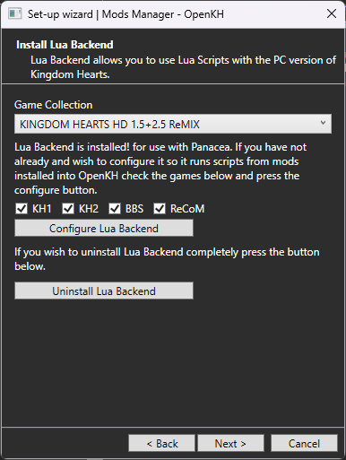

# OpenKH Mod Manager FAQs

### Return to the [Main Page](index.md)

### Special Thanks to:
* Shananas for the continued upkeep of the OpenKH Mod Manager when something new arises
* MainMemory for her updating of Panacea to work with the PC releases
* Xeeynamo for the initial rough version of the program
* Alios for discovering a major issue with the Mod Manager so that I may include an answer to the problem in this FAQs document
* Everyone else in the OpenKH community for helping make the modding environment for these games as welcoming and exciting as it has been

## [Table of Contents]()
* [Is extracting my games mandatory for the mod manager to work?](#q-is-extracting-my-games-mandatory-for-the-mod-manager-to-work)
* [Lua mods aren't working!](#q-lua-mods-arent-working)
* [Does OpenKH support Steam Deck/Linux?](#q-does-openkh-support-steam-decklinux)
* [I moved my OpenKH install and now I can't use the mod manager!](#q-i-moved-my-openkh-install-and-now-i-cant-use-the-mod-manager)
* [I can't open the mod manager on my removeable storage device!]()
* [I want to start making mods but don't know how](#q-i-want-to-start-making-mods-but-dont-know-how)

---

### Q: Is extracting my games mandatory for the mod manager to work?

> **A:** For the best user experience, yes. We understand it takes up a lot of storage, but it allows you to retain your unmodified game files through a dynamic file replacement system instead of relying on a slow and tedious patching method. Some tips to reduce the storage used by game extraction are:
> * Only extract the game(s) you are actively playing/modding.
> * Skip the game extraction portion of the initial setup wizard. Alternatively, you may enable `Dev View` by going to `Info > Dev View` inside the mod manager. This will allow you to patch your game(s) instead.
    >   * **WARNING:** This **<ins>will</ins>** make helping debug problems with your game more difficult, and mod making far more arduous. 
    >   * To revert your game to a completely vanilla slate, you may attempt to use the `Full Restore` options under `Patching > Full Restore`, but we cannot guarantee it will work if you have not properly kept a backup of your `.pkg` and `.hed` files. If this is the case, you may need to delete the respective game's `.pkg` and `.hed` files and verify the integrity of your game through Steam or EGS.

> The one exception is that Lua mods will work fine with the mod manager, so long as you have installed both Panacea and Lua Backend. Mods that alter or add files to the game will, in fact, require the extracted data, unless patching.

---

### Q: Lua mods aren't working!

> **A:** Did you download and place either `Lua Backend` or `Lua Frontend` where your games are installed? If not, OpenKH can do this for you through the mod manager initialization wizard. If you need to configure `Lua Backend`, go to `Settings > Run wizard` until you reach the point where you can install `Lua Backend`. Select your games and click the button to configure it.
>> **Note:** Panacea must also be installed for this method to work. If you have not enabled it, you should, as there is no negative effect to the game by Panacea simply being present, regardless of how you apply your mods.
> 
> 

---

### Q: Does OpenKH support Steam Deck/Linux?

> **A:** Absolutely! Most mod creative tooling will work just fine under standard WINE installs.
> 
> However for our fellow Steam Deck users trying to simply apply mods, OpenKH's mod manager should work fine under **WINE, Proton, and Proton-GE** under the KH 1.5+2.5 prefix.
>>   * **Note:** Due to the nature of WINE/Proton, in order for mods to properly apply to your game, you **must** use OpenKH under the same prefix as the game, otherwise you will not be able to locate (and thus apply mods to) your game files.

---

### Q: I moved my OpenKH install and now I can't use the mod manager!

> **A:** Delete the `mods-manager.yml` config file and re-run the install wizard for the mod manager. If you have your game data extracted already, you can safely either skip that part, or if you do not, the manager will detect whichever files are present and skip them as needed, filling in the blanks.

---

### Q: I can't open the mod manager on my removeable storage device!

> **A:** If OpenKH is stored on a removable storage device such as flash drives, SD cards, or an external/portable HDD/SDD, some tools (namely the `Mod Manager` utility) will not be able to correctly verify ownership of the files necessary for mod deployment to work, and may lead to a generic error. Please try deleting your `mods-manager.yml` config file and relocate OpenKH to an internal drive location, such as: `C:/Game Modding/openkh`

---

### Q: I want to start making mods but don't know how

> **A:** You are more than welcome to request help getting started in any of the appropriate channels in our [Discord server](https://discord.openkh.dev). We strive for a friendly and welcoming atmosphere and will always accept you with open arms.

### If there are more FAQs that come up, this page will be updated appropriately.

## Return to the [Main Page](index.md)
