# [OpenKh Tool Documentation](../index.md) - KH2 Mod Manager

This document will focus on teaching you how to utilize the OpenKH Mod Manager as necessary for both the PC ports of all [legacy class](#legacy-class-kh-games) KH games, as well as the PS2 versions of Kingdom Hearts (& Final Mix) and Kingdom Hearts II (& Final Mix).

> If you are having trouble with the mod manager and need help, try looking at our [Frequently Asked Questions](./FAQ.md).

> If you are looking for a guide on creating mods, refer to the sister guide to this one [here](./creatingMods.md).
>> It includes both a simple and advanced set of mod generation instructions. **Use the table of contents!**

# [Table of Contents]()
* [1. Intro to Mod Manager](#intro-to-mod-manager)
    * [Installation & Panacea](#installation--panacea)
* [2. Installing Mods](#installing-mods)
    * [Mod Collections](#mod-collections)
* [3. Running the Game With Mods](#running-the-game-with-mods)
* [4. Additional Functions](#additional-functions) 
* [5. Game Classifications](#game-classifications)
    * [Legacy Class](#legacy-class-kh-games)
    * [Modern Class](#modern-class-kh-games)
    * [Miscellaneous Class](#miscellaneous-class-kh-games)

# Intro to Mod Manager

To start, this guide assumes you have already downloaded the [latest OpenKH release from GitHub](https://github.com/OpenKH/OpenKh/releases) and extracted the zip file somewhere you can remember the location of. This guide will also largely focus on the HD PC release of KH games, as they are purportedly more accessible for both players wishing to use mods and players who wish to learn to mod themselves. (This very mod manager ensures exactly that to be correct.)

OpenKH is by and large self-contained, so all of your configurations, installed mods, WIP mods (if you are a mod author), etc. will be easily contained within the extracted `openkh` folder.

## Installation & Panacea

To start, open `OpenKh.Tools.ModsManager.exe`. Some users may have file extensions disabled (the default in Windows), so it may be missing the `.exe` at the end. This is okay.

Upon opening for the first time, you will be greeted like so:

> 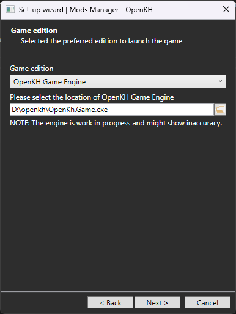

You might be thinking, "Wait, OpenKH Game Engine? I just want to mod my own copy of the original games!" Well, you're in luck! That option has a dropdown menu! Upon selecting `PC Release`, your window will change to look like this:

> 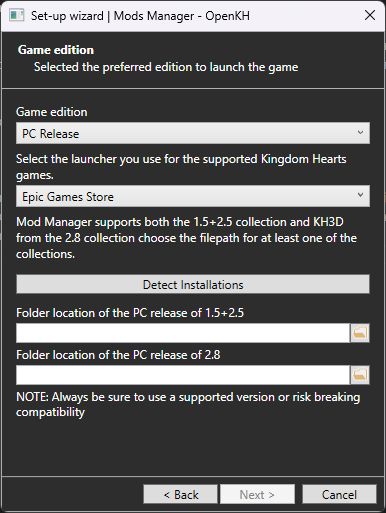

Make sure to select whether you are installing from Epic Games Store or Steam. **Both are supported equally by OpenKH!**

You will also need to provide the install location of either KH1.5+2.5 or KH2.8 (or both!). The autodetect function may or may not work for you. If not, no worries. You need to then navigate to the install location of your game collection(s) in question. For Steam, for example, the default path would be:

> C:/Program Files (x86)/Steam/steamapps/common/KINGDOM HEARTS -HD 1.5+2.5 ReMIX-

After clicking next, you will be presented with this screen:

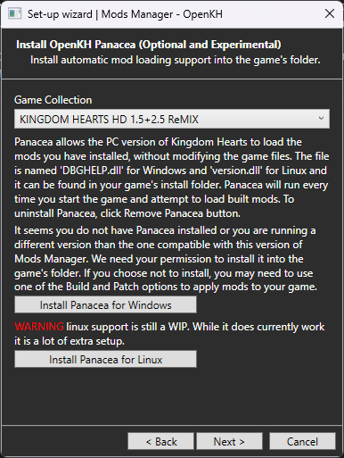

As the block of text tells you, Panacea is the mod loader which allows you to modify your game without directly overwriting the original game files. This is what allows the mod manager to work, and also allows you to enable and disable mods at the click of a button.

**Note: Panacea must be installed for both collections if you wish to modify both 1.5+2.5 & 2.8.**

To ensure both are mod-ready, use the dropdown menu at the top to select one collection at a time, and then click `Install Panacea for Windows`. 

**Steam Deck & Linux desktop users must use the** `Install Panacea for Linux` **button instead.**

Continuing, the next screen presented will allow you to install and pre-configure [Lua Backend](https://github.com/Sirius902/LuaBackend) for use with the games as well. This is a hook that allows the games you select to use Lua mods, akin to PCSX2's `pnach` function from ages past. Many mods utilize Lua to the fullest extent. Some incredible examples would be [Critical Mix](https://www.nexusmods.com/kingdomheartsfinalmix/mods/93) for KH1 and [BBS - Better Battle System](https://www.nexusmods.com/kingdomheartsbirthbysleepfinalmix/mods/31), both mods created by the very talented Xendra.

The next screen will present you with game extraction procedures:

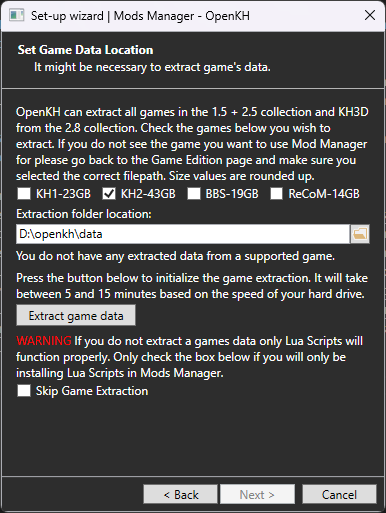

**Note: The extraction process WILL take a long time, depending on which games you decide to set up mods for.**

If you wish to only use Lua script mods, you may skip this step. However, if you are using mods which change assets in the games, you absolutely **must** extract your titles using this page. The reason for this is OpenKH relies on the extracted game data to effectively "hijack" the games' natural location where it attempts to read files from within compressed `.pkg` files. This will also allow you to modify your games without worrying about losing the original assets, so you can uninstall mods you no longer wish to use without having to verify the integrity of your game files via Steam or Epic.

## Installing Mods

Congratulations! You have successfully set up and installed the OpenKH Mod Manager!

You will be greeted with a blank window that looks like this:

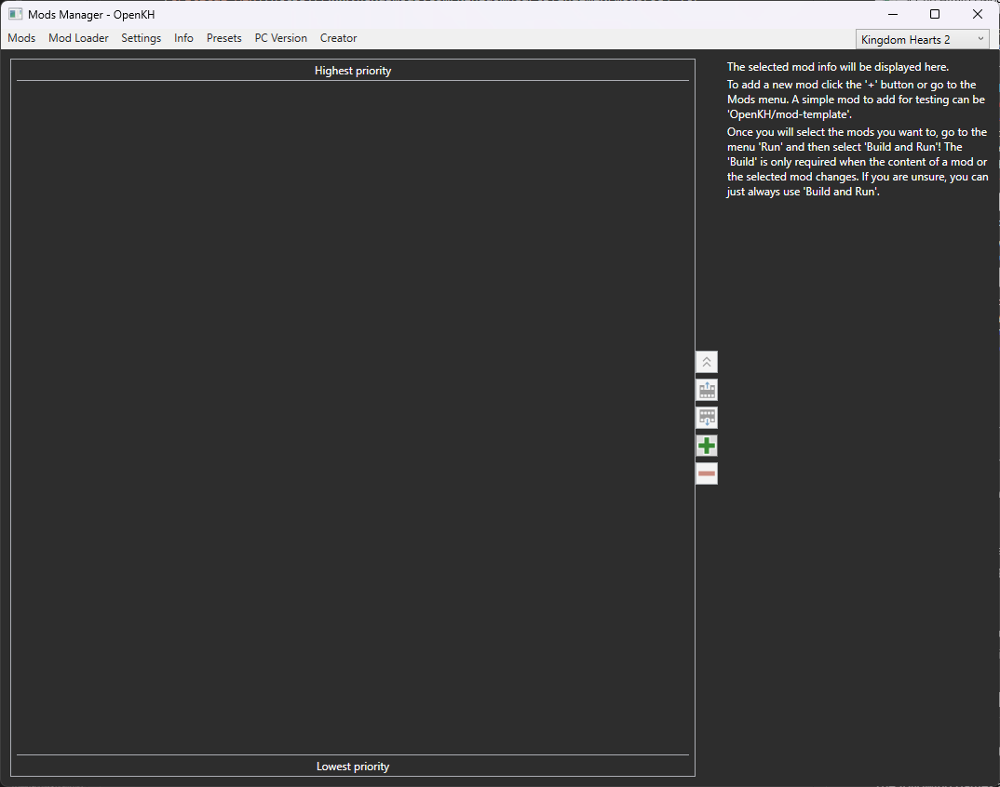

There are some key functionalities hidden within the mod manager, but this section will focus on teaching you the basics to get mods running first and foremost.

To start, on the right hand side of the middle separator, there are five buttons. (They may change over time so the screenshot may not be reflective of current releases. This does not affect the guide.) They are as follows, in order:

* Move currently selected mod to the top of the list (highest priority)
* Move currently selected mod up one slot, increasing priority
* Move currently selected mod down one slot, decreasing priority
* Add a new mod
* Remove currently selected mod

There are two primary methods of installing mods, as you will see when clicking the `Add a new mod` [+] button:

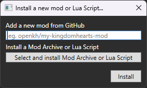

Mod authors may publish their mods directly to GitHub, a repository website, or distribute `.zip` archive files containing the same mod contents that would otherwise be identical to the GitHub method.

The one acception to this is a new feature, mod collections, which are currently only supported under GitHub install. See [here](#mod-collections) for details on what a mod collection is!

The aforementioned [Critical Mix](https://www.nexusmods.com/kingdomheartsfinalmix/mods/93) mod is an example of a mod that distributes its contents through an archive. An example of a mod that is distributed through GitHub would be Keytotruth's [Ultimate Mix](https://github.com/Truthkey/BBSUM_Mod) mod for Birth by Sleep.

To install a mod through GitHub, you simply copy the end portion of the mod you wish to install's GitHub URL into the provided line. For example: `Truthkey/BBSUM_Mod`

To install a mod through an archive, instead simply click the `Select and install Mod Archive or Lua Script` button, and provide the archive in question.

Once you have some mods installed, your page will look more like this:

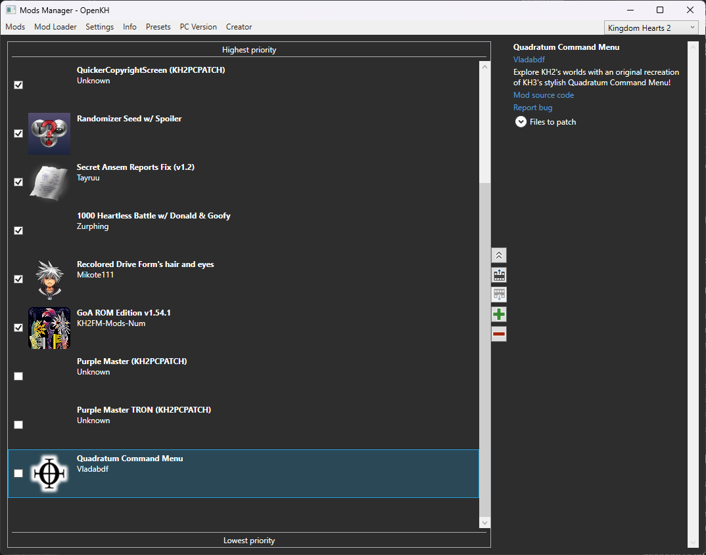

You're now free to check or uncheck which mods you wish to play with at any given time! Some mods may overwrite the same entire file. Because of this, OpenKH includes a priority system. Mods higher on the list have higher priority and will take precedence over mods lower in the list. 

### Mod Collections

Mod collections are a new feature allowing creators to group assets for multiple titles into a single GitHub repository and install cross game. In simpler words this means a single GitHub repository install can span from 1 game to all supported games.

The install procss is exactly the same as you would any other GitHub based mod, however once install the mod will appear in the list of mods for any game that is included.

Additionally the creators can now grant control over which files from the mod are required to be installed versus which ones you as the end user can opt into, allowing multiple mods.

You can access the selection of said optional mods from the collection settings button:

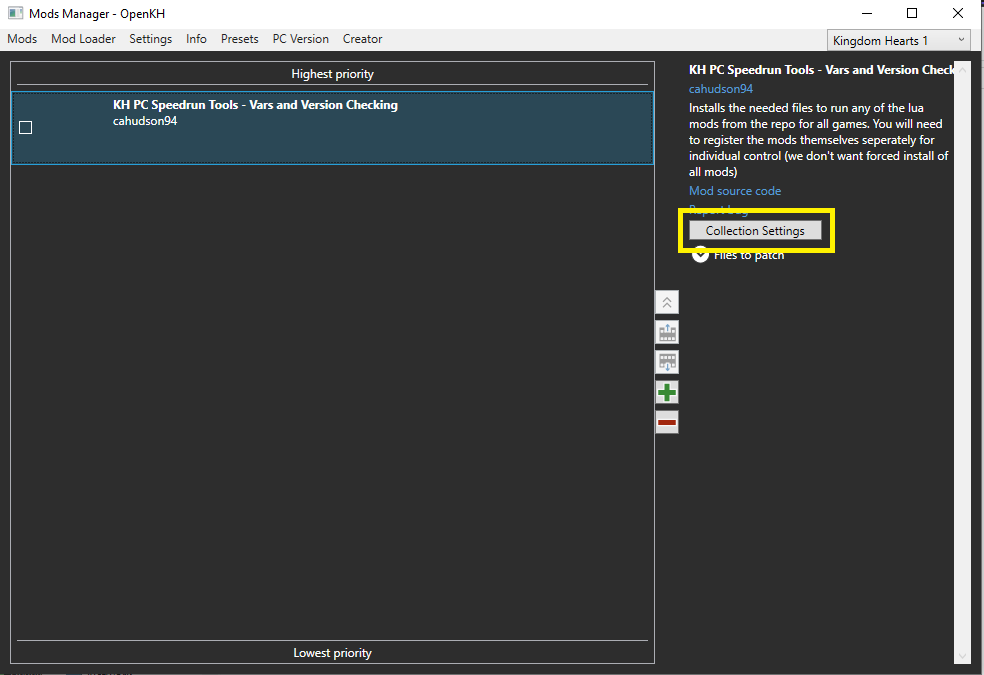

Which will bring you to the collection settings window:

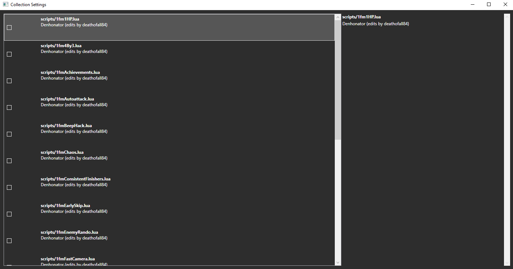

From here you can tick the check boxes and the selected mods will be added to the list of files to be installed!

## Running the Game With Mods

All you need to do now is click `Mod Loader` at the top and select `Build Only` or `Build and Run`.

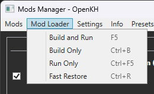

Here is a quick breakdown of the four options:
* `Build and Run` will compile your mod list into a `mod` folder within the `openkh` directory, and then run your selected game with the mods applied.
* `Build Only` will compile your mod list, however it will not run the game immediately after.
* `Run Only` will launch your game, but not load any selected mods (aside from Lua scripts; those will be applied anyway).
* `Fast Restore` will attempt to un-modify any original `.pkg` files provided by the vanilla game, if you used the Mod Manager's (hidden) patcher function instead of the `Build` function.

## Additional Functions

The `Settings` menu at the top of the window has some additional options that may be useful in certain scenarios.

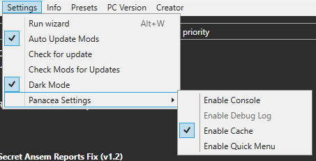

* `Run wizard` will re-initialize the mod manager from the beginning.
    * Changes only apply as you progress through, so canceling out will not overwrite your current settings.
    * This will also NOT clear out your mods lists.
* `Auto Update Mods` is self-explanatory.
    * Only works for GitHub repository mods!
* `Check for update` will update the whole of OpenKH, not just the Mod Manager.
* `Check Mods for Updates` will force your mod list to search for updates where applicable.
    * Useful only if you would be too inconvenienced to restart the whole program just so the `Auto Update` function can run.
* `Dark Mode` for the clinically sane.
* `Panacea Settings`
    * `Enable Console` in case you need to debug mods not loading properly.
        * `Enable Debug Log` for the same.
    * `Enable Cache`
    * `Enable Quick Menu`

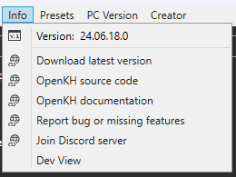

* Version info
* Link to the latest OpenKH release on GitHub
* Link to the OpenKH code repository
* Link to the OpenKH documentation website
* Link to the OpenKH issue/feature tracker built into GitHub
* Link to the OpenKH Discord server
* `Dev View` which will allow you to patch your PC port like a filthy animal.
    * This option, contradictory to the information above, will allow you to modify your games without extraction.
    * The upside to this is you do not have potentially 120GB of disk space being used.
    * The downside is you may encounter trouble later trying to run your game completely vanilla again without reinstalling the games from scratch.
    * Patching is far messier than dynamic replacement, so we opt for the latter over patches. Additionally, most people also have the hard drive space to spare, and would likely only play one game at a time instead of all five legacy class games at once.

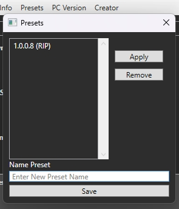

Presets allow you to have a massive mod list with certain priorities, load orders, etc. set so you can tailor your playthrough with a couple of simple clicks. You can even share your presets with friends and the community through the `presets` folder within `openkh`!

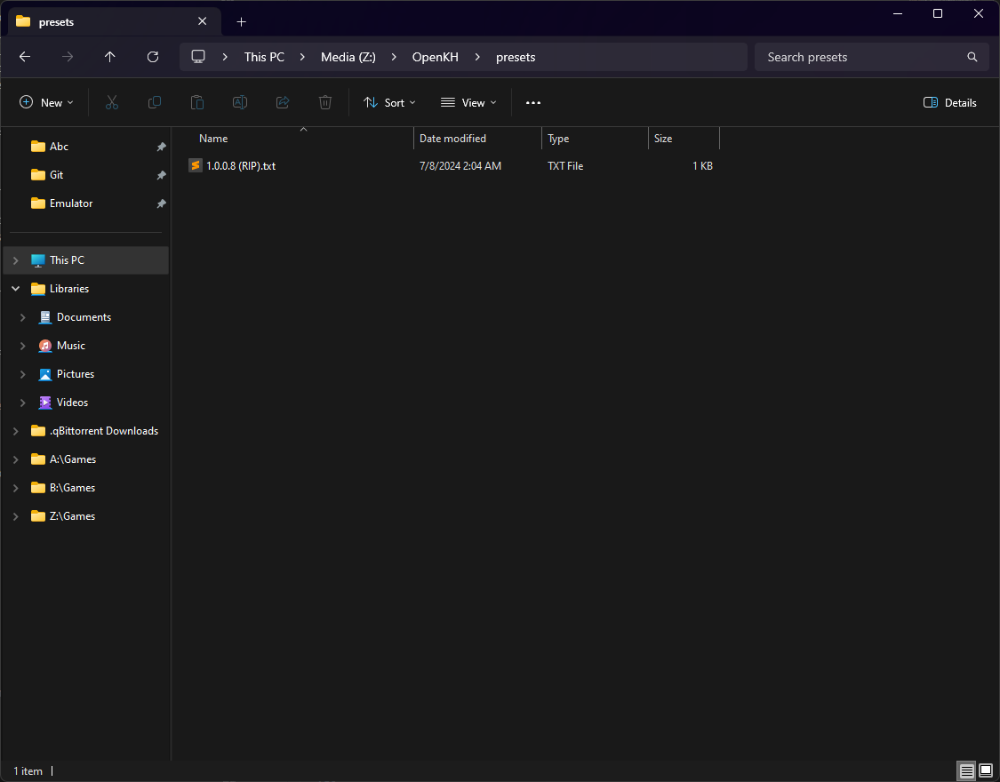

#### That about sums up what you need to know to use the OpenKH Mod Manager! If you have any questions beyond this point, feel free to reach out to the open arms community in [Discord](discord.openkh.dev). We don't bite!

## Game Classifications

### Legacy Class KH Games

The following games are considered "legacy class" within the confines of OpenKH so as to make it easy to determine what sort of utilities, verbiage, and documentation to refer to when modifying them as opposed to "[modern class](#modern-class-kh-games)" titles.

* Kingdom Hearts (& Final Mix)
* Kingdom Hearts II (& Final Mix)
* Kingdom Hearts: Re:Chain of Memories
* Kingdom Hearts: Birth by Sleep (& Final Mix)
* Kingdom Hearts: Dream Drop Distance (HD & 3D)

### Modern Class KH Games

These games are considered "modern class" as opposed to "[legacy class](#legacy-class-kh-games)" as they use more modern game engines with either free to download, free to use, or FOSS aspects to them. Due to the nature of these engines, their pipeline for making modifications (and thus, documentation) is far more streamlined for general use, and will always be considered secondary (though welcome) additions to the OpenKH project.

* Kingdom Hearts 0.2 Birth by Sleep: A Fragmentary Passage
* Kingdom Hearts III (& Re:Mind)
* Kingdom Hearts: Melody of Memory
* Kingdom Hearts IV

### Miscellaneous Class KH Games

These are games which, at the time of writing, are not considered to be within the scope of OpenKH. However, any and all documentation on these titles are more than welcome, as the preservation of knowledge in this series is the first and foremost goal of OpenKH.

* Kingdom Hearts 358/2 Days
* Kingdom Hearts: Re:Coded
* Kingdom Hearts Unchained χ / Union χ[Cross] / Dark Road
* Kingdom Hearts χ[chi]
* Kingdom Hearts: Chain of Memories **(GBA)**
* Everything else
